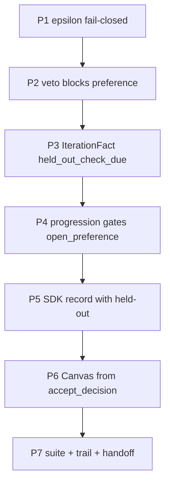

# Climb-signal intent repair

## Context

Act-on interrogate fixes are already committed and synced on `feature/climb-signal-redesign`. This plan closes the remaining **intent-blocking** gaps only (user: 1A + 2B). Designed climb accept rules outrank Canvas polish. Soft-fail on corrupt `accept_status` and any UI/UX wave stay out of scope.

Four failures vs original locks:

| Gap | Phase / ADR lock | Failure today |
|-----|------------------|---------------|
| ε fail-open on missing axes | Phase 06 hard ε | `evaluate_epsilon_band` `continue`s missing scores; partial targets can pass |
| Preference on vetoed rows | Phase 02 hard veto outranks soft judge | `record_preference` writes sidecar even when `accept_status == "vetoed"` |
| Dead `held_out_check_due` | Phase 08 cadence opens prefer-vs-held-out | Flag set/cleared only; progression goes to `draft` |
| Canvas ignores `accept_decision` | AcceptDecision sole boundary | [`canvas_accept.parse_latest_accept`](eliotapp/application/canvas_accept.py) reads flat keys only |

## Scope

**In**

1. Fail-closed ε for missing target and non-target qualitative scores.
2. Reject preference attach on vetoed iterations (no sidecar, no soft stop from preference).
3. Live held-out cadence via `IterationFact` → `progression.decide()` → SDK `pref-job-record --held-out`.
4. Canvas projects from nested `accept_decision` when present (legacy flat fallback).

**Out**

- Soft-fail Canvas on corrupt accept (operator resilience, not redesign intent).
- Deleting flat `accept_*` dual-write (writers keep mirrors for `climb_metrics` / cadence counts until a later migrate wave).
- UI/UX restyle of rail/strip.
- New climb metric or second `vs_held_out` field (use existing `AcceptDecision.held_out`).
- Inferring overlay from `held-out.txt` reference filename (Act-on already forbids this).

## Constraints

- HTTP never writes `scores.json` (CLI/SDK only).
- ADR 004 pairwise default; qualitative mean stays diagnostic.
- Core stays Path-free; `held_out_check_due` is a bool fact on `IterationFact`, not a filesystem check inside `progression`.
- Prefer eight small phases over large batches (**Foundational Thinking**, **Sequence Verifiable Units**).

## Alternatives (chosen)

1. **ε:** Fail-closed like hard veto (chosen) vs warn-only. Phase 06 wants hard ε.
2. **Held-out consumer:** Gate in `progression.decide()` + SDK `--held-out` on record (chosen) vs Canvas-only nudge. Phase 08 needs the check to open, not just display.
3. **Canvas:** Prefer `accept_decision` with flat fallback (chosen) vs delete flat fields now. Laziness: project correctly first; migrate writers later.

## Applicable skills (implementer)

- **how** before editing `progression` / SDK preference open path if unfamiliar.
- **control-cli** for held-out cadence runtime; **control-ui** only for a smoke GET that accept copy still renders (not a redesign).
- **/deslop** before each commit; **unslop** on prose.
- **interrogate** only if a phase redesigns the accept boundary again (not required for these surgical fixes).
- **show-me-your-work** trail row under `handoff/decision-trails/climb-signal-redesign.tsv`.

## Durable plan files

On implementation start, materialize under [`.cursor/plans/archive/climb_signal_intent_repair/`](.cursor/plans/archive/climb_signal_intent_repair/) (`overview.md` + phase files below) and index in [`.cursor/plans/README.md`](.cursor/plans/README.md).

## Phases



### Phase 1 — ε fail-closed

**Goal.** Missing qualitative scores cannot soft-pass the ornament-gaming guard.

**Changes.** [`eliotapp/core/shapes/accept.py`](eliotapp/core/shapes/accept.py) `evaluate_epsilon_band`: treat missing incumbent/challenger score for any named target as failure; treat missing non-target the same as a band failure (mirror hard-veto fail-closed). Keep empty `target_axes` as no-op.

**Data.** Same return tuple `(ok, reason, epsilon_failures, axis_deltas)`; reasons stay or add `epsilon_target_partial` / include section names in `epsilon_failures`.

**Verify.** Red then green in [`tests/test_epsilon_band.py`](tests/test_epsilon_band.py): partial targets reject; missing non-target rejects. Static pytest on that file.

### Phase 2 — Veto blocks preference attach

**Goal.** Hard veto outranks soft preference; no sidecar pollution; no `preference_tie` stop on vetoed rows.

**Changes.** [`eliotapp/application/workflow/climb_recording.py`](eliotapp/application/workflow/climb_recording.py) `record_preference`: if latest `accept_status == "vetoed"`, raise (or no-op return without write) before writing `preference-vN.json` / `preference_outcome`. Do not call `should_stop` with soft preference on that path.

**Data.** Unchanged `AcceptDecision` veto shape from Act-on.

**Verify.** [`tests/test_hard_veto.py`](tests/test_hard_veto.py): vetoed iter + `record_preference` → no preference sidecar; accept stays vetoed; TIE does not stop as preference_tie.

### Phase 3 — Snapshot fact for cadence

**Goal.** Progression can see `held_out_check_due` without Path I/O in core.

**Changes.** Add `held_out_check_due: bool` to [`IterationFact`](eliotapp/core/shapes/run_snapshot.py); load in [`eliotapp/infrastructure/run_snapshot.py`](eliotapp/infrastructure/run_snapshot.py) from iteration dict (default false).

**Verify.** Unit/fixture load in existing run_snapshot / run_state tests that construct `IterationFact`.

### Phase 4 — Progression opens held-out preference

**Goal.** After primary pairwise binds, cadence does not jump to `draft` while due.

**Changes.** [`eliotapp/core/progression.py`](eliotapp/core/progression.py): when climb is `pairwise_style_v1`, latest is binding, and `held_out_check_due`, return the same preference job branch as unbound preference (`open_preference` / `continue_preference` / `record_preference`) before `iteration_complete`/`draft`. Carry an issue string such as `held_out_overlay_due` so operators know the record must use `--held-out`.

**Verify.** [`tests/test_run_state.py`](tests/test_run_state.py) + extend [`tests/test_held_out_accept.py`](tests/test_held_out_accept.py): after cadence marks due, `inspect` next_action is preference open/continue/record, not draft.

### Phase 5 — SDK records overlay when due

**Goal.** Autonomous SDK path actually applies prefer-vs-held-out.

**Changes.** [`tools/sdk_climb_lib.py`](tools/sdk_climb_lib.py): when scoring/recording preference and latest iteration has `held_out_check_due`, pass `--held-out` to `pref-job-record` (explicit flag only). Do not infer from reference filename.

**Verify.** Focused SDK/unit test that record args include `--held-out` when due. Runtime **control-cli** on a fixture run with held-out + cadence boundary if cheap; otherwise static proof + note in trail.

### Phase 6 — Canvas projects from AcceptDecision

**Goal.** AcceptDecision is the Canvas source of truth when present (intent), not a restyle.

**Changes.** [`eliotapp/application/canvas_accept.py`](eliotapp/application/canvas_accept.py) `parse_latest_accept`: if `accept_decision` dict present → `AcceptDecision.from_dict` → `LatestAccept` (status, reason, preference_outcome, patch_scope; add `held_out: bool` on `LatestAccept` from decision). Else legacy flat fields. Optional one-line held-out hint on rail only if it costs almost nothing; no layout redesign.

**Verify.** [`tests/test_canvas_accept.py`](tests/test_canvas_accept.py): decision-only, flat legacy, decision wins on conflict. Keep [`tests/test_presentation_runs.py`](tests/test_presentation_runs.py) scores-immutable assertion green. Optional **control-ui** GET `/runs/<slug>` smoke.

### Phase 7 — Closeout

**Goal.** Suite green; trail + STATE note that intent repair landed; plans index points at this folder.

**Changes.** Trail row in [`handoff/decision-trails/climb-signal-redesign.tsv`](handoff/decision-trails/climb-signal-redesign.tsv); short note in [`handoff/STATE.md`](handoff/STATE.md); index [`/.cursor/plans/README.md`](.cursor/plans/README.md). No second supersede-003 ADR.

**Verify.** `$env:PYTHONPATH="."; python -m pytest tests/ -q` (full suite). Claim done only with that evidence (**Prove It Works**).

## Verification (project-level)

```powershell
$env:PYTHONPATH="."; python -m pytest tests/test_epsilon_band.py tests/test_hard_veto.py tests/test_held_out_accept.py tests/test_run_state.py tests/test_canvas_accept.py tests/test_presentation_runs.py -q
$env:PYTHONPATH="."; python -m pytest tests/ -q
```

Plus per-phase red→green as above. Runtime: CLI inspect after cadence (control-cli); optional Canvas GET (control-ui).

## Implementation guidance

- **Laziness Protocol:** smallest change per phase; keep flat mirrors until a later migrate.
- **Boundary Discipline:** guards at record/progression/Canvas parse; trust typed `AcceptDecision` inside.
- **Outcome-Oriented Execution:** converge on fail-closed ε + live cadence + decision projection; no throwaway dual next_action.
- **Never Block:** implement without re-asking scope; commit only when human asks.
- After PR (when human asks): Opening a PR playbook + babysit.

## Hand back

Four intent gaps, seven shippable phases, Canvas projection without UX redesign, held-out cadence via progression+SDK. Soft-fail and dual-write deletion deferred. Implementation starts when you approve this plan.