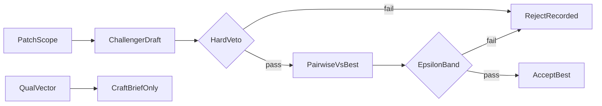

# Climb-signal redesign (fresh-session final)

**PASS on branch `feature/climb-signal-redesign` (2026-07-17).** Gate: `handoff/CLIMB-SIGNAL-REDESIGN-PASSED.md`. Interrogate then PR when human asks.

**Authority:** [handoff/STATE.md](handoff/STATE.md) item 1. Layout peel and Document Canvas are closed. Do not reopen SYNTHESIS peel or full-workflow webapp.

---

## Read first (dependent blocks)

| Block | Path | Why |
|-------|------|-----|
| Redesign handoff | [handoff/CLIMB-SIGNAL-REDESIGN-HANDOFF.md](handoff/CLIMB-SIGNAL-REDESIGN-HANDOFF.md) | Must-plan items, forbidden, done-when |
| Research brief | [handoff/CLIMB-SIGNAL-RESEARCH-2026-07.md](handoff/CLIMB-SIGNAL-RESEARCH-2026-07.md) | 2026 SOTA + 2027 gap opinion (not a PASS gate) |
| Living state | [handoff/STATE.md](handoff/STATE.md) | Product order |
| ADR 003 (history) | [docs/adr/003-style-fidelity-climb-signal.md](docs/adr/003-style-fidelity-climb-signal.md) | Current default = qualitative mean; supersede, do not rewrite in place |
| Preference shipped | [handoff/REFERENCE-PREFERENCE-SHIPPED.md](handoff/REFERENCE-PREFERENCE-SHIPPED.md) | Reuse spine |
| Pref orchestration | [handoff/PREFERENCE-ORCHESTRATION-PASSED.md](handoff/PREFERENCE-ORCHESTRATION-PASSED.md) | Job board + resume |
| Canvas gate | [handoff/FULL-WORKFLOW-WEBAPP-PASSED.md](handoff/FULL-WORKFLOW-WEBAPP-PASSED.md) | HTTP never writes scores |
| StyleBlock recovery FAIL | [handoff/STYLEBLOCK-RECOVERY-001-FAILED.md](handoff/STYLEBLOCK-RECOVERY-001-FAILED.md) | Block alone does not move held-out discrimination |
| Arch second opinion | [handoff/ARCHITECTURE-SECOND-OPINION-2026-07.md](handoff/ARCHITECTURE-SECOND-OPINION-2026-07.md) | Style library note; process climb is the durable bet |
| Phase detail dir | [.cursor/plans/archive/climb_signal_redesign/](.cursor/plans/archive/climb_signal_redesign/overview.md) | Per-phase goals (keep in sync with this brief) |
| Root plan file | [.cursor/plans/archive/climb_signal_redesign.plan.md](.cursor/plans/archive/climb_signal_redesign.plan.md) | Cursor todos |

**Decision trail (create on execute):** `handoff/decision-trails/climb-signal-redesign.tsv`

---

## Niche durability (locked read)

Style-block as sole differentiator is **fragile**. Mid-2026 already commoditizes voice containers (Claude Styles/Skills, Custom GPT voice docs, Sudowrite Story Bible samples, GRPO/AuthorMix author-style lines). Dense Style Block remains a good **run constitution / input**, not product moat.

**Niche that can hold ~12–18 months (~2027-07) if this plan ships:**

1. Operator process climb (excerpt/axis-local, pause, revert, pairwise-vs-best)
2. Hard verifiable floors + content-brief veto
3. Gaming-visible run-folder + Canvas
4. Held-out genuine in the accept loop

If only the block improves and mean climb stays, the niche closes early. Re-evaluate after phases 03–07.

---

## Problem and north star

**Problem:** Default `style_fidelity` climb uses qualitative mean for best/seed/stop. Every `record_iteration` appends; there is no challenger reject. Revisers game soft axes. SURFACE/PROSODY/CAST and content-brief do not veto climb accept today.

**North star:**



- Accept = pairwise candidate vs current-best (sometimes vs held-out)
- Qualitative vector = diagnostic → craft brief only
- Revise unit = one axis set or one excerpt set per step
- Hard veto = Python floors + content-brief (soft judge cannot override)
- Crossover = optional splice under same accept (not a new scalar)
- HTTP never writes `scores.json`

---

## Locked defaults (no open forks)

| Decision | Choice |
|----------|--------|
| Accept spine | New metric id `pairwise_style_v1`; reuse preference job board + ab/ba; style-block as run constitution in judge framing |
| Not chosen | Defaulting solely to `reference_preference_v1`; silent semantic swap under `style_fidelity` name |
| Deterministic floors | Relative ε vs incumbent first; absolute floors only if dogfood demands |
| Crossover | Stacked after Canvas (phase 09), not first merge |
| Scores ownership | CLI/SDK only (`climb_recording`, `scores_io`, sdk-climb) |

---

## Code touch map (from explorers)

| Area | Key paths |
|------|-----------|
| Mean ruler today | [eliotapp/application/workflow/climb_metrics.py](eliotapp/application/workflow/climb_metrics.py) `_best_record`, `should_stop`, `qualitative_mean` |
| Record always keeps | [eliotapp/application/workflow/climb_recording.py](eliotapp/application/workflow/climb_recording.py) `record_iteration` |
| Decide / binding | [eliotapp/core/progression.py](eliotapp/core/progression.py) (preference on `style_fidelity` → repair today) |
| Pref spine to reuse | [eliotapp/core/evaluator/reference_preference.py](eliotapp/core/evaluator/reference_preference.py), [preference_jobs.py](eliotapp/application/workflow/preference_jobs.py), [job_board.py](eliotapp/application/workflow/job_board.py) |
| Optional veto pattern | [eliotapp/core/evaluator/quality_veto.py](eliotapp/core/evaluator/quality_veto.py) |
| Revise unit today | [.cursor/agents/revise-drafter.md](.cursor/agents/revise-drafter.md), [draft_inputs.py](eliotapp/application/workflow/draft_inputs.py), [one-command.md](.cursor/skills/workflow/references/one-command.md) |
| Canvas read-only | [workspace_canvas.py](eliotapp/application/workspace_canvas.py), [climb_strip.py](eliotapp/application/climb_strip.py), [presentation/routes/runs.py](eliotapp/presentation/routes/runs.py) |
| Tests to extend | `tests/test_hillclimb.py`, `tests/test_run_state.py`, `tests/test_preference_operator_smoke.py`, `tests/test_climb_strip.py`, `tests/test_presentation_runs.py` |

**Gotchas to encode:**

- Today every iteration is kept; add rejected-but-recorded / challenger-lost so history keeps files while best ignores losers.
- `decision.tsv` currently tracks total delta; align with accept reasons.
- Even-iter whole-draft PROSODY cadence pass conflicts with axis-local `PatchScope` (fix or skip when scoped).
- Preference jobs on `style_fidelity` are repair; new metric must allow them.

---

## Data shapes

- `AcceptDecision`: accepted | rejected | vetoed; reason; incumbent; challenger; optional held-out
- `PatchScope`: whole_draft | axis | excerpt; target axes; span markers
- `HardVeto`: deterministic floor fail and/or content-brief fail

---

## Phases (ordered)

### Phase 00 — Gaming harness
Red/xfail fixture: qualitative mean can rise while pairwise-vs-best would reject. No production accept change yet. Detail: [phase-00-harness.md](.cursor/plans/archive/climb_signal_redesign/phase-00-harness.md)

### Phase 01 — Accept types
Pure core types `AcceptDecision`, `PatchScope`, `HardVeto` under `eliotapp/core/`. No behavior change. Detail: [phase-01-accept-types.md](.cursor/plans/archive/climb_signal_redesign/phase-01-accept-types.md)

### Phase 02 — Hard veto
Wire SURFACE/PROSODY/CAST + content-brief into CLI/SDK accept path. Soft judge cannot override. Detail: [phase-02-hard-veto.md](.cursor/plans/archive/climb_signal_redesign/phase-02-hard-veto.md)

### Phase 03 — Pairwise-vs-best accept
`pairwise_style_v1`: challenger vs current-best via preference job spine; style-block constitution; rejected-but-recorded semantics; turn harness green. Detail: [phase-03-pairwise-accept.md](.cursor/plans/archive/climb_signal_redesign/phase-03-pairwise-accept.md)

### Phase 04 — Retire mean ruler
`init_run` default → `pairwise_style_v1`. Migrate `_best_record`, seed promotion, stop/retry. New ADR; keep ADR 003 as history. Sparkline may plot qual mean as **diagnostic** only. Detail: [phase-04-retire-mean-ruler.md](.cursor/plans/archive/climb_signal_redesign/phase-04-retire-mean-ruler.md)

### Phase 05 — Excerpt / axis revise
`PatchScope` on craft brief + revise-drafter contract; fix cadence-pass conflict when scoped. Detail: [phase-05-revise-unit.md](.cursor/plans/archive/climb_signal_redesign/phase-05-revise-unit.md)

### Phase 06 — ε-band
Target ↑ and non-target axes within ε of incumbent, else reject. Detail: [phase-06-epsilon-band.md](.cursor/plans/archive/climb_signal_redesign/phase-06-epsilon-band.md)

### Phase 07 — Canvas gaming UX
Read-only JobRail / strip / tree: patch scope, accept reason, pairwise keep-best. No HTTP scores writes. Detail: [phase-07-canvas-gaming-ux.md](.cursor/plans/archive/climb_signal_redesign/phase-07-canvas-gaming-ux.md)

### Phase 08 — Held-out anti-cheat
Periodic prefer-vs-held-out under same AcceptDecision family. Detail: [phase-08-held-out-anticheat.md](.cursor/plans/archive/climb_signal_redesign/phase-08-held-out-anticheat.md)

### Phase 09 — Crossover splice
Span-splice operator → same pairwise accept. CLI-first; stacked PR. Detail: [phase-09-crossover.md](.cursor/plans/archive/climb_signal_redesign/phase-09-crossover.md)

### Phase 10 — Closeout
CONTEXT + ADR + STATE + plans index + trail + gate record; dogfood one run; archive plan when green. Detail: [phase-10-closeout.md](.cursor/plans/archive/climb_signal_redesign/phase-10-closeout.md)

Testing map: [testing.md](.cursor/plans/archive/climb_signal_redesign/testing.md)

---

## Forbidden

- Reweight qualitative axes as the fix
- HTTP writes `scores.json`
- Train lab-scale writing RM / co-evolve rubric generator as MVP
- Re-litigate eliotapp homes / reopen closed gates
- Permanent dual climb truth (mean + pairwise forever)

---

## Verification

```powershell
$env:PYTHONPATH="."
python -m pytest tests/ -q
```

Per phase: pytest green; presentation tests still forbid HTTP scores writes. After accept path: CLI/SDK smoke on one run slug. After Canvas: GET `/runs/<slug>`. Before closeout: one dogfood climb with pairwise accept reasons on disk.

---

## Implementer non-negotiables

- **how** before editing climb_metrics / progression / preference / Canvas
- **interrogate** AcceptDecision before merge
- **show-me-your-work** trail on execute
- `/deslop` before commit; **unslop** on ADR/prose
- **babysit** after PR
- **migrate-callers-then-delete** mean-as-sole-ruler

---

## Fresh-session start line

New chat in `C:\Projects\EliotWF` · open [.cursor/plans/archive/climb_signal_redesign.plan.md](.cursor/plans/archive/climb_signal_redesign.plan.md) · human says execute · start phase 00 only.