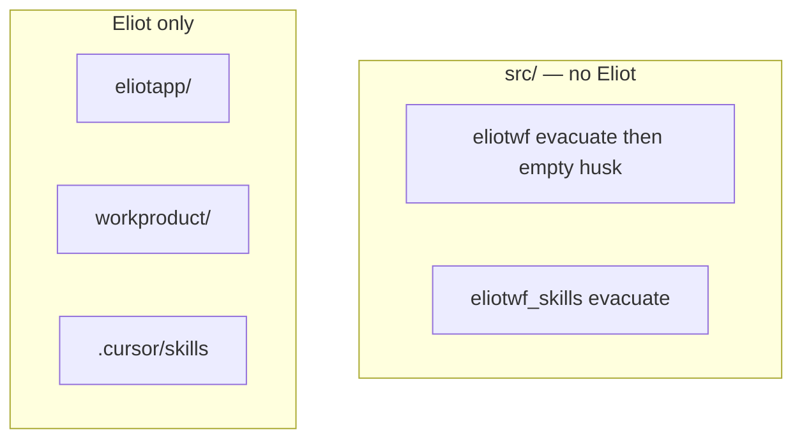

# Eliotapp rules + scaffold gate

Prerequisite for [eliotwf_app_restructure](eliotwf_app_restructure_bcfc6cd4.plan.md). **Rules only** — no code migration.

**Branch:** off current `master` (hooks/SDK climb already merged 2026-07-16). Do not reopen `hooks-sdk-phase-1`.

## Non-negotiable

**`src/` stays clean of Eliot.**

| Path | Eliot? |
|------|--------|
| `eliotapp/` | **Yes** — sole Eliot code home |
| `workproduct/` | Data only — `runs/`, `style-blocks/`, `catalog.json` (not Python) |
| `.cursor/skills/` | Prose / thin scripts only |
| `src/eliotwf/` | **No Eliot** — today 100% Eliot UI (evacuate); after migrate = empty husk (delete or leave vacant) |
| `src/eliotwf_skills/` | **No** — legacy to evacuate; no new Eliot here |

Do **not** frame this as “two Eliot homes” (`src/eliotwf` + `eliotapp`). That was wrong. Eliot has **one** code home: `eliotapp/`.



---

## Why this plan exists

Today write-path + thermonuclear only bless `src/eliotwf/**` and `src/eliotwf_skills/**`. That trapped Eliot inside `src/`. This plan opens **`eliotapp/**`** and declares **`src/**` off-limits for Eliot**.

---

## 1. `repo-layout.mdc`

**protocol-1 vs protocol-1c (do not conflate):**

| Clause | Path | Role in *this* repo |
|--------|------|---------------------|
| **protocol-1** `product_home` | `src/eliotwf/` | Scaffold default for a generic finished product under `src/<slug>/`. **Not** Eliot’s home. After evacuation this tree is an empty husk — do not treat it as permission to put Eliot under `src/`. |
| **protocol-1c** `eliot_home` (new) | `eliotapp/` | **Sole** Eliot code home + `workproduct/` for data. |

```text
(eliot_home "eliotapp/")
(import_package "eliotapp")
(workproduct_root "workproduct/")
(workproduct_contains 'runs 'style-blocks 'catalog.json)
(forbidden 'eliot-implementation-under-src)
```

Layer folders under `eliotapp/` (`core` / `application` / `infrastructure` / `presentation`, plus `cli/` for hillclimb operators) are **packaging layout** for an engine + thin Starlette shell — not a day-one Protocol/ports DDD app. ADR/AGENTS must say that.

**protocol-0 write-path** — allow implementation under:

- `eliotapp/` — **all Eliot Python**
- `tests/`
- `src/eliotwf/` — only evacuate-only leftovers during migration, or a future non-Eliot product if one is scaffolded there; **never** new Eliot features
- **Forbidden:** new Eliot engine/UI under `src/eliotwf_skills/` or any new `src/**/eliot*` engine trees
- **Forbidden:** Python under `workproduct/`

During migration, temporary edits to legacy `src/eliotwf_skills/` / Eliot bits still under `src/eliotwf/` are **evacuate-only** (main plan), not a permanent home. Optional: write-path note “legacy path until deleted.”

**protocol-0 conflicts to amend explicitly** (audit 2026-07-15):

- `forbidden-root-level-dirs` — list stays (`core`, `application`, `app`, …); **do not** add `eliotapp`. Naked layer dirs at root remain forbidden because layers live *under* `eliotapp/`.
- `forbidden 'parallel-package-tree-at-repo-root-without-skills_home-declaration` — add exception for declared `eliot_home`; otherwise `eliotapp/` trips this clause.

**protocol-3** — roles for `eliotapp/` and `workproduct/`:

- `eliotapp/` — sole Eliot Python (engine + thin HTTP shell + `cli/`)
- `workproduct/` — sole Eliot data: `runs/`, `style-blocks/`, `catalog.json` (default under this root; dual-read `sources/catalog.json` only during migrate — main plan)
- Env (document in ADR 005 / AGENTS, not enforced by mdc): **`ELIOTWF_WORKPRODUCT_ROOT`** overrides the workproduct root; legacy `ELIOTWF_RUNS_BASE` / `ELIOTWF_CATALOG_PATH` are deprecated aliases for the locator (main plan)

Also update the `tests/` role line: it currently hardcodes `PYTHONPATH=src`; after main-plan packaging keep wording neutral ("see pyproject").

---

## 2. `thermonuclear.mdc`

```text
globs: eliotapp/**,tests/**,tools/**/*.py,src/eliotwf/**,src/eliotwf_skills/**
```

- `eliotapp/**` first — that is Eliot Python.
- Keep `src/eliotwf/**` and `src/eliotwf_skills/**` only until evacuation finishes (then remove from glob in a later cleanup). Those globs cover leftover code during migrate, not a second Eliot home.
- `apply-body-when`: include `eliot_home`
- Note: **Eliot Python = `eliotapp/**`**; `src/eliotwf_skills` is legacy.

---

## 3. Layer rules — Eliot globs are `eliotapp/` only

Do **not** add `src/eliotwf/<layer>/**` for Eliot. Today that tree is Eliot UI to evacuate; it is not a finished non-Eliot product. If a future non-Eliot product is scaffolded under `src/<slug>/`, retarget layer globs then — not in this gate.

| Rule | Glob (this gate) |
|------|------------------|
| core-domain | `eliotapp/core/**` |
| application-layer | `eliotapp/application/**` |
| infrastructure-wiring | `eliotapp/infrastructure/**` |
| presentation-surface | `eliotapp/presentation/**` |

Optional during evacuate only: keep existing `src/eliotwf/<layer>/**` globs so leftover files still get layer rules until deleted — but the plan and AGENTS text must still say Eliot lives in `eliotapp/**` only.

---

## 4. `skills-repo.mdc`

- Prose: `.cursor/skills/`
- Python behind skills: **`eliotapp/`** (core + infrastructure), never `src/eliotwf_skills/` as destination
- **Globs — do NOT add `eliotapp/**`** (audit fix): globbing all of `eliotapp/**` would attach skills-repo to every layer file and bleed into layer rules (`mdc-authoring` no-bleed). Keep globs `.cursor/skills/**,tools/drafts/skills/**` (+ legacy `src/eliotwf_skills/**` until gone); the body *names* `eliotapp/` as the modules destination without glob-attaching to it — layer rules own `eliotapp/**` injection.
- Scripts import `eliotapp`
- **Forbidden:** new modules under `src/eliotwf_skills/`
- Remove “layer-rules-do-not-apply” note — Eliot **is** the `eliotapp` layers
- **Forbidden:** describing `src/eliotwf/` as the Eliot HTTP product

---

## 5. Scaffold / AGENTS / ADR

- INIT/README: scaffold still fills `src/<slug>/` for **non-Eliot** products; this repo’s Eliot tree is root `eliotapp/` + `workproduct/` — not under `src/`
- **AGENTS.md** must say:
  - Eliot code → `eliotapp/` (import `eliotapp`); data → `workproduct/` (`runs/`, `style-blocks/`, `catalog.json`)
  - **`src/` has no Eliot** (evacuate then husk)
  - **Honesty:** this is a **workproduct engine + thin Starlette shell**, not a mature ports/spokes DDD product; layer dirs are packaging; hillclimb mutation stays CLI/SDK (main plan wires `eliotapp/cli/`)
  - Override data root with **`ELIOTWF_WORKPRODUCT_ROOT`** (default `<repo>/workproduct`)
- **ADR 005** must record:
  - Sole code home `eliotapp/`; sole data home `workproduct/` including **catalog** at `workproduct/catalog.json`
  - Env: **`ELIOTWF_WORKPRODUCT_ROOT`**; deprecate `ELIOTWF_RUNS_BASE` / `ELIOTWF_CATALOG_PATH` as locator aliases during migrate
  - `src/` clean of Eliot; evacuate `src/eliotwf` + `src/eliotwf_skills`
  - Engine + thin shell; no day-one Protocol ports requirement
- **CONTEXT:** terms **eliotapp**, **workproduct**, and short notes for **ELIOTWF_WORKPRODUCT_ROOT** and catalog-under-workproduct

Reference architecture sketch (not implemented in this gate): `tools/drafts/architect-eliotapp/SYNTHESIS.md`.

---

## Verification

- Grep plans/rules: no sentence that makes `src/eliotwf` an Eliot home
- `eliotapp` in repo-layout, thermonuclear, four layer rules, skills-repo
- `workproduct` = data only (`runs/`, `style-blocks/`, `catalog.json`)
- ADR 005 / AGENTS / CONTEXT name **`ELIOTWF_WORKPRODUCT_ROOT`** and engine+thin-shell honesty

## Out of scope

- Creating `eliotapp/` code tree or moving files (main plan)
- Deleting `src/eliotwf_skills` (main plan evacuation)
- Packaging/runtime plumbing — pyproject packages, `PYTHONPATH`, CI workflow, start script, hooks (main plan owns these; see its packaging phase)
