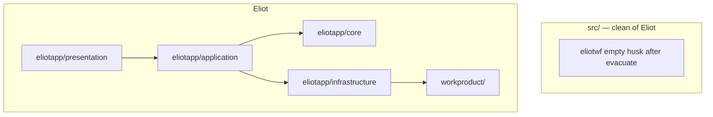

# Eliot → eliotapp (src stays clean)

## Locked

1. **`src/` has no Eliot.** Not `src/eliotwf/`, not `src/eliotwf_skills/`, not any other `src/**` path as an Eliot home.
2. **Eliot code** = root **`eliotapp/`** (`core` / `application` / `infrastructure` / `presentation`).
3. **Eliot data** = root **`workproduct/`**.
4. **`.cursor/skills/`** = cognitive prose + thin scripts.
5. **Rules gate first:** [eliotapp_rules_gate](eliotapp_rules_gate_fca58b8f.plan.md).
6. Pure math → `eliotapp.core`; folder I/O → WorkProduct spoke.

```text
src/eliotwf/           # NO ELIOT — evacuate UI, then delete or leave empty husk
src/eliotwf_skills/    # NO ELIOT — delete after evacuate

eliotapp/              # ALL Eliot code
workproduct/           # ALL Eliot run/style-block artifacts
.cursor/skills/        # prose
```



## Phases (after rules gate)

1. Skeleton `eliotapp/` layers  
2. `workproduct/` + path defaults  
3. Spokes  
4. Evacuate engine from `src/eliotwf_skills` → `eliotapp`  
5. Evacuate Eliot UI from `src/eliotwf` → `eliotapp/presentation`  
6. Packaging + runtime plumbing (see below)  
7. Test-import sweep + hooks  
8. Remove Eliot from `src/`; shims only if needed briefly; pytest  

## Packaging + runtime plumbing (audit 2026-07-15 — was missing)

`pyproject.toml` today: `[tool.setuptools.packages.find] where = ["src"]`. A root `eliotapp/` package is invisible to `pip install -e .` and to `PYTHONPATH=src`. Everything below hardcodes the old layout and must change in one phase:

| Artifact | Today | After |
|----------|-------|-------|
| `pyproject.toml` | `where = ["src"]` | Add root package: `packages.find` include `eliotapp*` with `where = [".", "src"]` or explicit `[tool.setuptools.package-dir]` |
| `.github/workflows/test.yml` | `PYTHONPATH: src` | `PYTHONPATH: .;src` (or rely on editable install); prefer pyproject `[tool.pytest.ini_options] pythonpath = [".", "src"]` |
| `tools/start-eliotwf.ps1` | `PYTHONPATH=src`, `eliotapp.presentation.app:app` | repo root on path, `eliotapp.presentation.app:app` |
| `.cursor/hooks/run_tests_on_stop.py` | `PYTHONPATH = root/src` | include repo root |
| `.cursor/hooks/validate_skills_module.py` | imports `eliotwf_skills.*`, path-checks `src/eliotwf_skills` | imports `eliotapp.*`, path-checks `eliotapp/` |
| `.cursor/scaffold/manifest.json` | `uvicorn_target: eliotapp.presentation.app:app` | `eliotapp.presentation.app:app` (or drop if Eliot leaves scaffold manifest) |
| AGENTS.md / STATE.md verify commands | `PYTHONPATH=src` | updated invocation |

## Test-import sweep

~34 files under `tests/` import `eliotwf` / `eliotwf_skills`. Evacuation phases update them alongside the modules they cover — not as a big-bang rename at the end. CI must be green at each phase boundary (temporary re-export shims in old locations are acceptable mid-migration only).

## Migration honesty notes (audit)

- **`src/eliotwf/` end state:** today it is 100% Eliot web UI. After evacuation it is an **empty husk** — delete it (or leave `src/` empty until a future non-Eliot product is scaffolded there). Do not pretend a "finished product shell" remains; nothing non-Eliot exists in it today.
- **Legacy run folders contain Python:** 41 `.py` scripts live inside `tools/runs/**` (experiment one-offs). The "no Python under `workproduct/`" rule applies to **new** artifacts; when legacy runs migrate, either archive their scripts to `tools/drafts/` or exempt migrated-legacy folders explicitly in ADR 005.
- **Branch strategy:** Hooks/SDK climb is **merged to `master`** (2026-07-16; see `handoff/HOOKS-SDK-PASSED.md`). Branch rules gate + this restructure off **current `master`**. Do not reopen `hooks-sdk-phase-1`.

## Out of scope

- Cut-and-scaffold that puts Eliot under `src/`  
- Treating `src/eliotwf` as Eliot product home  
