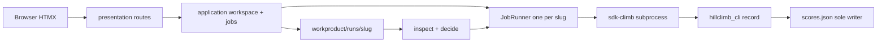

# Full-workflow local webapp

## Poteto chain audit (2026-07-17)

Honest score against `poteto-mode` multi-phase plan + architect + principles.

**Done correctly**
- Playbook: multi-phase plan (not Feature). Architect Arena with three radical UX constraints.
- Explorers: [presentation](cc7485a7-6a94-41ff-a971-95730fdeebaf), [job seams](a44e95c2-20a2-43ea-996f-da7124599865) as `poteto-agent`.
- Arena: [Studio](95ec11e1-9f97-4f33-920d-be1af134962d), [Cockpit](c6eaeb02-6585-4707-be5c-4c87f3f14302), [Canvas](05c78d79-6989-4505-a227-4d7be31feb00).
- Product forks asked only when preference (1A/2A). Empirical UX deferred to Phase 1 prototype.
- Scope in/out, synthesis with grafts, control-ui + interrogate named in guidance.
- Leaf principles read for this audit: experience-first, exhaust-the-design-space, laziness-protocol, separate-before-serializing-shared-state, model-the-domain, foundational-thinking, redesign-from-first-principles.

**Gaps found (remediated below or on execute)**
1. Plan format. Poteto wants `NN-slug/overview.md` + per-phase files for 3+ phases. This file is a single Cursor CreatePlan overview. Todo `poteto-plan-dir` splits on execute.
2. Phase sizing. Original phases 2/5/6 touched too many concerns. Split into 2a/2b, 5a/5b, 6a/6b below.
3. Leaf principles. First draft cited Laziness / Separate / Model without reading those leaves. Now read; citations still hold.
4. Exhaust vs Prototype. Arena sketches exhausted *architecture*. Living HTML switcher is still Phase 1 (not done yet). Correct sequencing for a plan deliverable.
5. Architect Phase A. Used explorers + prior sdk-climb how-explain; did not re-run full `how` Critique on presentation. Acceptable. Re-run how before Phase 3 edit if implementer is cold.
6. Missing Constraints section. Added below.
7. Hand-back. This audit + summary is step 7. Stop until you say execute.

## Context

Today the Starlette/HTMX shell stages files then ejects to Cursor for analyze and climb ([Explore presentation UX seams](cc7485a7-6a94-41ff-a971-95730fdeebaf)). Mutation already exists as `tools/sdk-climb.py` + hillclimb CLI ([Explore job backend seams](a44e95c2-20a2-43ea-996f-da7124599865)). You locked **local single operator** and **full chain in browser**.

## Scope

**In**
- Browser journey: brainstorm → author/passage → analyze → optional invent seeds → hillclimb → pick best draft
- Starlette + HTMX + Jinja (extend [`eliotapp/presentation/`](eliotapp/presentation/), [`tool-ui-htmx`](.cursor/skills/tool-ui-htmx/SKILL.md))
- Background jobs that spawn SDK climb / sibling drivers; one active job per slug
- Human story progress; style-fidelity visibility while climbing
- Fix `open_preference_job` missing import in [`tools/sdk-climb.py`](tools/sdk-climb.py)

**Out**
- Multi-user SaaS, accounts, remote deploy
- Replacing `decide()` / inventing a second climb engine on HTTP
- SPA / React rewrite

## Constraints

- Local only. `CURSOR_API_KEY` + `pip install -e ".[sdk]"` on the box.
- Hillclimb mutation stays CLI/SDK-owned. HTTP queues and observes.
- One active job per slug. No second writer on `scores.json` (ownership, not a polite lock).
- Keep Starlette + HTMX + Jinja. No SPA default.
- Dual-read migrate: align `--runs-base` with `WorkProductLocator`; prefer per-run ledger over global `.sdk-climb-last.json` for UI truth.
- Redesign as if the webapp were day-one (*redesign-from-first-principles*), deliver in thin phases (*foundational-thinking*).

## Synthesis (architect arena)

Three candidates compared:

| Candidate | Metaphor | Strength | Weakness for 2A |
|-----------|----------|----------|-----------------|
| [Guided Studio](95ec11e1-9f97-4f33-920d-be1af134962d) | Linear story | Calm first-run | Hide climb signal; wizard chrome after day one |
| [Run Cockpit](c6eaeb02-6585-4707-be5c-4c87f3f14302) | Operator desk | Pause/resume, sparkline, ledger | Dense for first-time invent/analyze |
| [Document Canvas](05c78d79-6989-4505-a227-4d7be31feb00) | Run folder as workspace | Drafts as product; continuous edit loop | Cold start without guidance |

**Chosen base: Document Canvas.** Graft Studio onboarding for empty runs. Graft Cockpit climb strip (sparkline, pause/resume, driver ledger). Shared rule from all three: HTTP never writes `scores.json`; one worker per slug; `inspect`/`decide` stays traffic cop.

**Principles that drove this pick.** *Experience First* chose the document loop over a permanent wizard. *Exhaust the Design Space* required the three sketches before committing. *Laziness* wraps sdk-climb instead of reimplementing climb on HTTP. *Separate Before Serializing Shared State* gives browser (revisions + queue flag) and SDK (scores/jobs/drafts) different writers. *Model the Domain* centers `ArtifactTree`, `ActiveDoc`, `JobRail`, `DriverLedger`.

## UX shape (shipped product)

**Home.** List of workspaces (extend [`run_index`](eliotapp/application/run_index.py)). New piece starts empty-run onboarding (Studio steps 1–4 as a short path into the canvas).

**Workspace shell** (`GET /runs/{slug}` redesigned, not tabs-only).
- Left: `ArtifactTree` (rough input, discovery, excerpt, style block, drafts with lineage)
- Center: `ActiveDoc` (HTMX swap; markdown edit for human-owned docs; generated drafts fork on edit)
- Right: `JobRail` (one job; story headlines mapped from `next_action`)
- Climb strip when `scores.json` exists: style-fidelity sparkline, Pause / Resume / Step (Cockpit)

**Jobs.** `POST /runs/{slug}/jobs` queues intent (`distill` | `analyze` | `write_seeds` | `improve`). Atomic reject if non-terminal job exists. Worker binds generation id + input revision.

**Product.** Best draft pick writes a human choice marker / `best-draft.md` copy; does not rewrite score history.

## Data structures (foundational)

- `ArtifactTree` / `ArtifactNode` / `ActiveDoc` / `JobRail` / `JobRequest` (Canvas)
- `DriverLedger` + append-only `driver/events.jsonl` under the run (Cockpit)
- `studio-state` only for empty-run onboarding phase index (migrate from `wizard-state.json`)
- Progress for UI: per-run job + ledger (stop hardcoding sole reliance on global `tools/runs/.sdk-climb-last.json`)

## Alternatives rejected

- HTTP calling hillclimb_cli / Agent inside the request: timeout and dual-writer risk
- SPA cockpit: unearned stack change vs existing HTMX
- Permanent linear wizard after day one: fights the draft-centric product
- Mutable single `draft.md`: destroys score provenance

## Phases (shippable increments)

Each phase: pytest green where code lands + `control-ui` on `.\tools\start-eliotwf.ps1` for UI phases. Prefer 2–3 files per phase (*foundational-thinking* option value).

0. **Plan dir split (on execute).** Write `.cursor/plans/archive/full_workflow_webapp/{overview,phase-*.md,testing}.md` from this overview.

1. **Throwaway UX prototype.** `tools/drafts/webapp-ux-proto/` three-way switcher (Studio / Cockpit / Canvas+strip). Screenshots via control-ui. Confirm Canvas base before production templates.

2a. **Job ledger types.** `JobRequest`, `DriverLedger`, atomic one-job-per-slug store under the run. No subprocess yet.

2b. **Spawn + import fix.** Subprocess `sdk-climb.py` with locator-aligned `--runs-base`; fix `open_preference_job` import; extend fixture tests.

3. **Read-only Document Canvas.** Tree + active doc + empty rail from disk; HTMX center swap; works without `scores.json`.

4. **Onboarding.** Empty-run Studio-lite into canvas (reuse [`pipeline_wizard`](eliotapp/application/pipeline_wizard.py)).

5a. **Improve queue.** `POST` improve + JobRail story poll mapped from `decide()`.

5b. **Climb strip.** Style-fidelity sparkline + cooperative pause / resume / step.

6a. **Analyze job** on the same queue protocol (paste/upload fallback stays).

6b. **Invent / write_seeds job.** No `scores.json` until explicit climb start.

7. **Pick best + polish.** Deliverable copy; tool-ui-htmx empty/error/loading; Cursor handoff not happy path.

8. **Interrogate + ship.** Adversarial review on job boundary; handoff / WORKFLOW / WEB-UI gate; PR + babysit.

## Verification

- Static: `pytest` (presentation + sdk-climb + new job_runner tests)
- Runtime: control-ui against local `:8000` — create run, stage passage, start improve on fixture, see story + new draft, pause/resume, pick best
- Prove disk: only CLI/SDK writes `scores.json`; HTTP writes revisions + job request/ledger only

## Implementation guidance (poteto)

- **how** before editing unfamiliar climb/presentation subsystems
- **architect** sketch already synthesized; scrap and re-arena if fill-in produces repeated friction
- **interrogate** on contested job-boundary before phase 8 merge
- **control-ui** for every UI phase
- **/deslop** + **unslop** before commit
- **show-me-your-work** decision trail for this multi-phase effort
- **babysit** after PR open

## Applicable skills

`tool-ui-htmx`, `control-ui`, `pipeline` / `workflow` / `evaluator` (behavior contracts), poteto `architect` / `interrogate` / `prototype` as named above.
