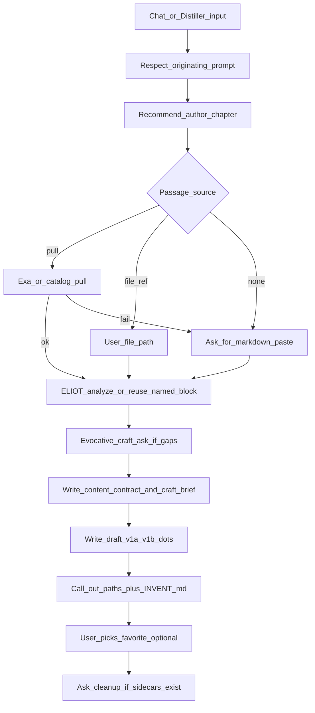

# Invent seeds flow (skill-first v1)

## Goal

Restore the useful Distiller→ELIOT path as an **invent** session: new work under a suited voice, not pastiche/lost-chapter by default, and not buried only in chat.

Decisions already locked in [handoff/DISTILLER-BOARD-MAP.md](handoff/DISTILLER-BOARD-MAP.md) (Hybrid invent flow). This plan implements them as agent SOP + thin Python contracts.

**v1 surface:** Cursor skills + run folders. Web wizard / frontend entry is **phase 2** (catalog notes only in v1). Preference/discrimination stay out.

**Activation phrases:** invent, invent seeds, write N seeds from Distiller content, new piece in X’s voice from this payload.

## Plan review (2026-07-10) — gaps fixed below

Checked against hybrid decisions + repo contracts. Issues found and absorbed into this plan:

1. **Passage sources incomplete** — decisions allow referencing a file in/out of repo, not only Exa/catalog/paste.
2. **`content-brief` writer wrong** — must use [`content_contracts.py`](src/eliotwf_skills/workflow/content_contracts.py) (`render_content_brief` / `write_content_contract` + `passage-meta.json`), not `write_craft_brief`. [`build_draft_inputs`](src/eliotwf_skills/workflow/draft_inputs.py) refuses a brief whose hash does not match `passage-meta.json`.
3. **`INVENT.md` “best”** — with no scoring, list seed paths; set `best` only after the user picks (or leave unset).
4. **Cleanup** — invent v1 creates few resume sidecars; cleanup ask is light. Full job/score cleanup matters if they later promote to hillclimb.
5. **ADR 001** — invent artifacts (`INVENT.md`, `style-block-id.txt`, `tools/style-blocks/`) need a short ADR note.
6. **Craft ask** — skip when the originating prompt already answers N / feel / storyline; only ask what is missing.
7. **emulate-drafter** — parent passes `output_path=draft-v1a.md` (etc.); no agent rewrite required beyond invent posture in eliot skill.

## Target flow

## Run folder contract (one slug)

Under `tools/runs/<slug>/` (invent session):

| Artifact | Role |
|----------|------|
| `rough-input.md` | Distiller/chat input |
| `thematic-payload.sexp` | Ideas (optional if content brief fully stated in chat) |
| `discovery.json` | Author/passage candidates (existing validator) |
| `source-excerpt.md` | Pulled, file-copied, or pasted passage (200–2000 words) |
| `passage-meta.json` | Required with content brief (existing contract) |
| `style-block.md` | Active block for this run |
| `style-block-id.txt` | Durable id, e.g. `pretty_horses_ch1` |
| `content-brief.md` | Via `write_content_contract` / `render_content_brief` from chat + payload |
| `craft-brief-v1.md` | Via `write_craft_brief` from craft ask / prompt |
| `draft-v1a.md` … | Seed drafts (N from prompt, else ask) |
| `INVENT.md` | Index: style-block id, seed paths, optional `best` after user pick |

No `scores.json` / job board in v1 unless the user later asks to promote into hillclimb.

## Style-block library

- Store reusable blocks at [`tools/style-blocks/<id>.md`](tools/style-blocks/) (new tree; `.gitkeep` + short README). Commit useful blocks when the user wants them shared; no blanket gitignore.
- Id rule: lowercase `author_work_loc`, abbreviated, e.g. `br_kamarov_bk3_3`, `pretty_horses_ch1`.
- Thin Python in [`src/eliotwf_skills/distiller/`](src/eliotwf_skills/distiller/): `style_block_id(...)` + install into run (`style-block.md` + `style-block-id.txt`). Reuse library file when id exists and user did not force re-analyze; otherwise ELIOT analyze → write library file + run copy.
- Small tests in `tests/` for id slugify and copy-into-run.

## Skill / agent changes (main work)

1. **[`.cursor/skills/pipeline/SKILL.md`](.cursor/skills/pipeline/SKILL.md)**  
   Add session type `invent`: Distiller (or accept existing payload) → resolve_passage (Exa / catalog / **file ref** / paste) → analyze-or-reuse named style block → craft ask if gaps → `write_content_contract` + `write_craft_brief` → N× `emulate-drafter` with `output_path=draft-v1{suffix}.md`. Stop before hillclimb/jobs.

2. **[`.cursor/skills/distiller/SKILL.md`](.cursor/skills/distiller/SKILL.md) + refs**  
   - Originating prompt constraints override Exa query templates ([`exa-discovery.md`](.cursor/skills/distiller/references/exa-discovery.md)).  
   - Recommend best + list a few probables when search returns options.  
   - Fall through: no usable open text → ask for markdown paste; honor explicit file paths when given.  
   - Soften “emulation prompts = pastiche” toward “payload + craft direction → seeds.”

3. **[`.cursor/skills/eliot/SKILL.md`](.cursor/skills/eliot/SKILL.md) + workflows**  
   Invent emulate posture: style block + content brief + craft brief → new piece; do not default to lost-chapter/pastiche. Point at [`emulate-drafter`](.cursor/agents/emulate-drafter.md) + [`draft_inputs.py`](src/eliotwf_skills/workflow/draft_inputs.py) / [`content_contracts.py`](src/eliotwf_skills/workflow/content_contracts.py).

4. **Craft ask protocol** (new short ref under pipeline)  
   Before first seed: ask only for missing pieces (feel / example / storyline / N / register) in plain evocative language. If the originating prompt already specifies them, do not re-ask. Persist into content contract + `craft-brief-v1.md`.

5. **Surface + cleanup**  
   After seeds: call out repo-relative paths in chat; write `INVENT.md` (seeds listed; `best` only after user pick). Cleanup ask only if tracking sidecars exist; never delete drafts, briefs, style block, payload, `INVENT.md` without confirmation.

6. **Handoff + ADR**  
   Update [`handoff/PIPELINE-UI-CATALOG.md`](handoff/PIPELINE-UI-CATALOG.md) with `invent` (UI phase 2). Update [`docs/adr/001-run-persistence.md`](docs/adr/001-run-persistence.md) for invent artifacts + `tools/style-blocks/`. Point [`handoff/DISTILLER-BOARD-MAP.md`](handoff/DISTILLER-BOARD-MAP.md) next moves here. Light touch on [`handoff/STATE.md`](handoff/STATE.md) / [`handoff/README.md`](handoff/README.md).

## Out of scope (v1)

- Preference / discrimination / seed-promote scoring.
- New pipeline wizard HTMX steps (phase 2).
- Auto-deleting files without an explicit user yes.
- Changing ELIOT analyze math or Distiller payload field set.

## Verification

- Unit tests for style-block id + library copy.
- Manual dogfood checklist in handoff: Distiller-ish input → constrained author/chapter → pull **or file ref or paste** → craft ask only if gaps → 3 seeds → paths + `INVENT.md` → user picks favorite.
- Confirm `build_draft_inputs` succeeds on the invent folder after content contract write (even without `scores.json`).
- Existing distiller/discovery validators still pass.