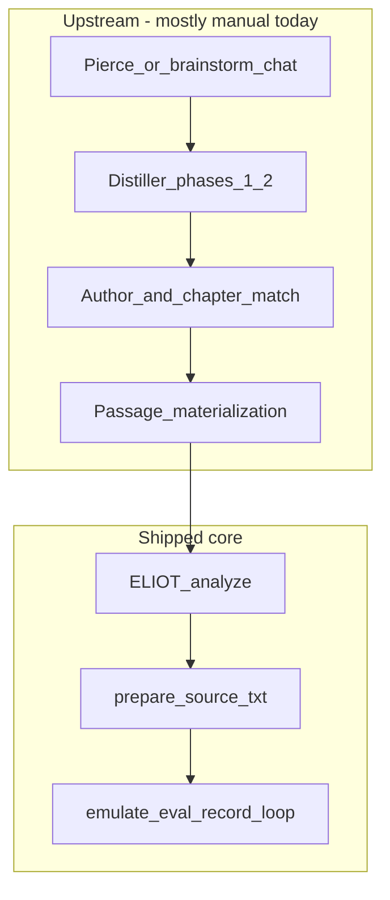
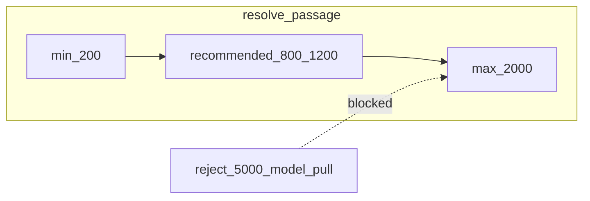
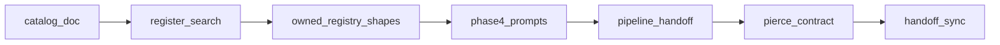

# Pre-UI full pipeline workflow

## Problem

Today the product ships **hillclimb-from-source** (`/hillclimb`, [workflow skill](.cursor/skills/workflow/SKILL.md)) and **distiller phases 1–3** ([distiller skill](.cursor/skills/distiller/SKILL.md), smoke at `tools/runs/distiller-smoke/`). The owner's real workflow is longer and was only partially automated:



Gaps blocking a honest Web UI later:

| Gap | Impact |
|-----|--------|
| Author search biased to classical + public-domain Exa | Technical/spiritual topics degrade |
| No owned-corpus fallback when Exa fails | Modern books (Fowler, Butterfield) unreachable |
| Distiller phase 4 emulation prompts deferred | No copy-paste bridge from payload to ELIOT emulate |
| No register routing | One prompt cannot serve literary vs tutorial vs essay |
| Pierce upstream not contracted | UI cannot know what to capture from brainstorm |
| [PassageCandidate](src/eliotwf_skills/distiller/shapes.py) only has `source_url` | Cannot record local owned paths |
| [CONTEXT.md](CONTEXT.md) / [WORKFLOW.md](handoff/WORKFLOW.md) stale | Distiller marked "not built"; steps 1–3 still "separate sessions" |

**Out of scope for this plan:** Web UI routes, HTMX, Pierce Flask app port, EPUB/PDF auto-ingest, Cursor automation (phase 7), draft-merge crossover.

---

## Deliverable 0 — UI provisioning catalog (write first)

Create **[handoff/PIPELINE-UI-CATALOG.md](handoff/PIPELINE-UI-CATALOG.md)** as the durable spec the Web UI team reads later. One section per provisioned surface:

- **Brainstorm input** — Pierce transcript export, `rough-input.md`, or pasted topic
- **Register** — `literary | technical | essay | philosophical` (drives author-search template)
- **Distiller artifacts** — `discovery.json`, `thematic-payload.sexp`, phase-4 emulation prompts
- **Source provenance** — `web` (Exa URL) vs `owned` (catalog entry + local path)
- **Owned corpus registry** — external paths via [sources/catalog.json](sources/catalog.json) (schema only in repo; files live on disk)
- **ELIOT inputs** — passage markdown (sloppy OCR tolerated), **200–2000 words** after `resolve_passage`, output `style-block.md`
- **Hillclimb run folder** — existing ADR 001 layout (`source.txt`, `calibration.json`, `cast-aliases.json`, `scores.json`, drafts)
- **Session types** — distiller-only run vs full pipeline run vs hillclimb-only (chapter extension)

Update [CONTEXT.md](CONTEXT.md) glossary (Distiller shipped; add Register, OwnedCorpus, SourceProvenance, PipelineRun, PassageBounds).

---

## Passage length policy (`resolve_passage`)

**Owner policy:** hard bounds **200–2000** (reject model tendency toward ~5000); sweet spot **800–1200** for ELIOT dense style-block quality.

| Tier | Words | Role |
|------|-------|------|
| **Hard minimum** | 200 | Floor for all resolved passages |
| **Recommended (ELIOT analyze)** | 800–1200 | Empirical sweet spot for dense style-block quality |
| **Hard maximum** | 2000 | Cap for `resolve_passage`; reject model defaults toward 5000 |
| **prepare calibration floor** | 800 | [prepare.py](src/eliotwf_skills/workflow/prepare.py) `MIN_WORDS` — excerpts 200–799 may analyze without prepare |

**Repo alignment audit:**

| Location | Current | Target |
|----------|---------|--------|
| [exa-discovery.md](.cursor/skills/distiller/references/exa-discovery.md) step 4 | **200–800** | **200–2000**; target 800–1200 |
| [input-detection.md](.cursor/skills/eliot/references/input-detection.md) | AnalyzeMode **300+** soft | Hard floor **200** at `resolve_passage` |
| `PassageCandidate` in [shapes.py](src/eliotwf_skills/distiller/shapes.py) | no `word_count` | Optional `word_count`, validated 200–2000 |
| Scorer corpus `WORD_CAP=3000` | unrelated | Leave alone (evaluator margins) |



**Implementation (Phase 2 + 4):**

- Add [passage_bounds.py](src/eliotwf_skills/distiller/passage_bounds.py): `MIN_PASSAGE_WORDS=200`, `MAX_PASSAGE_WORDS=2000`, `RECOMMENDED_MIN=800`, `RECOMMENDED_MAX=1200`
- [discover_format.py](.cursor/skills/distiller/scripts/discover_format.py) validates `word_count`; tests: 199 fails, 200 passes, 2001 fails
- [exa-discovery.md](.cursor/skills/distiller/references/exa-discovery.md) step 4: extract 200–2000 (target 800–1200; never 5000)
- **prepare alignment (ADR 002):** recommend path **A** — `prepare` keeps `MIN_WORDS=800`; pipeline calls ELIOT directly on `source-excerpt.md` when excerpt is 200–799 words (YAGNI unless hillclimb must run on sub-800 excerpts)
- UI catalog: green 800–1200; yellow 200–799 and 1201–2000; red block above 2000

---

## Phase 1 — Register-aware author search

**Goal:** Replace implicit classical bias with explicit register routing before author/chapter suggestions.

**Skill changes** ([distiller/references/](.cursor/skills/distiller/references/)):

- New `register-detection.md` — infer register from thematic payload + brainstorm signals; one-line declaration required before phase 3
- Split author guidance:
  - `author-matching-literary.md` (existing criteria, classical examples)
  - `author-matching-technical.md` (tutorial voice, pedagogy, clarity; Butterfield-class matches)
  - `author-matching-essay.md` (argument, spiritual/philosophical register)
- Update [author-matching.md](.cursor/skills/distiller/references/author-matching.md) to route by register
- Update [exa-discovery.md](.cursor/skills/distiller/references/exa-discovery.md): public-domain Exa is **preferred**, not exclusive; on weak/no results emit `passage_resolution: needs_owned_corpus` (see Phase 2)

**Verification:** Agent smoke on three fixture topics (literary, technical-tutorial, essay) producing distinct author lists; no code change to shapes yet.

---

## Phase 2 — Owned corpus registry (external paths)

**Goal:** When Exa cannot supply prose, distiller still names author/work/location; human or agent resolves text via a catalog.

**Registry** (committed schema, user-owned content off-repo):

```
sources/
  catalog.schema.json    # JSON Schema for entries
  catalog.json.example   # Butterfield-style example (paths are placeholders)
```

**Entry shape** (each catalog row):

- `id` — stable slug (`butterfield-ml-c64`)
- `author`, `work`, `register` — match distiller output
- `locations` — `[{ "label": "Ch 7 — addressing modes", "path": "C:/Books/..." }]`
- `notes` — optional voice description for author-search prompts

User's real [catalog.json](sources/catalog.json) is **gitignored** (add to `.gitignore`); only example committed.

**Shape extension** in [shapes.py](src/eliotwf_skills/distiller/shapes.py):

```python
# PassageCandidate additions
provenance: Literal["web", "owned", "manual"]
local_path: str | None          # absolute path when provenance=owned
catalog_id: str | None        # links to catalog entry
word_count: int | None         # after resolve_passage; must be 200–2000 when set
```

- `source_url` remains optional (null when owned)
- [discover_format.py](.cursor/skills/distiller/scripts/discover_format.py) validates: owned requires `catalog_id` or `local_path`; web requires `source_url`; `word_count` in 200–2000 when set

**Skill protocol** ([distiller/SKILL.md](.cursor/skills/distiller/SKILL.md)): new step after Exa — `resolve_passage`: lookup catalog by author/work/location; slice to **200–2000 words** (prefer 800–1200); if hit, set provenance `owned` and `local_path`; record `word_count`; else instruct human to paste excerpt into run folder.

**Verification:** Extend [tests/test_distiller.py](tests/test_distiller.py) — owned passage fixture validates; web fixture unchanged; `word_count` boundary tests (199/200/2001).

**ADR:** Add [docs/adr/002-owned-corpus-registry.md](docs/adr/002-owned-corpus-registry.md) — external registry, no auto-scan, manual placement of markdown, legal boundary, prepare vs analyze path for excerpts 200–799 words.

---

## Phase 3 — Distiller phase 4 (emulation prompts)

**Goal:** Ship STEP 4 from [ELIOT_DISTILLER_v1_2_1.md](eliotworkflow/ELIOT_DISTILLER_v1_2_1.md) — numbered emulation prompts per author candidate, usable before analyze.

**Add** [distiller/references/emulation-prompts.md](.cursor/skills/distiller/references/emulation-prompts.md) (deferred section in [output-format.md](.cursor/skills/distiller/references/output-format.md) moves here).

**Skill:** Bump distiller to v1.1; protocol-2 adds `phase-4-emulation-prompts`; output order: STYLE CANDIDATES → EMULATION PROMPTS → THEMATIC PAYLOAD last.

**Optional sidecar:** `emulation-prompts.json` in distiller run folder (UI catalog documents it).

**Gate:** Analyze path is proven (Rilke E2E, Dostoevsky gate) — prerequisite satisfied.

**Verification:** Smoke on `distiller-smoke` topic; validate prompts reference payload facets, not style texture.

---

## Phase 4 — Passage-to-hillclimb handoff

**Goal:** Document and minimally wire the chain from resolved passage to existing hillclimb engine (no new Python loop module unless needed).

**Contract** (add to [handoff/PIPELINE-UI-CATALOG.md](handoff/PIPELINE-UI-CATALOG.md) and [workflow skill](.cursor/skills/workflow/SKILL.md) as `protocol-0-upstream` or new thin **[pipeline skill](.cursor/skills/pipeline/SKILL.md)**):

1. Distiller run complete (`discovery.json` + payload + optional emulation prompts)
2. **Resolve passage** — Exa fetch OR read `local_path` from catalog; slice to **200–2000 words** (target **800–1200**; never 5000)
3. Write excerpt to run staging: `tools/runs/<slug>/source-excerpt.md` then `prepare --source` (or copy → `source.txt`; excerpts 200–799 may skip prepare for analyze-only)
4. ELIOT analyze → `style-block.md`
5. `init` + existing protocol-2 loop (emulate with payload / phase-4 prompt as retry-brief seed)

**Reuse:** [prepare.py](src/eliotwf_skills/workflow/prepare.py) already accepts any external path; no EPUB automation.

**ELIOT note:** Add short guidance in [eliot/references/](.cursor/skills/eliot/references/) for analyzing sloppy OCR markdown (headers optional, focus on prose texture).

**Verification:** One end-to-end manual run documented in `handoff/PIPELINE-SMOKE-PASSED.md` using owned-corpus fixture path (can use small committed excerpt under `tests/fixtures/` for CI; real Butterfield path in local catalog only).

---

## Phase 5 — Pierce / brainstorm interface (contract only)

**Goal:** Do not port [piercee4.5deep.py](eliotworkflow/piercee4.5deep.py) into the product; define the handoff Pierce → distiller.

**Document in UI catalog:**

- Input artifact: `rough-input.md` or exported chat transcript (ADR 001 distiller layout already has `rough-input.md`)
- Trigger: user declares "ready to distill" after NARRATIVE_SYNTHESIS or equivalent
- Pierce remains in `eliotworkflow/` reference; optional future skill wrapper is Web UI phase

**Distiller activation** ([activation.md](.cursor/skills/distiller/references/activation.md)): accept multi-turn transcript, not only single paste.

---

## Phase 6 — Plan and handoff sync

- Mark distiller phase 4 + pipeline work in [eliot_workflow_build.plan.md](.cursor/plans/eliot_workflow_build.plan.md) (phase 4 distiller → in progress, new `phase-pipeline` todo)
- Update [handoff/STATE.md](handoff/STATE.md) — current phase = **pre-UI pipeline**; Web UI v2 waits on this
- Update [handoff/README.md](handoff/README.md) deferred table
- Cross-link catalog from [AGENTS.md](AGENTS.md)

---

## Suggested implementation order



Each phase ends with pytest green + a short gate note in `handoff/`.

---

## What the Web UI inherits (summary)

Without building UI now, this plan leaves explicit contracts for:

| UI screen / action | Backend contract |
|--------------------|------------------|
| New project / brainstorm | Import transcript → `rough-input.md` |
| Register picker | Override or confirm auto-detected register |
| Author candidates | Render `discovery.json` authors[] |
| Passage resolution | Exa URL vs catalog picker vs upload excerpt; **word count 200–2000**, highlight 800–1200 |
| Catalog manager | CRUD on `sources/catalog.json` entries (paths outside repo) |
| Analyze | ELIOT on resolved excerpt → `style-block.md` |
| Hillclimb | Existing `hillclimb_runs` + run folder |
| Run list | Filter by `session_type` + slug (ADR 001 extension later) |

---

## Risks and constraints

- **Passage too short/long** — enforce 200–2000 at `resolve_passage`
- **Sloppy OCR** — ELIOT analyze quality varies; catalog `notes` should flag known-good chapters
- **Absolute paths** — catalog entries break on machine move; UI should allow re-pointing
- **Copyright** — registry documents user-placed excerpts only; no scraping automation
- **Register misclassification** — allow manual override in catalog and distiller run metadata
