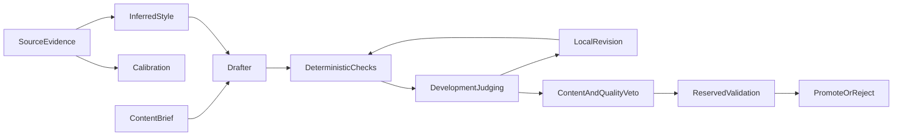

# Reverse-engineering quality master plan

## Purpose and precedence

This is a master planning artifact, not an implementation plan. A worker must derive and approve one child phase plan before changing code.

This plan becomes the active quality-evidence track. It supersedes the strict next-deliverable order in [handoff/STATE.md](../../handoff/STATE.md) for work covered here. It absorbs unfinished run-integrity and hook concerns. The Cursor SDK driver, cloud scheduling, and draft merge remain deferred until the benchmark gate has produced trustworthy evidence.

The governing objective is:

> Maximize blind held-out style fidelity, subject to content correctness, general prose non-regression, originality, and a fixed evaluation budget.

Do not collapse those conditions into one weighted score.

## Verified starting point

A fresh read-only audit verified these premises against current code and artifacts:

- ELIOT's inferred [style block](../skills/eliot/references/output-format.md) and Python's [calibration](../../src/eliotwf_skills/evaluator/calibration.py) are separate representations derived from the same source.
- [loop.py](../../src/eliotwf_skills/workflow/loop.py) can persist a provisional total-based stop before discrimination is attached. Consumers must not treat an iteration as complete until the binding discrimination result exists.
- The current `held-out.txt` is tuning evidence because discrimination tells feed later retry briefs. It is not untouched final validation.
- [pairwise.py](../../src/eliotwf_skills/evaluator/pairwise.py) is an anchor-relative style comparator. It cannot become a general prose-quality veto without new questions and validation.
- [ADR 001](../../docs/adr/001-run-persistence.md) and current run files lack immutable content lineage. Force reinitialization can leave stale sidecars from another run generation.
- `tools/runs/aa-hc-3iter/` is forensic evidence only. Its comparator changed and its histories overlap. Do not use it as the clean baseline.

## Target control flow

Friction follows uncertainty. Cheap checks reject obvious failures. Development judging may guide revision. Content and quality vetoes protect the incumbent. Reserved validation runs once after the configuration is frozen and never produces another retry brief.

## Child-plan contract for lighter models

Every child phase must:

- Deliver one behavior change through one named seam.
- Touch at most two runtime modules, one CLI or agent contract, one focused test file, and two documentation files. Split again if this limit is exceeded.
- A paired drafter interface may update both `emulate-drafter.md` and `revise-drafter.md` in one phase only when their input schema, precedence rule, and forbidden evidence list remain identical.
- State exact prerequisites, read-first files, files allowed to change, and files forbidden to change.
- Begin with a failing focused test when behavior changes.
- End with one binary, artifact-backed gate and a short handoff record.
- Run focused tests during development and `$env:PYTHONPATH="src"; python -m pytest tests/ -q` before claiming the phase complete.
- Avoid live model calls in the phase that first defines a judging instrument. Validate mechanics with fixtures first; run live evidence in a later experiment-only phase.
- Stop on a failed gate. Record the finding and derive a corrective child phase instead of widening scope.
- Leave unrelated historical run folders untouched.

Each child plan must use this section order: Goal; Prerequisites; Read first; In scope; Out of scope; Files; Test-first steps; Gate; Handoff; Stop conditions.

## Numbered child plans

Run these in order. A later plan may start only when the prior handoff exists and its hashes reproduce.

1. [Reverse-engineering phase 1](reverse-engineering-phase-01.plan.md) — baseline and protocol freeze.
2. [Reverse-engineering phase 2](reverse-engineering-phase-02.plan.md) — run inspection and invariants.
3. [Reverse-engineering phase 3](reverse-engineering-phase-03.plan.md) — generation-bound transitions and recovery.
4. [Reverse-engineering phase 4](reverse-engineering-phase-04.plan.md) — content-brief and provenance contracts.
5. [Reverse-engineering phase 5](reverse-engineering-phase-05.plan.md) — separate content and craft inputs.
6. [Reverse-engineering phase 6](reverse-engineering-phase-06.plan.md) — development and reserved-evidence roles.
7. [Reverse-engineering phase 7](reverse-engineering-phase-07.plan.md) — development freeze and post-validation lock.
8. [Reverse-engineering phase 8](reverse-engineering-phase-08.plan.md) — content-adherence veto mechanics.
9. [Reverse-engineering phase 9](reverse-engineering-phase-09.plan.md) — general prose-quality veto mechanics.
10. [Reverse-engineering phase 10](reverse-engineering-phase-10.plan.md) — fixture-tested benchmark runner.
11. [Reverse-engineering phase 11](reverse-engineering-phase-11.plan.md) — clean benchmark population and lock.
12. [Reverse-engineering phase 12](reverse-engineering-phase-12.plan.md) — fixture-only dry run.
13. [Reverse-engineering phase 13](reverse-engineering-phase-13.plan.md) — live quality smoke, development experiment, and freeze.
14. [Reverse-engineering phase 14](reverse-engineering-phase-14.plan.md) — one-time reserved validation.
15. [Reverse-engineering phase 15](reverse-engineering-phase-15.plan.md) — scoped multi-passage pilot.
16. [Reverse-engineering phase 16](reverse-engineering-phase-16.plan.md) — offline staged-evaluation replay.
17. [Reverse-engineering phase 17](reverse-engineering-phase-17.plan.md) — conditional adaptive stopping.

## Workstream 0: freeze the experiment before implementation

### Phase 0: baseline and protocol freeze

Create the child plan that defines the baseline commit and workflow versions, model roles, prompts, seeds, budgets, metrics, benchmark item identities, reserved-validation identities, and pass/fail language. Validation text must remain unavailable to drafting and tuning workers.

Gate: one immutable experiment manifest can be reviewed without opening reserved validation content, and every later workstream names that manifest as its parent.

Likely references: [handoff/STATE.md](../../handoff/STATE.md), [workflow/SKILL.md](../skills/workflow/SKILL.md), [SCORER-V2-PASSED.md](../../handoff/SCORER-V2-PASSED.md), and [ADR 001](../../docs/adr/001-run-persistence.md).

## Workstream A: trustworthy run state

### Phase A1: run inspection and invariants

Add a read-only run inspection seam that recognizes legitimately partial and complete runs, detects mixed generations or missing dependencies, and returns exactly one `next_action`.

Gate: fixtures cover seed rounds, pending discrimination, scored-but-unrecorded jobs, completed iterations, and mixed-generation rejection.

Likely files: [loop.py](../../src/eliotwf_skills/workflow/loop.py), [job_board.py](../../src/eliotwf_skills/workflow/job_board.py), [hillclimb_once.py](../skills/workflow/scripts/hillclimb_once.py), [test_hillclimb.py](../../tests/test_hillclimb.py), and [test_job_board.py](../../tests/test_job_board.py).

### Phase A2: transition enforcement and recovery

Make writes atomic, add generation identity and frozen input/config hashes, refuse stale sidecars, and define recovery for every nonterminal state. Replace provisional stop ambiguity with explicit incomplete versus complete iteration state.

Gate: intentional interruption at every transition resumes without duplicate drafts, verdicts, decisions, or score entries.

## Workstream B: separate content truth from style inference

### Phase B1: content-brief and provenance contracts

Define versioned, hashable `content-brief.md` and provenance metadata for web, owned, and manual passages. Preserve source identifiers, content hashes, retrieval facts, scope, and parent artifact links. Extend existing run metadata rather than adding a database.

Gate: fixtures round-trip all provenance kinds, reject invalid combinations, and keep old runs readable.

Likely files: [distiller shapes](../../src/eliotwf_skills/distiller/shapes.py), [prepare.py](../../src/eliotwf_skills/workflow/prepare.py), [run_store.py](../../src/eliotwf/infrastructure/run_store.py), and [pipeline_wizard.py](../../src/eliotwf/application/pipeline_wizard.py).

### Phase B2: brief plumbing

Pass the immutable content brief separately from the mutable craft retry brief through prepare, draft, revision, and pipeline contracts. Do not send source text, calibration numbers, score history, or future validation evidence to a drafter.

Gate: tests prove that a retry may change craft guidance but cannot silently replace content requirements.

Likely contracts: [emulate-drafter.md](../agents/emulate-drafter.md), [revise-drafter.md](../agents/revise-drafter.md), and [pipeline/SKILL.md](../skills/pipeline/SKILL.md).

## Workstream C: assign distinct evidence roles

### Phase C1: development and reserved-validation roles

Introduce explicit artifact roles for analysis source, development genuine passages, and reserved validation passages. Keep existing discrimination and pairwise formulas frozen.

Gate: reserved validation material cannot enter drafting, qualitative evaluation, discrimination tells, retry briefs, or development reports.

### Phase C2: development-only tuning and freeze

Make all iterative tells and revisions consume development evidence only. Freeze the selected draft, prompts, configuration, and hashes before reserved validation opens. A later validation failure must create a new experiment generation rather than resume tuning in place.

Gate: an attempted post-validation retry fails with a precise generation-state error.

## Workstream D: protect output quality at promotion

### Phase D1: content-adherence veto

Define and fixture-test a pass/fail finalist check against the immutable content brief. Remove source-derived content checks such as cast or scene replay where they conflict with the new brief. Do not add this result to the climb score.

Gate: fixtures distinguish an on-topic imitation from a stylistically convincing but off-topic draft.

### Phase D2: general prose-quality veto

Design a finalist-only blind comparison against the incumbent for coherence, repetition, completeness, and obvious factual failure. Permit ties, balance A/B orientation, hide source and style block, and keep the result a veto or human-review trigger.

Gate: mechanics pass fixtures first, then a separately approved live smoke shows stable handling of wins, losses, ties, and judge disagreement.

Reuse the comparison machinery in [pairwise.py](../../src/eliotwf_skills/evaluator/pairwise.py) only where its mechanics fit. Do not reuse its current source-relative questions under a new name.

## Workstream E: establish the non-regression evidence

### Phase E0: benchmark runner mechanics

Build and fixture-test the benchmark runner, dry-run states, freeze behavior, reserved-consumption state, and item-clustered outcome aggregation. Use synthetic fixtures only and make no live calls.

Gate: fixture mechanics cover every terminal path, pre-validation cannot resolve reserved evidence, and reports are deterministic.

### Phase E1: clean benchmark fixtures and manifest

Create a locked benchmark with at least four target corpora and two independent briefs per target. Each item needs analysis evidence, development evidence, reserved validation evidence, content brief, baseline output, model roles, seeds, trial budget, and hashes.

Gate: one command validates the full manifest and proves reserved validation has not been consumed.

### Phase E2: baseline and treatment dry run

Run both policies through all pre-validation mechanics without opening reserved validation. Fix harness defects only through separate corrective phases, then restart the dry run from a new generation.

Gate: both arms produce complete, comparable, content-addressed artifacts.

### Phase E3: development experiment and final freeze

Run a bounded live quality-veto smoke first. If it is valid, run development judging, record cost and wall time, select finalists, apply content and quality vetoes, and freeze both arms.

Gate: every benchmark item has a finalist or an explicit no-finalist result, with no missing lineage.

### Phase E4: one reserved-validation execution

Open reserved validation once. Report fidelity per independent benchmark item, content and quality non-losses, severe single-item collapses, cost, and uncertainty. Fragment trials are clustered evidence within an item, not independent sample count.

Gate: return `PASS`, `FAIL`, or `INCONCLUSIVE` under the Phase 0 criteria. A valid experiment in which the treatment fails is a successful execution and must not trigger tuning in this phase.

## Workstream F: improve inferred constraints only after evidence exists

### Phase F1: scoped multi-passage evidence pilot

For one target, compare additional passages while explicitly recording author, work, edition or translator, register, chapter mode, and topic scope. Produce a ranking-stability report only. Do not alter production selection.

Gate: show whether extra passages reduce or increase winner reversals relative to the clean benchmark.

### Phase F2: offline staged-evaluation replay

Replay the frozen Workstream E traces using deterministic checks, one cold qualitative pass, a small blind batch, and expanded judging only near decision boundaries. Measure winner agreement, veto agreement, cost, and wall time against the full policy.

Gate: staged evaluation meets the predeclared non-regression margin while reducing evaluation cost. Otherwise retain the full policy.

### Phase F3: conditional adaptive stopping

Only if F2 passes, derive a production child plan for adaptive trial counts and stopping. Keep a hard maximum and fixed-budget fallback. Do not use a nominal delta smaller than the measurement resolution.

Gate: production and replay tests select the same winners and preserve all finalist veto outcomes on the locked benchmark.

## Quality non-regression contract

A candidate may replace the incumbent only when:

- The immutable content brief passes.
- No high-confidence hard constraint fails.
- Deterministic measurements remain inside declared tolerances.
- Blind general-quality comparison finds no material loss under the Phase 0 margin.
- Reserved-validation fidelity improves or ties under the declared rule.
- Source overlap remains below the originality limit.
- Every input, judgment, and transition resolves through one run generation and immutable hashes.

The strongest allowed claim is scoped: no regression was detected on the named benchmark, under the named margins and judge set. Do not claim universal preservation of writing quality.

## Locked exclusions

Do not include these in child plans unless this master artifact is explicitly revised:

- Cursor SDK driver, cloud scheduling, API-key work, or unattended cloud execution.
- Draft merge or crossover.
- Wizard Start Climb or server-side Task API.
- EPUB or PDF ingestion.
- ELIOT analyzer or Dense Style Block format redesign.
- Scorer-v2 weight tuning or edits to historical gate evidence.
- Automatic Exa fetching inside Python.
- Database migration.
- Broad cleanup of `tools/runs/`.
- Binding AUTHORPRINT.
- Production adaptive stopping before F2 passes.

## Planning and state discipline

Before deriving each child phase, read [AGENTS.md](../../AGENTS.md), [handoff/STATE.md](../../handoff/STATE.md), this master artifact, [ADR 001](../../docs/adr/001-run-persistence.md), [workflow/SKILL.md](../skills/workflow/SKILL.md), and [one-command.md](../skills/workflow/references/one-command.md).

After a phase gate passes, update the child plan status and [handoff/STATE.md](../../handoff/STATE.md) with actual verification evidence. Do not mark later phases started. Keep [.cursor/plans/README.md](README.md) aligned because its scorer-v2 and active-plan entries are currently stale.