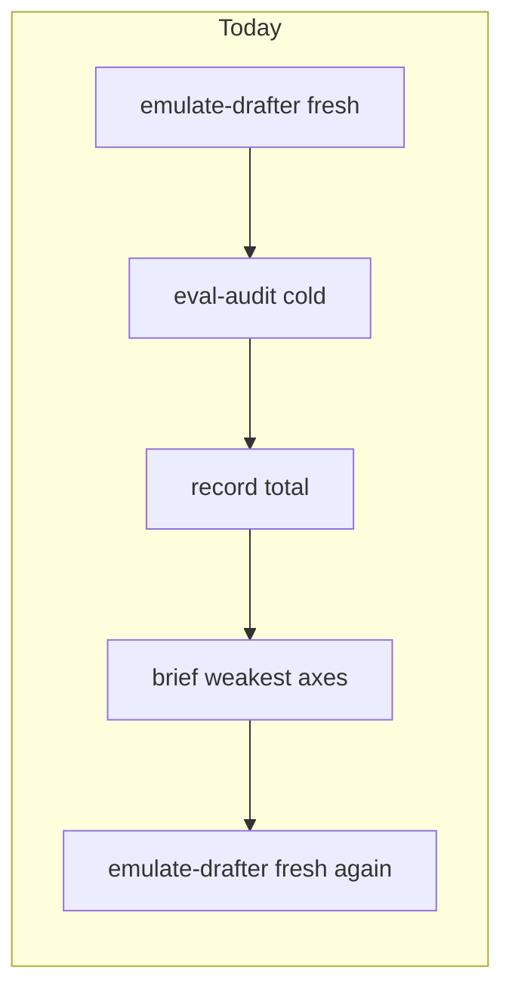
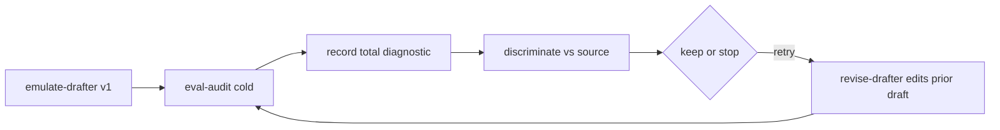

# Revise-in-place + indistinguishability gate

## Clarification: “parity” vs indistinguishability

These are related goals, different instruments:

| Term | What it measures | Ceiling |
|------|------------------|---------|
| **Indistinguishability** (your pick) | Blind spot-the-real: judge picks which of A/B is genuine source | Coin-flip detection (~0.5) → score 1.0; always caught → 0.0 |
| **Pairwise win-rate** | Blind A/B “which is better on axis X?” vs source anchor | Win rate 0.5 = 100 (parity); beating source is capped, not rewarded |
| **Absolute `EvaluatorScore.total`** | Draft vs style-block grades | Can exceed the source (rubric overfit) — this is the 5.7 trap |

“Parity with original text” = the *policy*: do not reward outscoring the master. **Indistinguishability** is the concrete gate for this plan. Pairwise stays available as a later sidecar; it is not the first-ship stop rule.

## Problem (verified)

- Iters 2+ **regenerate** with no prior draft ([`emulate-drafter.md`](.cursor/agents/emulate-drafter.md)).
- Loop climbs [`EvaluatorScore.total`](src/eliotwf_skills/workflow/loop.py); scorer-v2 discrimination exists but is **not** wired into `/hillclimb`.
- `seeds: N` is parent-only multi-seed for v1, not revision.

## Target loop

**Defaults locked for this plan:**

1. **Keep/reject metric:** discrimination `indistinguishability` (higher better). Absolute total remains recorded for diagnostics and UI, not the climb signal.
2. **Drafting:** iter 1 = full emulate (optional existing `seeds: N`); iters 2+ = **revise-in-place** of best-so-far draft.
3. **Eval:** fresh `eval-audit` every iteration (draft + block only) — never parent-chat scoring.
4. **Scorer freeze:** workflow/playbook forbid loop agents from editing rubric, calibration, `score_draft*.py`, or qualitative rubric mid-run.
5. **No ban-list restore.** Briefs stay craft language; optional later: promote *recurring* discrimination tells only after they repeat across trials.

## Implementation

### 1. New agent: `revise-drafter`

Add [`.cursor/agents/revise-drafter.md`](.cursor/agents/revise-drafter.md):

- Inputs: style-block path, **prior draft path**, craft brief, output path.
- Must **edit** the prior draft (rewrite failures in author texture), not blank-page regenerate.
- Must not read `scores.json`, qualitative history, or source (same anti-poisoning as emulate, except prior draft is allowed).
- Model default: same as emulate (`composer-2.5` via parent Task override).

### 2. Workflow skill + one-command

Update [`.cursor/skills/workflow/SKILL.md`](.cursor/skills/workflow/SKILL.md) and [`references/one-command.md`](.cursor/skills/workflow/references/one-command.md) + [`playbook.md`](.cursor/skills/workflow/references/playbook.md):

- Iter 1: `emulate-drafter` (unchanged).
- Iter 2+: Task `revise-drafter` with `best_draft` (or last kept draft) + craft brief.
- After each `record`, parent runs discrimination prepare/score against `source.txt` (or held-out slice) via existing [`discrimination_v2.py`](.cursor/skills/evaluator/scripts/discrimination_v2.py) + Task `discriminate`.
- Persist per-iter: `discrimination-vN.json` (rate, indistinguishability, tells).
- **Keep-best / stop:** prefer higher indistinguishability; on tie, fall back to total. Stop at `max_iterations` or when indistinguishability plateaus (reuse `min_delta` semantics on that metric, or fixed “no improvement for 1 iter” — implement as delta on indistinguishability in status).
- Retry brief: still craft language from weakest qualitative axes; do **not** paste score numbers. Tells may be quoted only as craft (“kill triple-parallel exposition”), not as ban catalogs.
- Explicit: never inline eval in parent; never edit scorer files during a run.

### 3. Loop / status Python (minimal)

Extend [`src/eliotwf_skills/workflow/loop.py`](src/eliotwf_skills/workflow/loop.py) + [`hillclimb_once.py`](.cursor/skills/workflow/scripts/hillclimb_once.py):

- Accept optional discrimination sidecar path on `record` or a small `record-discrimination` subcommand writing into run dir / scores manifest.
- `run_status` exposes `best_indistinguishability`, `best_draft` by that key (total remains available).
- Keep `EvaluatorScore.total` recording unchanged so old runs and UI do not break.

Do **not** fold pairwise or AUTHORPRINT into the stop rule in this ship.

### 4. Tests + handoff

- Unit tests: status prefers higher indistinguishability; revise path documented in skill (agent contract test if any exist for agents — otherwise skill/playbook assertions via existing hillclimb tests for status fields).
- Short handoff note: regenerate loop deprecated for iters 2+; metric = indistinguishability; total = diagnostic.
- Smoke: one Rilke or Dostoevsky 2-iter manual `/hillclimb` after ship (human gate).

## Out of scope (this ship)

- Wiring pairwise as co-equal stop rule.
- Restoring static ban lists.
- Changing ELIOT analyzer / 5.7 block format.
- Web UI changes beyond reading new status fields if already generic.
- Deleting absolute scoring.

## Success criteria

- Iter 2+ draft is visibly an edit of iter 1 (shared sentences/structure), not a full rewrite from topic alone.
- Each iter has cold `eval-audit` + discrimination artifact.
- `status` best draft tracks max indistinguishability.
- Loop agents do not touch scorer/rubric files.
