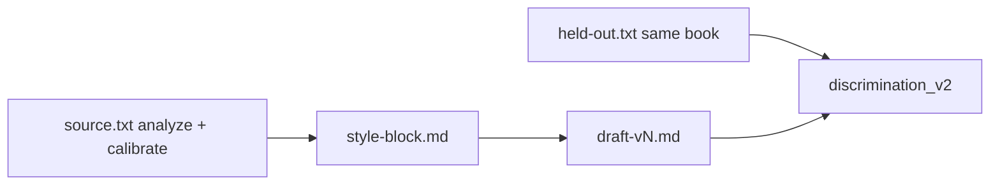

# Same-book held-out climb upgrades

## Problem (from mccarthy-hc-3iter)

Indist 0.40 with total ~88 is not “bad prose.” Discrimination used `source.txt` (the analyze excerpt) as genuine while the topic was a Ch.1 retell. Judges caught **plot identity** (double shooting, sister facts, hanging beat) as much as craft. Iter 3 raised total and killed indist by chasing ENVIRONMENT objects over recurring discrimination tells.

## Scope (locked)

**In:** same-book held-out seam + protocol-7 climb hygiene (topic, n, seeds, brief priority).  
**Out:** same-author corpus, pairwise/authorprint second metric, scorer/rubric edits, re-running McCarthy mid-change.

## 1. Prepare seam: `held-out.txt`

Extend [`src/eliotwf_skills/workflow/prepare.py`](src/eliotwf_skills/workflow/prepare.py) and [`hillclimb_once.py prepare`](.cursor/skills/workflow/scripts/hillclimb_once.py):

- Optional `--held-out <path>` on prepare.
- Copy into `tools/runs/<slug>/held-out.txt` (UTF-8 prose).
- Soft length check (~400–800 words preferred; warn or require a lower floor than analyze `MIN_WORDS=800` so Exa excerpts fit).
- `PrepareResult` exposes `held_out_path: Path | None`.
- Fallback unchanged: if no held-out, discrimination may still use `source.txt` (legacy runs).

Helper for parents (small, in prepare or loop): `genuine_path(run_dir) -> Path` returns `held-out.txt` if present else `source.txt`.

Tests in [`tests/test_hillclimb.py`](tests/test_hillclimb.py): prepare with/without held-out; `genuine_path` preference.

ADR touch: one line in [`docs/adr/001-run-persistence.md`](docs/adr/001-run-persistence.md) listing `held-out.txt` under session layout.

## 2. Protocol-7: same-book Exa held-out (not same-author)

Update [`SKILL.md`](.cursor/skills/workflow/SKILL.md) v1.6→1.7, [`one-command.md`](.cursor/skills/workflow/references/one-command.md), [`playbook.md`](.cursor/skills/workflow/references/playbook.md), [`.cursor/commands/hillclimb.md`](.cursor/commands/hillclimb.md):

- New-run sequence: after primary source is saved, Exa-fetch a **second continuous excerpt from the same work** (same book/period register). Save via prepare `--held-out` or write `held-out.txt` before loop.
- Forbidden: same-author different book as default genuine (style drift).
- Discrimination step: `discrimination_v2.py prepare --genuine <held-out.txt if present else source.txt>`.
- Results card: cite which genuine file was used.

## 3. Top climb hygiene (protocol only — already half-documented)

These are the other high-leverage fixes from the McCarthy postmortem; no new Python beyond defaults in docs:

| Fix | Rule |
|-----|------|
| Neighboring topic | Topic must be a **new scene in the same register**, not a retell of the analyze passage. Ask user one line if the derived topic is a rewrite of source beats. |
| Trials `n=10` | Parent uses discrimination `--n 10` (CLI default); stop using `n=5` in one-command examples. |
| Seeds | Default recommendation `seeds: 3` for iter-1 emulate only; score/discriminate candidates; record winner (already in one-command; make it the new-run default in the command). |
| Brief priority | When discrimination tells recur, **odd-iter briefs prefer those craft tells over the two weakest qualitative axes** if they conflict. Never chase diagnostic `total`. Cadence pass on even iters unchanged. |

## 4. Verification

- `pytest tests/test_hillclimb.py` (prepare + genuine_path).
- No mid-run scorer edits.
- Smoke note in handoff one-liner: next `/hillclimb` must show `held-out.txt` and `--genuine` pointing at it.

## Non-goals this pass

- Auto-Exa inside Python (parent still fetches; prepare only stores).
- Changing indistinguishability formula.
- Forced held-out (legacy `source.txt`-only runs still work).
