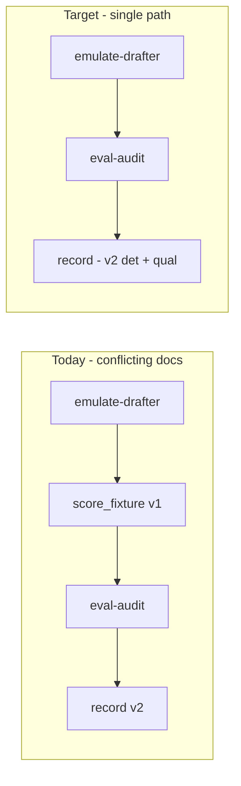

# Thermos `.cursor/` remediation plan

**Archived 2026-07-17.** Todos were left pending in YAML after the work landed elsewhere (workflow v1.10, `tests/test_hooks.py`, hooks/SDK climb, plan archives). Do not reopen; living state is `handoff/STATE.md`.

Verified against current tree on `master` (`a95c132`). Core drift confirmed:

- [workflow/SKILL.md](.cursor/skills/workflow/SKILL.md) protocol-2 still mandates `score_fixture.py` (v1) while [loop.py](src/eliotwf_skills/workflow/loop.py) `evaluate_draft` uses `score_draft_v2` when `calibration.json` exists.
- [one-command.md](.cursor/skills/workflow/references/one-command.md) already documents the correct loop (emulate → eval-audit → record) — no `score_fixture` step.
- Defaults split: [hillclimb_once.py](.cursor/skills/workflow/scripts/hillclimb_once.py) L213–214 and `HillclimbConfig` use **5 / 1.0**; skill + [hillclimb.md](.cursor/commands/hillclimb.md) document **3 / 1.5**.



---

## Phase 1 — Hillclimb loop truth (highest impact)

**Goal:** One canonical iteration sequence; `record` is the only scoring authority in the loop.

### 1a. Update workflow skill

Edit [`.cursor/skills/workflow/SKILL.md`](.cursor/skills/workflow/SKILL.md):

- **Remove** `step-2-evaluate-deterministic` (`score_fixture.py`) from protocol-2-loop.
- **Renumber** loop steps to match [one-command.md](.cursor/skills/workflow/references/one-command.md):
  - step-1 emulate → step-2 qualitative eval-audit → step-3 record → step-4 status → step-5 decision → step-6 stop/retry brief.
- **Update central_idea** — drop `score_fixture.py` from hillclimb invariant; state deterministic scoring happens inside `record` via `evaluate_draft` (v2 when calibrated).
- **Renumber all protocols** 1→7 in reading order (fix scrambled 1,2,5,3,6,4,7):
  - 1 input, 2 loop, 3 model-config (was 5), 4 contracts (was 3), 5 principles (was 6), 6 manual-gate (was 4), 7 one-command (unchanged).
  - Fix cross-refs (`model per protocol-5` → `protocol-3`).
- Bump skill `metadata.version` to **1.5**.

### 1b. Align satellite docs

- [playbook.md](.cursor/skills/workflow/references/playbook.md) frozen-harness bullet: replace “deterministic scorer (`score_fixture.py`)" with “`record` / `evaluate_draft` (v2 when `calibration.json` exists); `score_fixture.py` is ad-hoc repro only, not per-iteration.”
- [evaluator/SKILL.md](.cursor/skills/evaluator/SKILL.md) description: clarify “13 block sections (3 deterministic + 10 qualitative)” to avoid post-CADENCE misread.

**Keep** [score_fixture.py](.cursor/skills/evaluator/scripts/score_fixture.py) — still used by handoff prompts, style-block-diff reference, and legacy runs without calibration. No loop change in Python.

---

## Phase 2 — Default alignment (3 / 1.5)

Single source of truth matching protocol-7 and `/hillclimb` command.

| File | Change |
|------|--------|
| [`src/eliotwf_skills/workflow/loop.py`](src/eliotwf_skills/workflow/loop.py) `HillclimbConfig` | `max_iterations: int = 3`, `min_delta: float = 1.5` |
| [`hillclimb_once.py`](.cursor/skills/workflow/scripts/hillclimb_once.py) `init` argparse | `default=3`, `default=1.5` |

**Test:** add `test_hillclimb_config_defaults` in [tests/test_hillclimb.py](tests/test_hillclimb.py) asserting `HillclimbConfig(style_block="x", topic="t")` fields. Existing tests pass explicit values — no breakage expected.

---

## Phase 3 — Stale plans sync

Mark shipped work `completed` and scrub stale prose (pattern: [scorer-v2_final_phases](archive/scorer-v2_final_phases_589276ee.plan.md)).

| Plan | Action |
|------|--------|
| [writing-first_scoring_fixes](archive/writing-first_scoring_fixes_ad2e6923.plan.md) | Archived — shipped 2026-07-07 |
| [one-command_hillclimb_automation](archive/one-command_hillclimb_automation_a555d79b.plan.md) | Archived — shipped |
| [eliot_workflow_build](eliot_workflow_build.plan.md) | `phase5-loop` → completed; `phase2-drift-subagent` → completed; `phase6-service` → completed; leave phase4/7 as pending |

No handoff STATE rewrite unless a deferred entry contradicts the updated plans.

---

## Phase 4 — Hooks hardening

Principle: **observe-only** (do not block agent stop) but honest and broader coverage.

### 4a. `run_tests_on_stop.py`

- Fix docstring: “runs on every agent stop; observe-only (exit 0 always).”
- Add module header: `# hook-class: observe`
- Print one stderr line on failure: `observe: pytest failed (exit N)` — already partially there.

### 4b. `validate_skills_module.py`

- Broaden smoke imports after path check:
  ```python
  import eliotwf_skills.shapes.score
  import eliotwf_skills.workflow.loop  # noqa: F401
  ```
- Wrap imports in `try/except ImportError` → stderr message, exit 0.
- In [hooks.json](.cursor/hooks.json): no JSON comments possible — document observe class in script headers only.

### 4c. Matcher

- Attempt `matcher: "Write|StrReplace"` on `afterFileEdit`; if local smoke shows it does not fire, revert to `Write` and add a one-line note in [hooks-authoring.mdc](.cursor/rules/hooks-authoring.mdc) or script header documenting the limitation.

### 4d. Conduct rule

- [conduct.mdc](.cursor/rules/conduct.mdc) L29: change “stop hook … are authoritative” → “stop hook surfaces pytest failures; human review is authoritative” (matches observe semantics).

### 4e. Tests

Add [tests/test_hooks.py](tests/test_hooks.py):

- `validate_skills_module`: stdin JSON with `eliotwf_skills` path → exit 0; non-matching path → exit 0; malformed JSON → exit 0.
- `run_tests_on_stop`: mock subprocess or run with `PYTHONPATH=src` (fast `-q`); assert exit 0 always.

---

## Phase 5 — Qualitative completeness guard

In [score.py](src/eliotwf_skills/shapes/score.py):

- Add optional `require_complete: bool = False` to `parse_qualitative_scores`.
- When `True`, require `seen == set(QUALITATIVE_SECTIONS)` or raise `ValueError` listing missing sections.

In [loop.py](src/eliotwf_skills/workflow/loop.py) `record_iteration`:

- Call `parse_qualitative_scores(qualitative_json, require_complete=True)` when qualitative JSON is provided.

**Tests:** extend [tests/test_evaluator_score.py](tests/test_evaluator_score.py) — partial array fails with `require_complete=True`; full ten-section fixture passes.

---

## Phase 6 — `design-taste-frontend` decomposition

Current: [324 lines, 15 inline protocols](.cursor/skills/design-taste-frontend/SKILL.md); `paths` wrongly nested under `metadata`.

1. Move top-level `paths:` to YAML frontmatter per [skill-authoring.mdc](.cursor/rules/skill-authoring.mdc).
2. Extract protocols 4–11 into `references/protocols-layout-motion.md` (or split 4–7 / 8–11 if either ref exceeds ~200 lines).
3. SKILL body retains: central_idea, protocol-0/1/2/3, pointers to refs, protocol-12–14 (audit/preflight — keep near end).
4. Target ~100-line SKILL body (match workflow/evaluator pattern).

---

## Phase 7 — `grillwithdocs` cleanup

1. **Delete** [grill-me/SKILL.md](.cursor/skills/grillwithdocs/grill-me/SKILL.md) — 3-line redirect only; no repo references outside itself.
2. **Move** [triage/AGENT-BRIEF.md](.cursor/skills/grillwithdocs/triage/AGENT-BRIEF.md) → `triage/references/agent-brief.md`; update [triage/SKILL.md](.cursor/skills/grillwithdocs/triage/SKILL.md) pointer.
3. Add one-line note at top of [grilling/SKILL.md](.cursor/skills/grillwithdocs/grilling/SKILL.md): “legacy imperative skill; pipeline skills use def-sop — exempt.” No full def-sop migration in this pass.

---

## Phase 8 — Evaluator CLI consolidation

Create [`.cursor/skills/evaluator/scripts/scorer_cli.py`](.cursor/skills/evaluator/scripts/scorer_cli.py) with subcommands delegating to existing `main()` functions:

```
scorer_cli.py score|score-v2|gate|pairwise|discrimination|authorprint
```

Keep existing six scripts as **thin shims** (`from scorer_cli import main_score; raise SystemExit(main_score())`) so [run_phase5_smoke.py](tools/runs/scorer-v2/run_phase5_smoke.py) and handoff docs keep working unchanged.

Update [evaluator/SKILL.md](.cursor/skills/evaluator/SKILL.md) protocol-3 to mention `scorer_cli.py` as preferred entrypoint.

---

## Verification (required before done)

```powershell
$env:PYTHONPATH="src"
python -m pytest tests/ -q
```

Manual spot-checks:

1. Read updated protocol-2 in workflow SKILL — no `score_fixture` in loop steps.
2. `python .cursor/skills/workflow/scripts/hillclimb_once.py init --help` shows defaults 3 / 1.5.
3. Open each updated plan — no `pending` on shipped todos.

---

## Out of scope (explicit)

- Changing hook to **enforce** (non-zero exit on pytest fail) — observe-only retained unless you ask otherwise.
- New `score_run.py` diagnostic CLI — YAGNI; `record` + existing `score_v2.py` cover debugging.
- Full def-sop migration of all grillwithdocs skills.
- Editing handoff NEW-CHAT-PROMPT files that still mention `score_fixture` for emulation-debug workflows (those are intentional ad-hoc paths).
