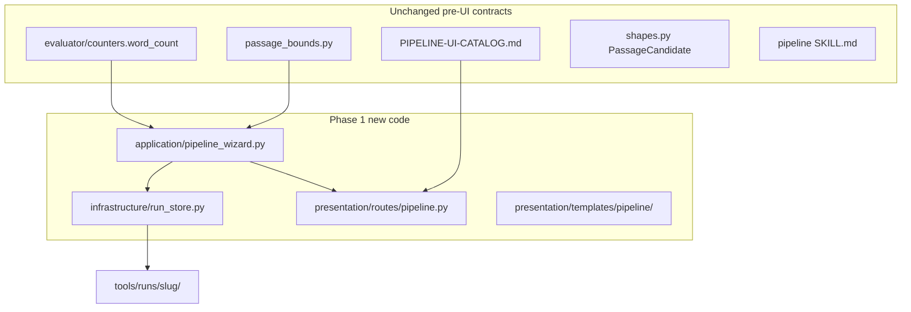

# Web UI v2 — Pipeline wizard (phase 1)

## Context

Pre-UI pipeline contracts are done ([`handoff/PIPELINE-UI-CATALOG.md`](handoff/PIPELINE-UI-CATALOG.md), [`docs/adr/002-owned-corpus-registry.md`](docs/adr/002-owned-corpus-registry.md), [`src/eliotwf_skills/distiller/passage_bounds.py`](src/eliotwf_skills/distiller/passage_bounds.py)). Web UI v1 is read-only hillclimb at [`src/eliotwf/presentation/routes/runs.py`](src/eliotwf/presentation/routes/runs.py).

**This plan does not alter those contracts.** The wizard is a presentation orchestration layer that reads/writes the same `tools/runs/<slug>/` artifacts ADR 001 documents.

**Why phase 1 is narrow.** Passage resolution with live bands is the smallest slice that (a) exercises the catalog's hardest UX contract, (b) wires `passage_tier()` from product code (final-review gate), and (c) leaves distiller/analyze/hillclimb agent loops in Cursor where they already work.

**STATE alignment.** [`handoff/STATE.md`](handoff/STATE.md) lists "draft viewer" as next Web UI v2 work. This plan is the upstream half of v2 (pipeline wizard before hillclimb read extensions). Update STATE when phase 1 passes.



## Scope

### In phase 1

- New-pipeline wizard shell (server-owned step index 0–2 shipped, 3+ stub)
- **Passage resolution step** with live word count and color bands via `passage_tier()`
- Slug + run-folder creation per ADR 001 variant B layout
- HTMX partial for band updates on textarea input (debounced)
- Application use case seam; routes do not import `eliotwf_skills`
- Infrastructure write port for run-folder artifacts (application-layer rule)
- CSRF on every wizard POST ([`tool-ui-htmx`](.cursor/skills/tool-ui-htmx/SKILL.md) protocol-3)
- HTTP + unit tests
- Handoff gate doc `handoff/WEB-UI-V2-PHASE1-PASSED.md`

### Out of phase 1 (later phases)

- In-browser distiller / Exa (agent-driven; import `discovery.json` only)
- Catalog CRUD UI for `sources/catalog.json`
- ELIOT analyze, prepare, hillclimb trigger from browser
- Run index listing distiller-only folders (v1 index still requires `scores.json`)
- Pierce port

### Distiller in the wizard

| Step | Phase 1 behavior |
|------|------------------|
| 0 Start | Slug entry + create distiller-layout folder |
| 1 Brainstorm | Optional `rough-input.md` paste; copy explains distiller runs in Cursor |
| 2 Passage | **Shipped** — paste excerpt, live bands, write `source-excerpt.md` |
| 3+ Analyze / hillclimb | Stub "continue in Cursor" links; no agent loop in browser |

## Data shapes (name before code)

Implement as frozen dataclasses in `application/pipeline_wizard.py` (or `application/pipeline_types.py` if the module grows).

| Type | Fields | Role |
|------|--------|------|
| `WizardState` | `slug`, `step: int`, `session_type: Literal["full-pipeline"]` | Persisted in `wizard-state.json` |
| `PassagePreview` | `word_count`, `tier`, `can_submit: bool`, `hint: str` | HTMX band partial + submit gate |
| `StageResult` | `ok: bool`, `errors: tuple[str, ...]`, `path: Path \| None` | Use-case return to routes |

**`wizard-state.json` schema (phase 1):**

```json
{ "step": 2, "session_type": "full-pipeline" }
```

Step integers: `0` start, `1` brainstorm, `2` passage, `3` done stub. Server reads this on GET `/pipeline/{slug}`; POST handlers advance and rewrite.

**Tier → UI** (thresholds only in `passage_bounds.py`; presentation maps tier string to Tailwind classes in `_passage_band.html`):

| `passage_tier()` | Words | Submit | Copy hint |
|------------------|-------|--------|-----------|
| `green` | 800–1200 | yes | Recommended for prepare + hillclimb |
| `yellow_low` | 200–799 | yes | ADR 002 analyze-only path; prepare needs 800+ |
| `yellow_high` | 1201–2000 | yes | Acceptable; prepare may still run |
| `red` | below 200 or above 2000 | **blocked** | Show min/max from `MIN_PASSAGE_WORDS` / `MAX_PASSAGE_WORDS` |

## Architecture

Follow existing DDD seams, [`tool-ui-htmx` skill](.cursor/skills/tool-ui-htmx/SKILL.md), and [`skills-repo.mdc`](.cursor/rules/skills-repo.mdc) (routes → application → skills modules; writes via infrastructure).

| Layer | Module | Responsibility |
|-------|--------|----------------|
| Infrastructure | [`src/eliotwf/infrastructure/run_store.py`](src/eliotwf/infrastructure/run_store.py) | Create run dir, write `rough-input.md`, `source-excerpt.md`, `wizard-state.json`; slug regex + collision check |
| Application | [`src/eliotwf/application/pipeline_wizard.py`](src/eliotwf/application/pipeline_wizard.py) | `preview_passage(text) -> PassagePreview`, `validate_passage_text`, `stage_passage`, `advance_wizard`, `load_wizard_state` |
| Presentation | [`src/eliotwf/presentation/routes/pipeline.py`](src/eliotwf/presentation/routes/pipeline.py) | Thin handlers; CSRF check; HTMX branch on `HX-Request` |
| Presentation | [`src/eliotwf/presentation/csrf.py`](src/eliotwf/presentation/csrf.py) | Issue + validate token (session cookie or signed cookie; pick smallest pattern matching v1 test client) |
| Templates | `presentation/templates/pipeline/` | `wizard.html`, `_passage_step.html`, `_passage_band.html`, `_done_stub.html` |
| App factory | [`src/eliotwf/presentation/app.py`](src/eliotwf/presentation/app.py) | Mount pipeline routes; optional `SessionMiddleware` if CSRF needs server session |
| Layout | [`presentation/templates/base.html`](src/eliotwf/presentation/templates/base.html) | Nav link to `/pipeline/new`; CSRF meta or block for forms |

**Word count (corrected).** Use `eliotwf_skills.evaluator.counters.word_count` (regex `\b\w+\b`), the same function [`prepare.py`](src/eliotwf_skills/workflow/prepare.py) uses. Do **not** whitespace-split in the wizard. The old plan text said "whitespace split"; that would drift from prepare and the catalog.

```python
from eliotwf_skills.evaluator.counters import word_count
from eliotwf_skills.distiller.passage_bounds import passage_tier

def passage_band(count: int) -> str:
    return passage_tier(count)
```

**Slug rules** (from ADR 001, enforce in `run_store.create_run`):

- Pattern `^[a-z][a-z0-9]*(-[a-z0-9]+)*$`, length 3–48
- If `tools/runs/<slug>/` exists and contains `scores.json`, reject (hillclimb session owns slug)
- If folder exists with only distiller/wizard files, allow resume (read `wizard-state.json`)

## Routes (phase 1)

| Method | Path | Behavior |
|--------|------|----------|
| GET | `/pipeline/new` | Step 0 slug form |
| POST | `/pipeline/new` | Validate slug, create folder + `wizard-state.json` step 1, redirect |
| GET | `/pipeline/{slug}` | Load `wizard-state.json`, render current step template |
| POST | `/pipeline/{slug}/back` | Decrement step (server-owned back; not browser back) |
| POST | `/pipeline/{slug}/brainstorm` | Write optional `rough-input.md`, advance to step 2 |
| POST | `/pipeline/{slug}/passage/preview` | HTMX: return `_passage_band.html` only (`HX-Request` branch) |
| POST | `/pipeline/{slug}/passage` | Validate tier != red, write `source-excerpt.md`, step 3 completion card |

**HTMX fragment contract** ([`preflight-checklist.md`](.cursor/skills/tool-ui-htmx/references/preflight-checklist.md)):

- Stable region id `#passage-band` in both full page and partial
- Textarea: `hx-post` preview, `hx-trigger="input changed delay:300ms"`, `hx-target="#passage-band"`, `hx-swap="innerHTML"`
- `hx-indicator` on async preview
- Submit button disabled server-side when `can_submit` is false (red tier); do not rely on client-only validation

**Run folder writes** (ADR 001 variant B during upstream):

- `rough-input.md` (optional, step 1)
- `source-excerpt.md` (passage step confirm)
- `wizard-state.json`

Do not write `scores.json`, `discovery.json`, or `source.txt` in phase 1.

## Phased delivery (implement in order)

Each phase ends with pytest green for its new tests.

### Phase A — Types + run store

- `infrastructure/run_store.py` + unit tests for slug validation and atomic writes
- Frozen types in application module

**Verify:** `pytest tests/test_run_store.py -q`

### Phase B — Passage use case

- `application/pipeline_wizard.py` preview/validate/stage
- `tests/test_pipeline_wizard.py` tier table + `passage_tier` caller regression (import chain from application)

**Verify:** `pytest tests/test_pipeline_wizard.py -q`

### Phase C — CSRF + shell routes

- `csrf.py`, `base.html` nav, steps 0–1 routes and templates
- POST creates folder under temp `runs_base` in tests

**Verify:** `pytest tests/test_presentation_pipeline.py -k "slug or brainstorm" -q`

### Phase D — Passage HTMX + completion

- Step 2 templates, preview + submit routes, done stub
- HTTP tests for preview fragment, red-tier block, green-tier write

**Verify:** `pytest tests/test_presentation_pipeline.py -q` then full suite

### Phase E — Handoff

- `handoff/WEB-UI-V2-PHASE1-PASSED.md`, STATE/README/AGENTS sync

## Verification

**Static**

```powershell
$env:PYTHONPATH="src"
python -m pytest tests/test_run_store.py tests/test_pipeline_wizard.py tests/test_presentation_pipeline.py -q
python -m pytest -q
```

**Unit tests** (`tests/test_pipeline_wizard.py`)

- `passage_band(950) == "green"`
- `passage_band(199) == "red"`
- `passage_band(2001) == "red"`
- `preview_passage` uses `word_count` from counters (spot-check against known fixture string)
- Regression: application module imports and calls `passage_tier`

**HTTP tests** (`tests/test_presentation_pipeline.py`)

- POST preview returns `_passage_band.html` with tier-specific class
- POST passage with 50 words returns 422/400, no `source-excerpt.md`
- POST passage with valid excerpt writes file and advances step
- Duplicate slug with `scores.json` rejected
- CSRF missing on POST returns 403

**Manual** (control-ui / browser)

- `.\tools\start-eliotwf.ps1` → `/pipeline/new` → complete passage step → `source-excerpt.md` on disk
- Refresh on step 2 restores textarea state only if you re-read file (optional stretch; not required for pass)

## Handoff sync (end of phase 1)

- [`handoff/STATE.md`](handoff/STATE.md) — Web UI v2 phase 1 (pipeline wizard passage step) passed
- [`handoff/README.md`](handoff/README.md) — gate row + link to `WEB-UI-V2-PHASE1-PASSED.md`
- [`AGENTS.md`](AGENTS.md) — wizard routes under presentation
- One-line comment atop `passage_tier` in [`passage_bounds.py`](src/eliotwf_skills/distiller/passage_bounds.py): consumed by `application/pipeline_wizard.py`

## Later phases (outline only)

**Full spec for fresh contexts:** [`handoff/WEB-UI-V2-PHASES.md`](../../handoff/WEB-UI-V2-PHASES.md) (phases 2–6 goals, shapes, routes, verification, paste-in prompt).

| Phase | Deliverable | Plan |
|-------|-------------|------|
| 2 | Import `discovery.json` + show `PassageCandidate` provenance on passage step | [`.cursor/plans/archive/web_ui_pipeline_wizard_phase2_be50658c.plan.md`](web_ui_pipeline_wizard_phase2_be50658c.plan.md) |
| 3 | Catalog picker (read `sources/catalog.json`, owned provenance) |
| 4 | Analyze action (ELIOT skill via agent or future automation) |
| 5 | Hillclimb launch + extend runs index with `session_type` column |
| 6 | HTMX drill-down on existing run detail (v1 extension) + draft viewer |

## Risks and mitigations

| Risk | Mitigation |
|------|------------|
| Users expect in-browser distill | Step 1 copy names Cursor + distiller skill; step 3 stub links pipeline skill |
| Word-count drift vs agent slice | Shared `counters.word_count`; confirm step re-validates before write |
| Application-layer FS rule | All writes in `infrastructure/run_store.py`; application calls port functions |
| No CSRF on v1 runs routes | Wizard POSTs only in phase 1; retrofit v1 later if needed |
| Wizard runs invisible on `/` index | Documented; phase 5 adds `session_type` filtering |

## Applicable skills

- [tool-ui-htmx](.cursor/skills/tool-ui-htmx/SKILL.md) — routes, HTMX partials, forms, preflight
- [pipeline](.cursor/skills/pipeline/SKILL.md) — downstream chain reference only
- poteto-mode **how** skill — before first route if unfamiliar with Starlette patterns
- cursor-team-kit **control-ui** — manual passage-step verification

## Implementation notes (poteto-mode)

- **Foundational thinking:** types and run store land before routes.
- **Boundary discipline:** validation at POST boundary; templates receive `PassagePreview` only.
- **Laziness protocol:** no separate `count_words` wrapper unless tests need it; call `word_count` directly.
- **Prove it works:** HTTP test that writes real file under `TemporaryDirectory` beats tier-only unit tests alone.
- Before commit: cursor-team-kit **deslop** on the diff.
