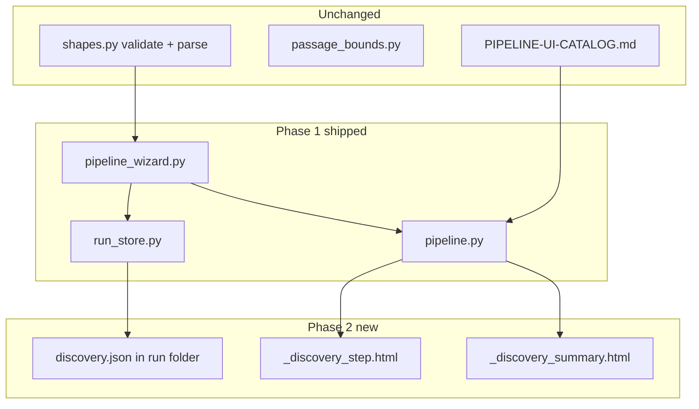

# Web UI v2 — Pipeline wizard (phase 2)

## Phase map and prerequisites

**Master roadmap:** [`handoff/WEB-UI-V2-PHASES.md`](../../handoff/WEB-UI-V2-PHASES.md) (phases 2–6 goals, cumulative file table, paste-in prompt).

| Phase | Plan | Gate |
|-------|------|------|
| 1 | [`.cursor/plans/archive/web_ui_pipeline_wizard_be50658c.plan.md`](web_ui_pipeline_wizard_be50658c.plan.md) | [`handoff/WEB-UI-V2-PHASE1-PASSED.md`](../../handoff/WEB-UI-V2-PHASE1-PASSED.md) |
| **2 (this plan)** | This file | `handoff/WEB-UI-V2-PHASE2-PASSED.md` |
| 3 | TBD — create `web_ui_pipeline_wizard_phase3_be50658c.plan.md` when phase 2 passes | `handoff/WEB-UI-V2-PHASE3-PASSED.md` |
| 4–6 | Spec in phase map only until prior gate passes | per phase map |

**Prerequisite:** Phase 1 gate must exist. Shipped code lives in `infrastructure/run_store.py`, `application/pipeline_wizard.py`, `presentation/routes/pipeline.py`.

**Contracts (do not rewrite):** [`handoff/PIPELINE-UI-CATALOG.md`](../../handoff/PIPELINE-UI-CATALOG.md), [`docs/adr/001-run-persistence.md`](../../docs/adr/001-run-persistence.md), [`docs/adr/002-owned-corpus-registry.md`](../../docs/adr/002-owned-corpus-registry.md), [`src/eliotwf_skills/distiller/shapes.py`](../../src/eliotwf_skills/distiller/shapes.py).



## Context

Phase 1 ships manual passage paste with live bands. Distiller runs in Cursor and writes `discovery.json` under `tools/runs/<slug>/` (ADR 001 variant B). Phase 2 lets the wizard **import** that artifact so the passage step shows author, work, location, and provenance before the user pastes or confirms an excerpt.

**This plan does not change** distiller skill, Exa MCP, `discover_format.py`, or validation rules in `shapes.py`. The application calls `validate_discovery_result` and `parse_discovery_result` from `eliotwf_skills.distiller.shapes`.

**Catalog section cleared:** Distiller artifacts and source provenance (manual upload path for `discovery.json`).

## Scope

### In phase 2

- New wizard step **2 Discovery** (file upload of `discovery.json`; optional skip)
- Validate upload via `shapes.py`; write canonical copy to run folder
- Read-only **discovery summary** on passage step (step 3) with provenance badge
- `excerpt_hint` from `PassageCandidate` may prefill textarea (user can edit; bands still live)
- `wizard-state.json` gains `discovery_imported: bool`
- Step renumber: passage → 3, done stub → 4
- CSRF on new POST; routes import only `application` + `csrf`
- Unit + HTTP tests; gate doc `handoff/WEB-UI-V2-PHASE2-PASSED.md`

### Out of phase 2 (phase 3+)

- Catalog picker and `passage-meta.json` (phase 3)
- Fetching web URLs in browser (agent-only)
- In-browser distiller / Exa
- ELIOT analyze, prepare, hillclimb (phases 4–5)
- Run index `session_type` column (phase 5)
- Run detail drill-down (phase 6)

## Wizard step flow (after phase 2)

| Step | Name | Behavior |
|------|------|----------|
| 0 | Start | Slug + create folder (unchanged) |
| 1 | Brainstorm | Optional `rough-input.md` (unchanged) |
| **2** | **Discovery** | Upload `discovery.json` or skip; validate + write artifact |
| 3 | Passage | Summary card + textarea; live bands; write `source-excerpt.md` |
| 4 | Done | Stub links to pipeline skill (was step 3) |

Server-owned step index in `wizard-state.json`. POST advances; back decrements.

## Data shapes (name before code)

Add to `application/pipeline_wizard.py` (or `application/pipeline_types.py` if module exceeds ~200 lines).

| Type | Fields | Role |
|------|--------|------|
| `DiscoveryImport` | `topic: str`, `passage: PassageCandidate`, `author_count: int` | Successful parse result returned to routes |
| `DiscoverySummary` | Same as import or subset for template display | Read-only card on passage step |
| `WizardState` (extend) | existing + `discovery_imported: bool = False` | Loaded from `wizard-state.json` |

**`wizard-state.json` schema (phase 2):**

```json
{
  "step": 3,
  "session_type": "full-pipeline",
  "discovery_imported": true
}
```

`discovery_imported` is false when user skips step 2. Do not store full discovery payload in wizard-state; artifact file is source of truth.

**Provenance → UI** (presentation maps `passage.provenance` string to badge classes in `_discovery_summary.html`):

| `provenance` | Badge copy | Extra UI |
|--------------|------------|----------|
| `web` | Web source | Link `source_url` when set |
| `owned` | Owned corpus | Hint: catalog picker in phase 3 |
| `manual` | Manual excerpt | No URL |

Validation errors from `shapes.py` surface verbatim in form error region.

## Architecture

| Layer | Module | Responsibility |
|-------|--------|----------------|
| Infrastructure | [`run_store.py`](../../src/eliotwf/infrastructure/run_store.py) | `write_discovery`, `read_discovery`, `discovery_exists`; atomic JSON write |
| Application | [`pipeline_wizard.py`](../../src/eliotwf/application/pipeline_wizard.py) | `import_discovery`, `load_discovery_summary`, `skip_discovery`, `passage_seed_from_discovery`; calls `shapes` for validate/parse |
| Presentation | [`pipeline.py`](../../src/eliotwf/presentation/routes/pipeline.py) | Upload handler, skip handler, pass `DiscoverySummary` to templates |
| Templates | `presentation/templates/pipeline/` | `_discovery_step.html`, `_discovery_summary.html`; extend `wizard.html` step branches |

**Import direction (non-negotiable):** `presentation` → `application` → `infrastructure` / `eliotwf_skills`. Routes never import `run_store` or `shapes` directly.

**Validation boundary:** `import_discovery` accepts raw bytes, `json.loads` at application boundary, then `validate_discovery_result` / `parse_discovery_result`. Reject invalid provenance (e.g. `web` without `source_url` per shapes rules).

**Word count on passage step:** still `evaluator.counters.word_count` on textarea content at preview/submit time. Discovery `passage.word_count` is display-only until user confirms excerpt.

## Routes (phase 2 additions)

| Method | Path | Behavior |
|--------|------|----------|
| GET | `/pipeline/{slug}` | Render step 2 discovery when `step==2` |
| POST | `/pipeline/{slug}/discovery` | Multipart `discovery_file`; validate; write `discovery.json`; set `discovery_imported`; advance to step 3 |
| POST | `/pipeline/{slug}/discovery/skip` | Advance to step 3 without file; `discovery_imported: false` |

Existing passage preview/submit routes unchanged except step number checks use 3 not 2.

**Upload limits:** Reject empty file and non-JSON content. Max size 512 KB (plain guard in route before read full body).

## Phased delivery (implement in order)

Each sub-phase ends pytest green for its new tests.

### Phase A — Run store discovery I/O

- `DISCOVERY_FILE = "discovery.json"` in `run_store.py`
- `write_discovery(directory, text)`, `read_discovery(directory) -> dict | None`
- Tests in `tests/test_run_store.py`

**Verify:** `pytest tests/test_run_store.py -q`

### Phase B — Application import use case

- `DiscoveryImport` type; `import_discovery(slug, raw: bytes, *, runs_base) -> StageResult` with parsed import in a new field or parallel return pattern
- `load_discovery_summary(slug, *, runs_base) -> DiscoverySummary | None`
- `passage_seed_from_discovery(summary) -> str` returns `excerpt_hint` or `""`
- `skip_discovery(slug, *, runs_base) -> StageResult`
- Tests: invalid JSON, web without URL, valid fixture

**Verify:** `pytest tests/test_pipeline_wizard.py -q`

### Phase C — Step renumber + discovery UI

- Update all step literals (brainstorm → 2, discovery new, passage → 3, done → 4)
- `_discovery_step.html` with upload form + skip link
- Wire POST handlers with CSRF

**Verify:** `pytest tests/test_presentation_pipeline.py -k discovery -q`

### Phase D — Passage provenance card

- `_discovery_summary.html` partial on passage step when `discovery.json` exists
- Optional textarea prefill from `excerpt_hint` on first GET of step 3 only (do not overwrite user edits on validation error re-render)

**Verify:** `pytest tests/test_presentation_pipeline.py -q` then full suite

### Phase E — Handoff

- `handoff/WEB-UI-V2-PHASE2-PASSED.md`
- Update `STATE.md`, `README.md`, `AGENTS.md`
- Link this plan from `WEB-UI-V2-PHASES.md` phase 2 section

## Verification

**Static**

```powershell
$env:PYTHONPATH="src"
python -m pytest tests/test_run_store.py tests/test_pipeline_wizard.py tests/test_presentation_pipeline.py -q
python -m pytest -q
```

**Unit tests**

- `import_discovery` rejects malformed JSON
- `import_discovery` rejects `web` passage without `source_url` (mirror `test_distiller.py` cases)
- `import_discovery` accepts `tools/runs/distiller-smoke/2026-07-06/discovery.json` content
- `passage_seed_from_discovery` returns `excerpt_hint` text
- `skip_discovery` advances step without writing `discovery.json`

**HTTP tests**

- POST discovery with valid fixture writes `discovery.json` under temp `runs_base`
- POST invalid discovery returns 200 with errors, no file write
- GET passage step after import includes author/work in HTML
- CSRF missing on discovery POST returns 403

**Manual**

- `.\tools\start-eliotwf.ps1` → new slug → brainstorm → upload distiller-smoke `discovery.json` → passage shows Grand Inquisitor provenance

## Handoff sync (end of phase 2)

- [`handoff/STATE.md`](../../handoff/STATE.md) — Web UI v2 phase 2 passed; next phase 3 catalog picker
- [`handoff/README.md`](../../handoff/README.md) — gate row + link to `WEB-UI-V2-PHASE2-PASSED.md`
- [`handoff/WEB-UI-V2-PHASES.md`](../../handoff/WEB-UI-V2-PHASES.md) — add **Implement plan** link to this file under phase 2
- [`AGENTS.md`](../../AGENTS.md) — note discovery import on wizard routes
- Create `.cursor/plans/archive/web_ui_pipeline_wizard_phase3_be50658c.plan.md` stub pointer when phase 2 passes (optional one-liner in phase 3 section of phase map)

## Later phases (outline)

See [`handoff/WEB-UI-V2-PHASES.md`](../../handoff/WEB-UI-V2-PHASES.md).

| Phase | Deliverable | Plan file |
|-------|-------------|-----------|
| 3 | Catalog picker, `passage-meta.json` | `web_ui_pipeline_wizard_phase3_be50658c.plan.md` (create at phase 2 gate) |
| 4 | Analyze handoff step | phase map § Phase 4 |
| 5 | Prepare + run index `session_type` | phase map § Phase 5 |
| 6 | Run detail HTMX tabs | phase map § Phase 6 |

## Files touched (phase 2)

| Path | Change |
|------|--------|
| `src/eliotwf/infrastructure/run_store.py` | discovery read/write |
| `src/eliotwf/application/pipeline_wizard.py` | import + summary types and use cases |
| `src/eliotwf/presentation/routes/pipeline.py` | discovery POST/skip; step renumber |
| `src/eliotwf/presentation/templates/pipeline/wizard.html` | step 2–4 branches |
| `src/eliotwf/presentation/templates/pipeline/_discovery_step.html` | new |
| `src/eliotwf/presentation/templates/pipeline/_discovery_summary.html` | new |
| `src/eliotwf/presentation/templates/pipeline/_passage_step.html` | include summary partial |
| `tests/test_run_store.py` | discovery I/O |
| `tests/test_pipeline_wizard.py` | import validation |
| `tests/test_presentation_pipeline.py` | upload HTTP |
| `tests/fixtures/discovery-smoke.json` | copy or symlink distiller-smoke fixture for tests |
| `handoff/WEB-UI-V2-PHASE2-PASSED.md` | gate record |

## Risks and mitigations

| Risk | Mitigation |
|------|------------|
| Step renumber breaks existing in-progress wizards | Document one-time bump; old `step: 2` folders treat as passage (migration helper in `load_wizard_state` optional) |
| User uploads huge JSON | 512 KB cap at route |
| Duplicate validation logic | Only call `shapes.py`; never re-validate provenance in templates |
| Routes import `shapes` for convenience | Forbidden; application owns parse |
| `excerpt_hint` prefill overwrites edits | Prefill only when textarea empty on GET |

## Applicable skills

- [tool-ui-htmx](../../.cursor/skills/tool-ui-htmx/SKILL.md) — multipart form, CSRF, server-owned wizard step
- [pipeline](../../.cursor/skills/pipeline/SKILL.md) — downstream chain reference
- [distiller](../../.cursor/skills/distiller/SKILL.md) — discovery.json schema reference only

## Paste-in for implementer

```
Read .cursor/plans/archive/web_ui_pipeline_wizard_phase2_be50658c.plan.md and implement phase 2 only.
Phase map: handoff/WEB-UI-V2-PHASES.md
Phase 1 gate: handoff/WEB-UI-V2-PHASE1-PASSED.md
Catalog: handoff/PIPELINE-UI-CATALOG.md
Run pytest with PYTHONPATH=src when done.
Do not change shapes.py validation rules or passage_bounds thresholds.
```
