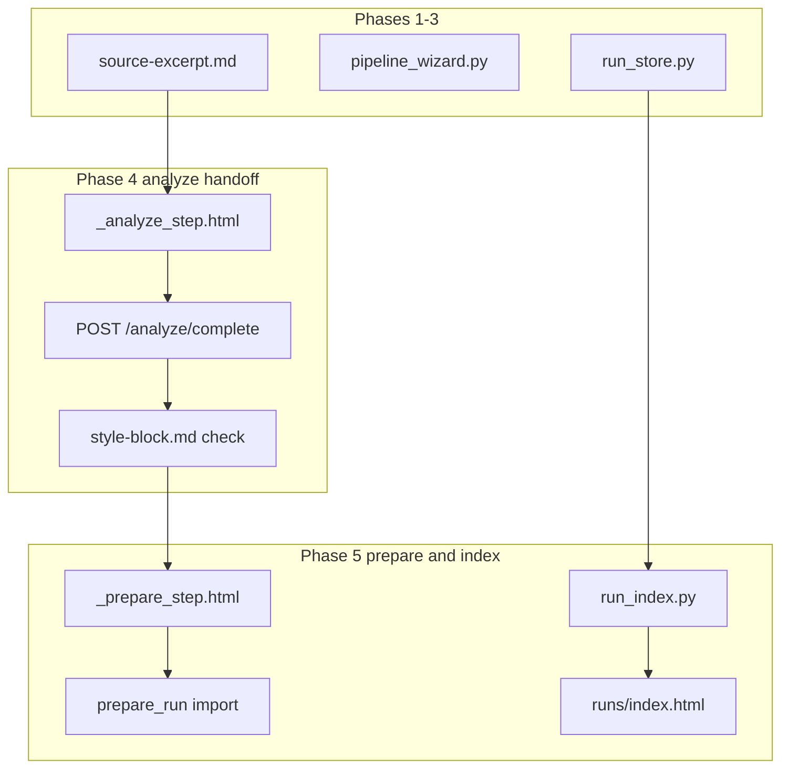

# Web UI v2 — Pipeline wizard (phases 4 + 5)

## Why combine 4 and 5

Phase 4 is intentionally small ([`handoff/WEB-UI-V2-PHASES.md`](handoff/WEB-UI-V2-PHASES.md) § Phase 4): handoff card + `style-block.md` existence check + step renumber. Phase 5 is the natural next wizard beat (prepare bridge + run index) and shares the same modules (`pipeline_wizard.py`, `run_store.py`, `runs/index.html`). Phase 6 is a different surface (v1 run detail HTMX tabs) and should remain its own plan.

**Prerequisite:** [`handoff/WEB-UI-V2-PHASE3-PASSED.md`](handoff/WEB-UI-V2-PHASE3-PASSED.md)

**Shipped baseline:** passage at step 3, [`stage_passage`](src/eliotwf/application/pipeline_wizard.py) already advances to **step 4**; [`_done_stub.html`](src/eliotwf/presentation/templates/pipeline/_done_stub.html) is the current step-4 UI.

**Resolved decisions (from phase map):**

| ID | Choice |
|----|--------|
| D1 | **Handoff-only analyze** (4a). No subprocess ELIOT in Python. |
| D4 | **CSRF on v1 runs routes** deferred to phase 6. |



## Wizard steps after this plan

| Step | Name | Behavior |
|------|------|----------|
| 0 | Start | unchanged |
| 1 | Brainstorm | unchanged |
| 2 | Discovery | unchanged |
| 3 | Passage | unchanged |
| 4 | Analyze | ELIOT handoff card; mark complete when `style-block.md` exists |
| 5 | Prepare / hillclimb | prepare button if ≥800 words; hillclimb handoff card |

**Migration note:** `stage_passage` already writes `step: 4`. Swapping step-4 template from done stub → analyze is backward-compatible for in-flight runs.

---

## Phase 4 — Analyze handoff

### Scope

**In**
- Step 4 UI: path to `source-excerpt.md`, links to `.cursor/skills/eliot/` and `.cursor/skills/pipeline/`, expected output `style-block.md`
- ADR 002 branch note from live word count on excerpt (`yellow_low` → analyze-only; `green` → mention prepare on step 5)
- `mark_analyze_complete(slug)` use case: require non-empty `style-block.md`; advance wizard to step 5
- `run_store` helpers for `style-block.md` existence/read
- Replace [`_done_stub.html`](src/eliotwf/presentation/templates/pipeline/_done_stub.html) usage at step 4 in [`wizard.html`](src/eliotwf/presentation/templates/pipeline/wizard.html)

**Out**
- Running ELIOT inside the HTTP process (phase 4b / subprocess)
- `prepare`, hillclimb loop, run index (phase 5 below)

### Data shapes (add to [`pipeline_wizard.py`](src/eliotwf/application/pipeline_wizard.py))

| Type | Fields | Role |
|------|--------|------|
| `AnalyzeContext` | `excerpt_path: Path`, `style_block_path: Path`, `word_count: int`, `tier: str`, `style_block_present: bool`, `analyze_only: bool` | Step 4 GET context |
| `StageResult` | (existing) | `mark_analyze_complete` returns errors when block missing/empty |

`analyze_only` = `word_count < 800` (same threshold as [`prepare.MIN_WORDS`](src/eliotwf_skills/workflow/prepare.py)); equivalently `tier == "yellow_low"`. Do **not** treat `yellow_high` (1201–2000 words) as analyze-only.

### Infrastructure ([`run_store.py`](src/eliotwf/infrastructure/run_store.py))

- `STYLE_BLOCK_FILE = "style-block.md"`
- `style_block_exists(directory) -> bool` (file exists and stripped non-empty)
- `read_style_block(directory) -> str` (optional; for future phase 6)

### Routes ([`pipeline.py`](src/eliotwf/presentation/routes/pipeline.py))

| Method | Path | Behavior |
|--------|------|----------|
| GET | `/pipeline/{slug}` step 4 | Render `_analyze_step.html` with `AnalyzeContext` |
| POST | `/pipeline/{slug}/analyze/complete` | CSRF; call `mark_analyze_complete`; redirect or re-render errors |

Extend `_render_wizard` step-4 branch (mirror step-3 pattern).

### Template [`_analyze_step.html`](src/eliotwf/presentation/templates/pipeline/_analyze_step.html)

- Copy-paste card: absolute run path to `source-excerpt.md`
- Skill links: `eliot`, `pipeline`
- Tier band (reuse `_passage_band.html` styling or inline tier text)
- ADR 002 note when `analyze_only`
- Primary action: "Mark analyze complete" (disabled when `style_block_present` already true is optional UX; server still validates)
- Back button (existing pattern)

### Verification (phase 4 gate)

- Unit: `mark_analyze_complete` fails without `style-block.md`
- Unit: succeeds with non-empty fixture block in run dir; `wizard-state.json` step → 5
- HTTP: POST without block returns error on step 4
- HTTP: with fixture `style-block.md`, advances to step 5
- Manual: run ELIOT in Cursor on staged excerpt; mark complete in UI

**Gate doc:** `handoff/WEB-UI-V2-PHASE4-PASSED.md`

---

## Phase 5 — Prepare, hillclimb handoff, run index

### Scope

**In**
- Step 5 UI: prepare action + hillclimb handoff card
- `stage_prepare(slug)` calling `prepare_run` from [`eliotwf_skills.workflow.prepare`](src/eliotwf_skills/workflow/prepare.py) with text from `read_source_excerpt`; writes `source.txt`, `calibration.json` (and `cast-aliases.json` when aliases provided — none in v1 UI)
- Guard: refuse prepare when `word_count < 800` with ADR 002 message; show skip path for analyze-only runs
- Hillclimb handoff: copy for `/hillclimb` + slug; link to `GET /runs/{slug}` when `scores.json` exists
- New [`application/run_index.py`](src/eliotwf/application/run_index.py): `infer_session_type(run_dir)` + `list_all_runs(runs_base)`
- Extend [`runs/index.html`](src/eliotwf/presentation/templates/runs/index.html): `session_type` column; wizard-in-progress rows link to `/pipeline/{slug}`; hillclimb rows keep `/runs/{slug}`

**Out**
- Launching hillclimb loop from HTTP
- CSRF retrofit on runs routes (D4 → phase 6)
- Run detail tabs / draft viewer (phase 6)

### Data shapes

**[`run_index.py`](src/eliotwf/application/run_index.py)** (new module)

| Type | Fields |
|------|--------|
| `SessionType` | `Literal["hillclimb-only", "full-pipeline", "distiller-only", "wizard-in-progress"]` |
| `IndexedRun` | `slug`, `session_type`, `topic: str \| None`, `word_count: int \| None`, `best_total: float \| None`, `run_dir: Path`, `wizard_step: int \| None` |

**`infer_session_type` rules** (evaluate top-to-bottom; first match wins):

| Order | Condition | `session_type` |
|-------|-----------|----------------|
| 1 | `scores.json` + (`discovery.json` or `source-excerpt.md`) | `full-pipeline` |
| 2 | `scores.json` only | `hillclimb-only` |
| 3 | `source-excerpt.md` + `style-block.md`, no `scores.json` | `full-pipeline` (analyze done) |
| 4 | `wizard-state.json`, no `scores.json` | `wizard-in-progress` |
| 5 | `discovery.json` only (no wizard/excerpt/scores) | `distiller-only` |
| — | otherwise | skip dir (not listed) |

Prefer reading `topic` from `discovery.json` when present; else from `scores.json` manifest when hillclimb run.

**[`pipeline_wizard.py`](src/eliotwf/application/pipeline_wizard.py)**

| Function | Role |
|----------|------|
| `PrepareContext` | `excerpt_path`, `word_count`, `tier`, `analyze_only`, `source_prepared`, `scores_present`, `can_prepare` |
| `prepare_context(slug) -> PrepareContext` | builds context for step 5 GET |
| `stage_prepare(slug) -> StageResult` | import `prepare_run`; use `force=False` first call |

### Presentation

- [`_prepare_step.html`](src/eliotwf/presentation/templates/pipeline/_prepare_step.html): prepare form (POST), skip for analyze-only, hillclimb handoff block
- [`wizard.html`](src/eliotwf/presentation/templates/pipeline/wizard.html): `` include prepare step
- [`runs.py`](src/eliotwf/presentation/routes/runs.py): index calls `list_all_runs` instead of `list_runs` only; keep `run_detail` unchanged for hillclimb slugs

### `wizard-state.json`

No schema break. `session_type: "full-pipeline"` already written by `_persist_wizard_step`. Optional later: `"analyze_complete": true` — **not required** if step index is source of truth.

### Verification (phase 5 gate)

- Unit: `infer_session_type` on fixture dirs under `tests/fixtures/run-sessions/` (new mini fixtures)
- Unit: `stage_prepare` on 900-word excerpt creates `source.txt` + `calibration.json`
- Unit: `stage_prepare` rejects 287-word excerpt with clear error
- HTTP: `/` lists wizard-only slug (has `wizard-state.json`, no `scores.json`)
- HTTP: prepare POST on green-tier fixture run succeeds
- Manual: prepare → `/hillclimb` in Cursor → slug appears on `/` with scores when loop starts

**Gate doc:** `handoff/WEB-UI-V2-PHASE5-PASSED.md`

---

## Multi-agent parallelism

| Lane | Sub-phases | Hot files | Can start when |
|------|------------|-----------|----------------|
| **Analyze** | A → B | `pipeline_wizard.py`, `pipeline.py`, `wizard.html` | immediately |
| **Index** | C → E | `run_index.py`, `runs.py`, `index.html` | immediately (no dependency on A/B) |
| **Prepare UI** | D | `pipeline_wizard.py`, `pipeline.py`, `wizard.html` | after A (shares `pipeline_wizard.py` with lane Analyze) |

Lane **Index** (C → E) can run in parallel with lane **Analyze** (A → B). Lane **Prepare** (D) must wait until A lands on `pipeline_wizard.py`. Single agent: A → B → C → D → E → F.

## Phased delivery (implement in order)

Each sub-phase ends pytest green for its new tests before the next.

### A — run_store + analyze use cases
- `STYLE_BLOCK_FILE`, `style_block_exists`
- `AnalyzeContext`, `analyze_context`, `mark_analyze_complete`
- Tests in `tests/test_pipeline_wizard.py`

### B — Analyze step UI + route
- `_analyze_step.html`; `wizard.html` step 4 swap; `POST /analyze/complete`
- HTTP tests in `tests/test_presentation_pipeline.py`
- Gate: `WEB-UI-V2-PHASE4-PASSED.md` + handoff sync for phase 4

### C — run_index module
- `run_index.py` + `tests/test_run_index.py` + fixture dirs

### D — Prepare use case + step 5 UI
- `prepare_context`, `stage_prepare`; `_prepare_step.html`; `POST /prepare`
- Wizard step 5; HTTP tests

### E — Runs index extension
- Wire `list_all_runs` into `runs.py` + `index.html` session_type column
- HTTP test: wizard slug visible on index

### F — Phase 5 handoff sync
- `WEB-UI-V2-PHASE5-PASSED.md`; update `STATE.md`, `README.md`, `AGENTS.md`, `WEB-UI-V2-PHASES.md` references table

---

## Phase 6 (separate plan — not in this file)

Create [`.cursor/plans/archive/web_ui_wizard_phase_6_*.plan.md`](.cursor/plans/) at phase 5 gate. Scope per phase map: HTMX tabs on run detail, `GET /runs/{slug}/draft/{n}`, artifact allowlist route, passage band on detail page.

---

## Files touched (cumulative)

| Path | Change |
|------|--------|
| `src/eliotwf/infrastructure/run_store.py` | `style-block.md` helpers |
| `src/eliotwf/application/pipeline_wizard.py` | analyze + prepare use cases |
| `src/eliotwf/application/run_index.py` | **new** session inference + listing |
| `src/eliotwf/presentation/routes/pipeline.py` | analyze complete + prepare routes |
| `src/eliotwf/presentation/routes/runs.py` | index uses `list_all_runs` |
| `src/eliotwf/presentation/templates/pipeline/_analyze_step.html` | **new** |
| `src/eliotwf/presentation/templates/pipeline/_prepare_step.html` | **new** |
| `src/eliotwf/presentation/templates/pipeline/wizard.html` | steps 4–5 |
| `src/eliotwf/presentation/templates/runs/index.html` | session_type column + links |
| `tests/fixtures/run-sessions/*/` | **new** minimal dirs for inference |
| `tests/test_run_index.py` | **new** |
| `tests/test_pipeline_wizard.py` | analyze + prepare cases |
| `tests/test_presentation_pipeline.py` | HTTP analyze + prepare + index |
| `handoff/WEB-UI-V2-PHASE4-PASSED.md` | gate |
| `handoff/WEB-UI-V2-PHASE5-PASSED.md` | gate |

## Risks

| Risk | Mitigation |
|------|------------|
| User marks analyze complete without running ELIOT | Server checks file non-empty; handoff copy states agent step is required |
| `prepare_run` FileExistsError if re-clicked | Detect `source.txt` present; show success state instead of error |
| Index noise from junk dirs | Only list dirs matching slug regex (reuse `run_store.validate_slug` on folder name) |
| `hillclimb_runs.list_runs` drift | Keep hillclimb detail on existing module; index-only extension in `run_index.py` |

## Applicable skills

- [tool-ui-htmx](.cursor/skills/tool-ui-htmx/SKILL.md) — wizard steps + index table
- [pipeline](.cursor/skills/pipeline/SKILL.md) — analyze → prepare → hillclimb chain copy
- [workflow](.cursor/skills/workflow/SKILL.md) — `prepare_run` contract

## Paste-in for implementer

```
Read .cursor/plans/archive/web_ui_wizard_4-5_bbb1e9d8.plan.md and implement phases 4 then 5.
Phase map: handoff/WEB-UI-V2-PHASES.md
Phase 3 gate: handoff/WEB-UI-V2-PHASE3-PASSED.md
Run pytest with PYTHONPATH=src when done.
D1: handoff-only analyze — no ELIOT subprocess.
Do not change distiller shapes or passage_bounds thresholds.
```
