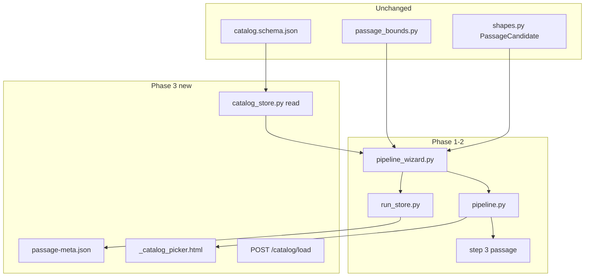

# Web UI v2 — Pipeline wizard (phase 3)

## Phase map and prerequisites

**Master roadmap:** [`handoff/WEB-UI-V2-PHASES.md`](handoff/WEB-UI-V2-PHASES.md)

| Phase | Plan | Gate |
|-------|------|------|
| 1 | [`.cursor/plans/archive/web_ui_pipeline_wizard_be50658c.plan.md`](.cursor/plans/archive/web_ui_pipeline_wizard_be50658c.plan.md) | [`handoff/WEB-UI-V2-PHASE1-PASSED.md`](handoff/WEB-UI-V2-PHASE1-PASSED.md) |
| 2 | [`.cursor/plans/archive/web_ui_pipeline_wizard_phase2_be50658c.plan.md`](.cursor/plans/archive/web_ui_pipeline_wizard_phase2_be50658c.plan.md) | [`handoff/WEB-UI-V2-PHASE2-PASSED.md`](handoff/WEB-UI-V2-PHASE2-PASSED.md) |
| **3 (this plan)** | This file | `handoff/WEB-UI-V2-PHASE3-PASSED.md` |
| 4–6 | Spec in phase map until prior gate passes | per phase map |

**Prerequisite:** [`handoff/WEB-UI-V2-PHASE2-PASSED.md`](handoff/WEB-UI-V2-PHASE2-PASSED.md) must exist.

**Shipped baseline:** [`src/eliotwf/infrastructure/run_store.py`](src/eliotwf/infrastructure/run_store.py), [`src/eliotwf/application/pipeline_wizard.py`](src/eliotwf/application/pipeline_wizard.py), [`src/eliotwf/presentation/routes/pipeline.py`](src/eliotwf/presentation/routes/pipeline.py), passage step at **wizard step 3**, done stub at **step 4**.

**Contracts (do not rewrite):** [`handoff/PIPELINE-UI-CATALOG.md`](handoff/PIPELINE-UI-CATALOG.md), [`docs/adr/002-owned-corpus-registry.md`](docs/adr/002-owned-corpus-registry.md), [`sources/catalog.schema.json`](sources/catalog.schema.json), [`src/eliotwf_skills/distiller/shapes.py`](src/eliotwf_skills/distiller/shapes.py), [`src/eliotwf_skills/distiller/passage_bounds.py`](src/eliotwf_skills/distiller/passage_bounds.py).

**Resolved decisions (from phase map D2/D3):**

| ID | Choice |
|----|--------|
| D2 | **Read-only picker** in phase 3; catalog CRUD in browser deferred to phase 3b |
| D3 | **`passage-meta.json` sidecar** separate from `wizard-state.json` |



## Context

Phase 2 shows discovery provenance on the passage step and prefills `excerpt_hint` for web/manual paths. When distiller marks `provenance: owned` or author/work matches the owned-corpus registry, the user still pastes prose by hand. Phase 3 closes that gap by reading markdown from catalog `locations[].path` into the textarea and recording owned metadata in `passage-meta.json` when the excerpt is saved.

**This plan does not change** `catalog.schema.json`, distiller skill, Exa MCP, or `shapes.py` validation rules.

**Catalog section cleared:** Owned corpus registry (read-only picker path; CRUD remains external until 3b).

## Scope

### In phase 3

- Read-only load of `sources/catalog.json` (missing file → empty catalog + link to `catalog.json.example`)
- Frozen `CatalogEntry` / `CatalogLocation` types in application layer
- `passage-meta.json` write on successful passage save when catalog load was used
- Catalog picker partial on passage step when discovery suggests owned corpus or author/work matches
- "Load from catalog" HTMX POST fills textarea + live band partial
- Hidden form fields carry `catalog_id` + `local_path` from catalog selection through to save
- `create_app(catalog_path=…)` injectable for tests (parallel to `runs_base`)
- Unit + HTTP tests; gate doc `handoff/WEB-UI-V2-PHASE3-PASSED.md`
- Remove phase 2 placeholder copy in [`_discovery_summary.html`](src/eliotwf/presentation/templates/pipeline/_discovery_summary.html) ("Catalog picker ships in phase 3")

### Out of phase 3 (phase 3b / 4+)

- Browser CRUD on `catalog.json` (phase 3b)
- Fetching web URLs in browser
- New wizard step or step renumber (phase 4 adds analyze step → steps 4–5)
- ELIOT analyze, prepare, hillclimb (phases 4–5)
- Run detail `passage-meta.json` tab (phase 6)

**Wizard steps unchanged in phase 3:**

| Step | Name |
|------|------|
| 0 | Start |
| 1 | Brainstorm |
| 2 | Discovery |
| 3 | Passage (+ catalog picker when applicable) |
| 4 | Done stub |

## Data shapes (name before code)

Add to [`application/pipeline_wizard.py`](src/eliotwf/application/pipeline_wizard.py) (or `application/pipeline_catalog.py` if module exceeds ~200 lines).

| Type | Fields | Role |
|------|--------|------|
| `CatalogLocation` | `label: str`, `path: str` | One row in `locations[]` |
| `CatalogEntry` | `id`, `author`, `work`, `register`, `locations: tuple[CatalogLocation, ...]`, `notes: str \| None` | Mirrors schema entry |
| `PassageMeta` | `provenance: Literal["owned"]`, `catalog_id: str`, `local_path: str`, `word_count: int` | Sidecar written on owned save |
| `CatalogLoadResult` | `ok`, `errors`, `text: str`, `preview: PassagePreview`, `catalog_id`, `local_path` | Returned to routes for HTMX partial |

**`passage-meta.json` schema (phase 3):**

```json
{
  "provenance": "owned",
  "catalog_id": "butterfield-ml-c64",
  "local_path": "C:/Books/.../ch07-addressing.md",
  "word_count": 287
}
```

Align with `PassageCandidate` owned fields; validate `word_count` via `validate_word_count` from `passage_bounds.py` on write.

**Picker visibility (passage step GET):**

Show catalog picker when any of:

- `discovery.json` passage `provenance == "owned"`
- `discovery.json` passage has `catalog_id`
- Any catalog entry matches discovery passage `author` + `work` (case-insensitive strip)

If `catalog_id` is set, pre-select that entry; else show all matches.

## Architecture

| Layer | Module | Responsibility |
|-------|--------|----------------|
| Infrastructure | [`catalog_store.py`](src/eliotwf/infrastructure/catalog_store.py) (new) | Parse `catalog.json`; `read_location_text(path)` with path allowlist from catalog only |
| Infrastructure | [`run_store.py`](src/eliotwf/infrastructure/run_store.py) | `PASSAGE_META_FILE`, `write_passage_meta`, `read_passage_meta` |
| Application | [`pipeline_wizard.py`](src/eliotwf/application/pipeline_wizard.py) | `load_catalog`, `match_catalog_entries`, `load_catalog_excerpt`, `stage_passage` writes meta when owned fields present |
| Presentation | [`pipeline.py`](src/eliotwf/presentation/routes/pipeline.py) | `POST /pipeline/{slug}/catalog/load`; pass catalog + matches to templates |
| Presentation | [`app.py`](src/eliotwf/presentation/app.py) | `app.state.catalog_path` default + test override |
| Templates | `_catalog_picker.html` (new); extend `_passage_step.html` | Entry/location selects + load button; hidden fields for owned meta |

**Import direction:** `presentation` → `application` → `infrastructure`. Routes never import `catalog_store` or read files directly.

**Path safety:** `load_catalog_excerpt` accepts only `(catalog_id, location_label)`; resolves path from the in-memory catalog tuple. Reject paths not present in loaded catalog. No arbitrary user-supplied filesystem paths.

**Word count:** `evaluator.counters.word_count` on loaded/saved textarea text; `passage_tier` for bands (fixture [`tests/fixtures/owned-corpus-excerpt.md`](tests/fixtures/owned-corpus-excerpt.md) is **287 words → `yellow_low`**).

## Routes (phase 3 additions)

| Method | Path | Behavior |
|--------|------|----------|
| GET | `/pipeline/{slug}` (step 3) | Include `catalog_entries`, `catalog_match`, `show_catalog_picker` in context when matches exist |
| POST | `/pipeline/{slug}/catalog/load` | CSRF; `catalog_id` + `location_label`; read file; return HTMX partial swapping textarea + `#passage-band` |

Extend existing `POST /pipeline/{slug}/passage` to accept optional `catalog_id` + `local_path` hidden fields; on success write `passage-meta.json` when both are present and provenance is owned.

## Phased delivery (implement in order)

Each sub-phase ends pytest green for its new tests.

### Phase A — Catalog store + fixture

- New [`src/eliotwf/infrastructure/catalog_store.py`](src/eliotwf/infrastructure/catalog_store.py): `load_catalog(path) -> tuple[dict, ...]` raw or parsed entries; missing file → `()`
- New [`tests/fixtures/catalog.json`](tests/fixtures/catalog.json) pointing `locations[].path` at `tests/fixtures/owned-corpus-excerpt.md`
- Tests in `tests/test_catalog_store.py`

**Verify:** `pytest tests/test_catalog_store.py -q`

### Phase B — Application catalog use cases

- Frozen `CatalogEntry` / `CatalogLocation` / `PassageMeta` types
- `load_catalog(*, catalog_path) -> tuple[CatalogEntry, ...]`
- `match_catalog_entries(discovery_summary, entries) -> tuple[CatalogEntry, ...]`
- `load_catalog_excerpt(catalog_id, location_label, *, catalog_path) -> CatalogLoadResult`
- `run_store.write_passage_meta` / `read_passage_meta`
- Extend `stage_passage(..., catalog_id=None, local_path=None)` to write sidecar when owned fields set
- Tests: missing catalog, valid load, path not in catalog rejected, meta written on save

**Verify:** `pytest tests/test_pipeline_wizard.py -k catalog -q`

### Phase C — App state + picker UI

- `create_app(catalog_path=…)` in [`app.py`](src/eliotwf/presentation/app.py); default `repo_root / sources / catalog.json`
- `_catalog_picker.html` with entry select, location select, "Load from catalog" button
- Include partial in `_passage_step.html` when `show_catalog_picker`
- Wire `POST /catalog/load` HTMX partial (textarea + band)
- Hidden `catalog_id` / `local_path` on passage form after load

**Verify:** `pytest tests/test_presentation_pipeline.py -k catalog -q`

### Phase D — Discovery summary cleanup + edge cases

- Update `_discovery_summary.html` owned badge (remove "ships in phase 3"; link to picker when visible)
- Empty catalog state: message + link to `sources/catalog.json.example`
- CSRF 403 on catalog POST without token

**Verify:** `pytest tests/test_presentation_pipeline.py -q` then full suite

### Phase E — Handoff

- `handoff/WEB-UI-V2-PHASE3-PASSED.md`
- Update `STATE.md`, `README.md`, `AGENTS.md`
- Link this plan from `WEB-UI-V2-PHASES.md` phase 3 section; mark phase 3 Shipped / phase 4 Next implement in references table
- Optional one-line ADR 001 addendum noting `passage-meta.json` in wizard run folders

## Verification

```powershell
$env:PYTHONPATH="src"
python -m pytest tests/test_catalog_store.py tests/test_pipeline_wizard.py tests/test_presentation_pipeline.py -q
python -m pytest -q
```

**Unit tests**

- `load_catalog` missing file returns empty tuple
- `load_catalog` parses fixture JSON
- `load_catalog_excerpt` reads owned-corpus fixture; tier is `yellow_low` (287 words)
- `load_catalog_excerpt` rejects path not in catalog
- `stage_passage` with catalog fields writes `passage-meta.json`
- `stage_passage` manual paste does not write `passage-meta.json`

**HTTP tests**

- Passage step with owned discovery fixture shows catalog picker HTML
- POST catalog/load returns excerpt text and band partial
- POST passage after catalog load writes both `source-excerpt.md` and `passage-meta.json`
- CSRF missing on catalog POST returns 403

**Manual**

- `.\tools\start-eliotwf.ps1` → create slug → import owned discovery or skip → passage step → pick catalog entry → load → save → confirm `tools/runs/<slug>/passage-meta.json`

## Handoff sync (end of phase 3)

- [`handoff/STATE.md`](handoff/STATE.md) — phase 3 passed; next phase 4 analyze handoff
- [`handoff/README.md`](handoff/README.md) — gate row + link to `WEB-UI-V2-PHASE3-PASSED.md`
- [`handoff/WEB-UI-V2-PHASES.md`](handoff/WEB-UI-V2-PHASES.md) — gate link under phase 3; references table phase 3 Shipped
- [`AGENTS.md`](AGENTS.md) — note catalog picker on passage step

## Files touched (phase 3)

| Path | Change |
|------|--------|
| `src/eliotwf/infrastructure/catalog_store.py` | new read-only catalog I/O |
| `src/eliotwf/infrastructure/run_store.py` | `passage-meta.json` read/write |
| `src/eliotwf/application/pipeline_wizard.py` | catalog types + use cases; extend `stage_passage` |
| `src/eliotwf/presentation/app.py` | `catalog_path` on app state |
| `src/eliotwf/presentation/routes/pipeline.py` | catalog load route; passage context |
| `src/eliotwf/presentation/templates/pipeline/_catalog_picker.html` | new |
| `src/eliotwf/presentation/templates/pipeline/_passage_step.html` | include picker |
| `src/eliotwf/presentation/templates/pipeline/_discovery_summary.html` | remove phase 3 placeholder |
| `tests/fixtures/catalog.json` | test catalog pointing at owned excerpt |
| `tests/test_catalog_store.py` | new |
| `tests/test_pipeline_wizard.py` | catalog cases |
| `tests/test_presentation_pipeline.py` | catalog HTTP |
| `handoff/WEB-UI-V2-PHASE3-PASSED.md` | gate record |

## Risks and mitigations

| Risk | Mitigation |
|------|------------|
| Arbitrary path read via forged POST | Resolve path only from loaded catalog tuple; never trust raw path from client |
| User machine has no `sources/catalog.json` | Empty catalog + example link; manual paste still works |
| Catalog path breaks after machine move | Document edit `catalog.json` externally (3b adds UI) |
| `stage_passage` signature grows | Optional `catalog_id`/`local_path` kwargs only; manual path unchanged |
| Discovery author/work fuzzy match too broad | Match author+work both required; case-insensitive strip |

## Applicable skills

- [tool-ui-htmx](.cursor/skills/tool-ui-htmx/SKILL.md) — HTMX partial for catalog load + band
- [pipeline](.cursor/skills/pipeline/SKILL.md) — owned provenance downstream
- [distiller](.cursor/skills/distiller/SKILL.md) — `PassageCandidate` owned fields reference

## Paste-in for implementer

```
Read .cursor/plans/archive/web_ui_wizard_phase_3_db503675.plan.md and implement phase 3 only.
Phase map: handoff/WEB-UI-V2-PHASES.md
Phase 2 gate: handoff/WEB-UI-V2-PHASE2-PASSED.md
Catalog: handoff/PIPELINE-UI-CATALOG.md, sources/catalog.schema.json
Run pytest with PYTHONPATH=src when done.
Do not change catalog.schema.json or shapes.py validation rules.
```
