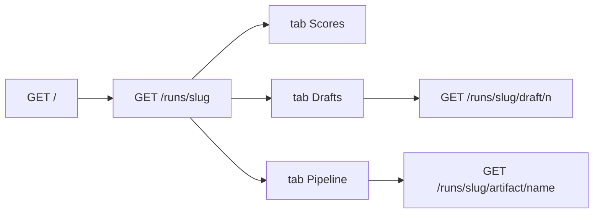

# Web UI v2 — Phase 6 run detail drill-down (final)

## Why this is the last wizard phase

Phases 1–5 built the **wizard** (`/pipeline/{slug}`) and **unified index** (`/`). Phase 6 completes the **hillclimb dashboard** (`/runs/{slug}`) so you can drill from index into drafts and pipeline artifacts without leaving the browser.

After phase 6 the local workbench is feature-complete per [`handoff/WEB-UI-V2-PHASES.md`](handoff/WEB-UI-V2-PHASES.md). Hosting, auth, and CSRF parity are a separate **host-prep** slice (weeks away).

**Prerequisites (shipped):**
- [`handoff/WEB-UI-V2-PHASE5-PASSED.md`](handoff/WEB-UI-V2-PHASE5-PASSED.md)
- Index routing fix: `wizard_step` → `/pipeline/`, `iteration_count` → `/runs/` ([`runs/index.html`](src/eliotwf/presentation/templates/runs/index.html) lines 26–31)

**Baseline detail page:** [`detail.html`](src/eliotwf/presentation/templates/runs/detail.html) — inline scoreboard, per-iteration axis breakdown, artifact path list. Entry still requires `scores.json` via [`hillclimb_runs.run_detail`](src/eliotwf/application/hillclimb_runs.py).



## Resolved decisions

| ID | Choice |
|----|--------|
| D4 | **Defer CSRF on runs routes to host-prep.** Phase 6 adds GET-only HTMX fragments. Wizard POSTs already have CSRF. Revisit when binding off localhost. |
| D6 | **Detail remains hillclimb-gated.** `GET /runs/{slug}` still requires `scores.json`. Wizard-in-progress and distiller-only rows stay on index (`/pipeline/` or plain text). |
| D7 | **Reuse wizard read seams.** Pipeline tab calls `pipeline_wizard.load_discovery_summary`, `preview_passage`, and includes [`_discovery_summary.html`](src/eliotwf/presentation/templates/pipeline/_discovery_summary.html) (no catalog picker). |

## Scope

**In**
- HTMX tab shell on [`detail.html`](src/eliotwf/presentation/templates/runs/detail.html): Scores | Drafts | Pipeline
- Extract existing scoreboard + axis sections into [`_tab_scores.html`](src/eliotwf/presentation/templates/runs/_tab_scores.html)
- [`_tab_drafts.html`](src/eliotwf/presentation/templates/runs/_tab_drafts.html): list `draft-v{n}.md`; click loads body via HTMX
- [`_tab_pipeline.html`](src/eliotwf/presentation/templates/runs/_tab_pipeline.html): discovery summary, passage-meta, excerpt preview
- Passage band in detail header when excerpt or passage-meta exists
- New application module [`run_detail_view.py`](src/eliotwf/application/run_detail_view.py): draft listing, allowlisted artifact reads, pipeline tab context
- Routes on [`runs.py`](src/eliotwf/presentation/routes/runs.py):
  - `GET /runs/{slug}/draft/{n}` — HTMX fragment
  - `GET /runs/{slug}/artifact/{name}` — allowlist only
- Tests in [`test_presentation_runs.py`](tests/test_presentation_runs.py) + unit tests for allowlist

**Out**
- CSRF retrofit (D4 → host-prep)
- Auth, HTTPS, non-localhost bind
- Running distiller/ELIOT/hillclimb from HTTP
- Detail page for folders without `scores.json`
- `style-block.md` on artifact allowlist (phase map lists four names only; add in host-prep if needed)

## Data shapes ([`run_detail_view.py`](src/eliotwf/application/run_detail_view.py))

| Type | Fields | Role |
|------|--------|------|
| `DraftRef` | `n: int`, `filename: str` | One draft in tab list |
| `PipelineTabContext` | `discovery_summary`, `passage_meta: dict \| None`, `excerpt_preview: str`, `preview: PassagePreview \| None` | Pipeline tab GET |
| `ArtifactResult` | `ok: bool`, `errors: tuple[str, ...]`, `content: str`, `content_type: str` | Allowlisted file read |

**Allowlist** (frozen set, map to `run_store` constants):

- `discovery.json` → `read_discovery` + validate optional for display
- `passage-meta.json` → `read_passage_meta`
- `source-excerpt.md` → `read_source_excerpt`
- `rough-input.md` → `read_rough_input`

**`read_allowlisted_artifact(slug, name, *, runs_base)`** rules:
- Reject if `name` not in allowlist (no path components, no `..`)
- Reject if slug fails `run_store.validate_slug`
- Return 404-style error tuple if file missing
- Cap excerpt preview length in application (e.g. first 2000 chars) for pipeline tab; full body only via artifact route

**`list_drafts(run_dir)`** — glob `draft-v*.md`, parse `n` from filename, sort by `n`.

## Presentation

### Tab shell ([`detail.html`](src/eliotwf/presentation/templates/runs/detail.html))

- Keep summary cards (best draft, best total, iters, stop)
- Add passage band partial when `preview` present (reuse [`_passage_band.html`](src/eliotwf/presentation/templates/pipeline/_passage_band.html))
- Tab buttons with `hx-get` to swap `#run-detail-tab` innerHTML
- Default tab: Scores (current content)
- Move inline scoreboard/axes into `_tab_scores.html`

### Drafts tab

- List drafts from `list_drafts`
- Each row: `hx-get="/runs/{{ slug }}/draft/{{ n }}"` → `#draft-pane`
- Fragment template [`_draft_body.html`](src/eliotwf/presentation/templates/runs/_draft_body.html): monospace `<pre>` of draft prose

### Pipeline tab

- If `discovery_summary`: include `_discovery_summary.html` with `show_catalog_picker=false`
- If `passage_meta`: small key-value card (catalog_id, local_path, word_count)
- If excerpt: truncated preview + link to full artifact route
- Missing files: omit section (no error wall)

### Routes ([`runs.py`](src/eliotwf/presentation/routes/runs.py))

Extend `_render_wizard` pattern from pipeline: check `request.headers.get("hx-request")` where useful; fragments return partial templates only.

| Method | Path | Behavior |
|--------|------|----------|
| GET | `/runs/{slug}` | Full page; pass `pipeline_ctx`, `preview`, `drafts` for tab shell |
| GET | `/runs/{slug}/draft/{n}` | HTMX fragment; 404 if draft missing |
| GET | `/runs/{slug}/artifact/{name}` | Plain-text or HTML preview; 403/404 on allowlist miss |

## Phased delivery (pytest green after each)

### A — Application read seam
- [`run_detail_view.py`](src/eliotwf/application/run_detail_view.py): `ALLOWLISTED_ARTIFACTS`, `list_drafts`, `read_draft`, `read_allowlisted_artifact`, `pipeline_tab_context`
- Unit tests: allowlist rejects `../etc/passwd`, `list_drafts` on fixture dir

### B — Tab shell + scores extraction
- `_tab_scores.html`; refactor `detail.html` to tab layout
- Existing `test_run_detail_shows_scoreboard` still passes

### C — Drafts tab + route
- `_tab_drafts.html`, `_draft_body.html`
- `GET /runs/{slug}/draft/{n}`
- HTTP test: fragment returns draft prose from hillclimb fixture

### D — Pipeline tab + passage band
- `_tab_pipeline.html`; wire `pipeline_tab_context` on detail GET
- HTTP test: full-pipeline fixture (scores + discovery + excerpt) shows discovery author on pipeline tab

### E — Artifact route + security tests
- `GET /runs/{slug}/artifact/{name}`
- HTTP test: `artifact/../../../etc/passwd` → 403 or 404, never reads outside run dir

### F — Gate + handoff sync
- [`handoff/WEB-UI-V2-PHASE6-PASSED.md`](handoff/WEB-UI-V2-PHASE6-PASSED.md)
- Update [`STATE.md`](handoff/STATE.md), [`AGENTS.md`](AGENTS.md), [`WEB-UI-V2-PHASES.md`](handoff/WEB-UI-V2-PHASES.md) references table
- Mark Web UI v2 **complete** in STATE (no phase 7 in phase map)

## Verification gate

| Gate | Test |
|------|------|
| Detail shows tab list | HTTP fixture with drafts |
| Draft fragment works | `GET /runs/{slug}/draft/1` returns prose |
| Allowlist blocks traversal | HTTP `artifact/../../../etc/passwd` |
| Scoreboard unchanged | Existing `test_run_detail_shows_scoreboard` |
| Full suite | `python -m pytest -q` with `PYTHONPATH=src` |

**Manual:** Index → hillclimb slug → Drafts tab → draft-v1 → Pipeline tab → discovery summary.

## Risks

| Risk | Mitigation |
|------|------------|
| `detail.html` grows large | Extract all three tabs to partials in step B |
| Duplicating discovery display logic | Reuse `_discovery_summary.html` + `load_discovery_summary` |
| Artifact route path escape | Allowlist keys only; never `Path(name)` join without basename check |
| Full-pipeline runs missing discovery on detail | Pipeline tab shows only present artifacts; no error |

## Applicable skills

- [`tool-ui-htmx`](.cursor/skills/tool-ui-htmx/SKILL.md) — HTMX tabs, fragment routes
- [`handoff/PIPELINE-UI-CATALOG.md`](handoff/PIPELINE-UI-CATALOG.md) — artifact names and bands

## Paste-in for implementer

```
Read .cursor/plans/archive/web_ui_wizard_phase_6_<id>.plan.md and implement phase 6 only.
Phase map: handoff/WEB-UI-V2-PHASES.md
Phase 5 gate: handoff/WEB-UI-V2-PHASE5-PASSED.md
Run pytest with PYTHONPATH=src when done.
D4: CSRF deferred to host-prep — no runs POST routes in this phase.
Detail entry still requires scores.json; do not change hillclimb_runs scoring.
```
