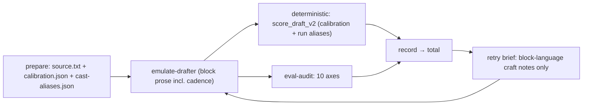

# Writing-First Scoring: Cadence, Source-Derived CAST, Craft Briefs

**Status:** shipped 2026-07-07

## Why (verified)

- ELIOT 5.3/5.7 PROSODY is rhythm + cadence + stress first; the numeric `fingerprint` was added in 5.7 as *verification* ("impressions are not verification targets"). The analyzer side is intact — [tools/runs/rilke-hc-5iter/style-block.md](tools/runs/rilke-hc-5iter/style-block.md) carries the full cadence prose.
- But the score only reads the skeleton: PROSODY is deterministic-only (buckets/punctuation), and [.cursor/skills/evaluator/references/style-block-rubric.md](.cursor/skills/evaluator/references/style-block-rubric.md) forbids eval-audit from judging it. Rhythm as sound is invisible to the loop.
- `record_iteration` scores via `evaluate_draft` (v2 when `calibration.json` exists in the run dir; v1 fallback for legacy runs).

## Phase 1 — Writing-first loop docs (no engine change)

Edit [.cursor/skills/workflow/references/one-command.md](.cursor/skills/workflow/references/one-command.md) and [.cursor/skills/workflow/SKILL.md](.cursor/skills/workflow/SKILL.md) (bump v1.4):

- **Retry brief language rule**: briefs quote the block's own field prose ("medium-weighted periodic sentences; reserve the short declarative and rhetorical question for departure moments"), never numeric targets. Fingerprint numbers are the check, not the goal. Forbidden: `bucket-counts-in-brief`.
- **Alternating passes**: odd iterations target the weakest qualitative axis; even iterations are a read-aloud cadence pass judged against the block's PROSODY prose (cadence sources, stress, closes) with "change nothing else."
- **Best-of-n seeding** (optional `seeds: N`, default 1): parent spawns N independent emulate-drafter Tasks *in one message* for draft-v1 candidates, scores all, records only the winner (losers kept as `draft-v1a.md` sidecars, not in scores.json). Attacks the real variance source (first drafts vary 72–85; climbing gains 2–5).

## Phase 2 — Source-derived CAST + wire scorer v2 into the loop

Goal: any sample text, no per-author Python tables in the scoring path.

- **Alias intake**: `/hillclimb` prepare step has the parent (which has just read the source for the style block anyway) write `tools/runs/<slug>/cast-aliases.json` — `{"CHARACTER": ["alias", ...]}`, named cast only; narrator/author excluded (they stay qualitative in DEIXIS/DNA). Document the schema + rules (epithets, roles, reverent pronouns w/ capitalization guard) in the workflow reference.
- **prepare.py**: accept optional alias mapping; pass to `calibration.measure(source_text, aliases=...)` so `cast_present` reflects who the source actually instantiates. CLI `--cast-aliases <path>` on the `prepare` subcommand in [.cursor/skills/workflow/scripts/hillclimb_once.py](.cursor/skills/workflow/scripts/hillclimb_once.py).
- **Empty named cast drops the axis**: in `_score_cast` (v2), return no CAST section instead of default 50.0 when `cast_present` is empty; deterministic mean is then over SURFACE+PROSODY (vector shows UNSCORED — already supported by `_build_vector`).
- **Loop records with v2**: `record_iteration` uses `score_draft_v2(draft, calibration, run_aliases)` when `calibration.json` exists in the run dir; falls back to v1 block-scoring when absent (old runs stay reproducible). `cast_aliases.py` per-author tables remain only as test fixtures.
- Tests: alias round-trip through prepare, cast_present populated, empty-cast omission, v1 fallback, and a rescore of the rilke fixture showing "the prodigal" now matches.

## Phase 3 — CADENCE qualitative axis (contract change; gate: confirm before starting)

Give the poetics a scored voice. Recommendation: add `CADENCE` as a tenth qualitative section.

- [src/eliotwf_skills/shapes/score.py](src/eliotwf_skills/shapes/score.py): add `"CADENCE"` to `BLOCK_SECTIONS` (vector grows 13→14; contract is versioned by this change — update tests asserting vector length).
- Rubric: new CADENCE section in style-block-rubric.md — judged against the block's PROSODY *prose* (cadence sources, stress patterns, departure function, paragraph close mode), with tier anchors and the trap "do not re-count sentence lengths; that is deterministic PROSODY's job."
- [.cursor/agents/eval-audit.md](.cursor/agents/eval-audit.md): nine → ten sections; JSON contract updated.
- Alternative (if contract must stay frozen): fold cadence questions into DNA and DEIXIS-tempo rubric text only — zero code, weaker signal. Named in case you prefer it.

## Which of these serves the writing (honesty check)

- Phase 1: pure craft — briefs become writing instructions.
- Phase 2: scoring honesty — removes a fake 16-pt penalty so the loop stops optimizing a substring.
- Phase 3: makes the thing you care most about (rhythm as heard) part of what climbing improves.

## Verification per phase

- Phase 1: docs only — review; skill/agent lints per authoring rules.
- Phase 2: `pytest tests/` green; rescore `tools/runs/rilke-hc-5iter-v2/draft-v1.md` → CAST 100 with run aliases, total ≈ high 80s.
- Phase 3: `pytest tests/` green; one live eval-audit smoke on an existing rilke draft returns 10 sections and validator accepts.

Update handoff STATE/README deferred entries as each phase lands (draft-merge stays deferred until Phase 2 ships).