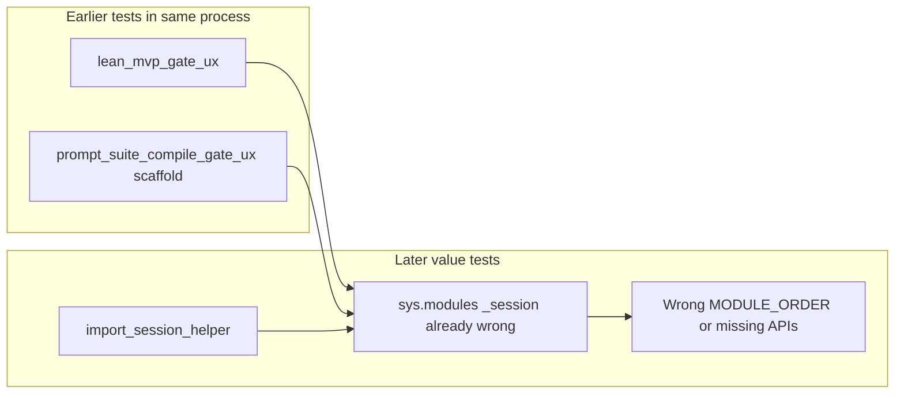

# Lean-MVP coaching: out-of-scope follow-up

## Context

[handoff/LEAN-MVP-COACHING-LAYER-PASSED.md](handoff/LEAN-MVP-COACHING-LAYER-PASSED.md) records **15 failed, 108 passed** on `python -m pytest tests -q`. The 15 failures ([`.pytest_cache/v/cache/lastfailed`](.pytest_cache/v/cache/lastfailed)) are all **value** or **prompt-suite-compile** tests that expect **value** `_session` APIs, but an earlier test in the same process cached **`sys.modules["_session"]` from another skill** because helpers do `sys.path.insert` + bare `import _session`.

**Self-check (verified):** There are **123** collected tests in `tests/` (sum of `def test_` across modules matches 15+108). Only **four** test modules import `_session` directly; lean-mvp coaching tests correctly use subprocess only. `_session` is a **package** at `scripts/_session/` (not a single `_session.py`) in value, lean-mvp, and compiled scaffolds alike.

Empty `kb_refs` today (intentionally allowed by [tests/test_lean_mvp_coaching.py](tests/test_lean_mvp_coaching.py)): **C02, C03, C04, C05, U02, U03, MS06, MT04** in [skills/lean-mvp/assets/atom-coaching.json](skills/lean-mvp/assets/atom-coaching.json). Coaching still works; `definitions` in the turn payload stay thin on those atoms.



Value `MODULE_ORDER` is four modules (`profile`, …); lean-mvp has five (`customer-context`, …). A poisoned import is easy to spot in isolation tests; in full suite it surfaces as wrong DAG / gate behavior.

---

## Track P0: `_session` import isolation (target: **123 passed**)

### Approach (minimal skill change)

Add one shared test helper that loads the **`scripts/_session` package** under a **unique module name** per resolved `scripts_dir` (e.g. `_skill_session_<hash>`), via `importlib.util.spec_from_file_location` on `_session/__init__.py` with `submodule_search_locations=[scripts_dir / "_session"]`. **Never** register `sys.modules["_session"]`.

Suggested location: [tests/skill_session_loader.py](tests/skill_session_loader.py) (new), with a single public API:

- `load_skill_session(scripts_dir: Path) -> ModuleType`
- After load, call **`reset_atom_indexes()`** (exported from both value and lean-mvp `_session`; compile scaffold matches). Replace [tests/test_value_session_integrity.py](tests/test_value_session_integrity.py)’s direct `_atom_indexes_built = False` hack with the same reset.
- Prefer **not** leaving every `scripts_dir` on `sys.path` permanently; insert only for the load if needed, or rely on `submodule_search_locations` so a later accidental `import _session` is less likely (still forbidden in tests after migration).

### Call sites to migrate (only four)

| File | Current pattern |
|------|-----------------|
| [tests/value_skill_support.py](tests/value_skill_support.py) `import_session_helper()` | insert path + `import _session` |
| [tests/test_value_session_integrity.py](tests/test_value_session_integrity.py) `import_session()` | duplicate of above |
| [tests/test_lean_mvp_gate_ux.py](tests/test_lean_mvp_gate_ux.py) `seed_ready_for_gate` | `from _session import ...` |
| [tests/test_prompt_suite_compile_gate_ux.py](tests/test_prompt_suite_compile_gate_ux.py) `gate_context` | `from _session import ...` |

Refactor integrity tests to use `import_session_helper()` from support (or the new loader) so path logic lives in one place.

### Regression guard

Add **one** test in the new module or [tests/test_skill_session_isolation.py](tests/test_skill_session_isolation.py):

1. Load [.cursor/skills/value/scripts](.cursor/skills/value/scripts) (same path [tests/value_skill_support.py](tests/value_skill_support.py) uses), assert `MODULE_ORDER[0] == "profile"`.
2. Load [skills/lean-mvp/scripts](skills/lean-mvp/scripts) (same as [tests/test_lean_mvp_gate_ux.py](tests/test_lean_mvp_gate_ux.py)), assert `MODULE_ORDER[0] == "customer-context"`.
3. Reload value module from loader cache; assert value `MODULE_ORDER` unchanged (length 4 vs lean-mvp 5).

This fails under the old `import _session` pattern when run after lean-mvp in the same test.

### Verification

```powershell
python -m pytest tests -q
```

**Done predicate:** `123 passed`, 0 failed; spot-check that the former 15 names in `lastfailed` are gone.

### Handoff touch-up (after green)

Update [handoff/LEAN-MVP-COACHING-LAYER-PASSED.md](handoff/LEAN-MVP-COACHING-LAYER-PASSED.md) `(section outcome)` measured line and `(next)` to record collision fix; keep coaching-layer facts unchanged.

---

## Track P1: Fill eight `kb_refs` (+ KB nodes where missing)

### Policy

- Use **dotted paths** into [skills/lean-mvp/assets/knowledge-base.json](skills/lean-mvp/assets/knowledge-base.json) (same rule as coaching layer).
- Prefer **restoring** prose from [docs/lean-product-playbook-prompt-suite.md](docs/lean-product-playbook-prompt-suite.md) (same source as INVEST restoration), not inventing new doctrine.
- After editing canonical tree, **byte-copy mirror** to [.cursor/skills/lean-mvp/](.cursor/skills/lean-mvp/) and run [tests/test_lean_mvp_skill_package.py](tests/test_lean_mvp_skill_package.py) mirror test.

### Proposed KB additions (new top-level or nested keys)

| New KB key (draft) | Source in playbook / references | Serves atom |
|--------------------|----------------------------------|-------------|
| `earlyvangelist_ladder` (5 rungs + action) | [skills/lean-mvp/references/customer-context.md](skills/lean-mvp/references/customer-context.md) doctrine; cross-check [docs/value-proposition-prompt-suite (1).md](docs/value-proposition-prompt-suite%20(1).md) `earlyvangelist_ladder` | **C05** |
| `adoption_lifecycle` (Rogers five segments + “hypothesis until purchase evidence”) | Atom ask + coaching `common_miss` on C04 | **C04** |
| `roi_prioritization_matrix` (return × effort buckets, v1 vs v1.1) | Playbook MVP-Scoper §3 (lines ~230–240) | **MS06** |
| `aarrr_framework` + `mtmm_retention_first` (define AARRR, pick one MTMM, retention before acquisition) | Playbook Metric-Optimizer §3 (lines ~317–322) | **MT04** |

### Proposed `kb_refs` per atom (existing keys where enough)

| Atom | Proposed `kb_refs` |
|------|-------------------|
| **C02** | `visual_grounding_analogies.follow_me_home` (voice-of-customer / observation, not marketing copy) |
| **C03** | `pmf_pyramid_hierarchy.problem_space_market` (array node; `flatten_kb_value` already joins lists) — or a short new `persona_traits` node if pyramid feels too coarse |
| **C04** | `adoption_lifecycle` (new) |
| **C05** | `earlyvangelist_ladder` (new) |
| **U02** | `kano_model_categories.performance_features` (second benefit for comparison / “more is better”) |
| **U03** | `visual_grounding_analogies.space_pen_mirage` (stay on motivation / problem, not solution) |
| **MS06** | `roi_prioritization_matrix` (new) |
| **MT04** | `aarrr_framework`, `mtmm_retention_first` (new, or one combined object with two dotted children) |

### Tests

- Existing `test_kb_refs_resolve_to_readable_text` must stay green (paths must exist).
- Optional tighten: assert these eight atoms have **non-empty** `kb_refs` so they cannot regress to silent definitions (small addition to [tests/test_lean_mvp_coaching.py](tests/test_lean_mvp_coaching.py)).

### Verification

```powershell
python -m pytest tests/test_lean_mvp_coaching.py tests/test_lean_mvp_skill_package.py -q
python tools/drafts/lean-mvp-coaching/demo_turn.py C05 --json-only
python tools/drafts/lean-mvp-coaching/demo_turn.py MS06 --json-only
python tools/drafts/lean-mvp-coaching/demo_turn.py MT04 --json-only
```

Confirm `coaching.definitions` is non-empty for those targets.

---

## Execution order

1. **P0** loader + four call sites + isolation test + full `pytest tests -q`.
2. **P1** KB JSON + eight `kb_refs` + mirror + coaching tests + demo spot checks.
3. Update handoff measured outcome.

## Explicit non-goals

- Renaming `_session.py` inside shipped skills (would break skill clones and docs).
- Converting all lean-mvp tests to subprocess-only (heavier than importlib isolation).
- Git commit / PR unless you ask separately.

## Model / agents

All work in-thread on **Composer 2.5**; no arena or subagent fan-out unless you change that.

---

## Plan audit log

| Claim | Status |
|-------|--------|
| 15 failures, 108 passed → **123** total tests | **Verified** (test method counts in `tests/`) |
| Eight empty `kb_refs` atoms (C02–C05, U02, U03, MS06, MT04) | **Verified** in [skills/lean-mvp/assets/atom-coaching.json](skills/lean-mvp/assets/atom-coaching.json) |
| Only four import sites | **Verified** (grep); no other `import _session` under `tests/` |
| Root cause `sys.modules["_session"]` collision | **Plausible**; diagram updated to include **prompt-suite scaffold** as well as lean-mvp |
| Loader loads `_session.py` | **Corrected** → package `scripts/_session/` |
| Value vs compile reset hooks | **Corrected** → both use `reset_atom_indexes()`; unify integrity helper |
| P1 `kb_refs` paths vs `test_kb_refs_resolve` | **Verified** — resolver walks dotted paths; new keys must exist in KB JSON |
| P1 C02 `follow_me_home` / C03 pyramid | **Weak but acceptable** teaching links; optional `persona_traits` called out |
| Plan file lives in repo `.cursor/plans/` | **Note:** file is under user `~/.cursor/plans/coaching_out-of-scope_3862e411.plan.md`; copy into [`.cursor/plans/`](.cursor/plans/) if you want it versioned with the repo |
