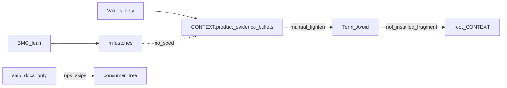

# Consumer vernacular polish (corrected)

## Your attempt (restated)

Pack is **transportable**: any repo, start from wherever (clarity / business / MVP), save under `workproduct/`, return later, and have that language usable in **forward coding work** the way [domain-modeling](file:///C:/Users/rphow.LITTLESPARK/.agents/skills/domain-modeling/SKILL.md) grows root `CONTEXT.md` (glossary only; Term / `_Avoid_`; from grilling via grill-with-docs). Docs describing the bridge are not enough — the installed pack must make the lift real.

## My earlier assumption — wrong

I treated “done” as **LIGHT**: chat cues + ship-repo docs. That matches “remind an attentive human once.” It does **not** match “later coding agents keep using the vocabulary.” Domain-modeling updates `CONTEXT.md` when terms crystallize; our seed stays buried under `workproduct/` and coding agents never see it unless something durable lands in the host repo.

## Failure evidence (ranked)

1. **`npx` does not install the bridge docs.** [docs/for-your-repo.md](docs/for-your-repo.md) says skills install, not a copy of every doc. [docs/AGENTS.fragment.md](docs/AGENTS.fragment.md) lives under ship `docs/` only — **zero** copies under `skills/*/assets/`. Cue “paste AGENTS.fragment” 404s in the consumer tree.

2. **Nothing durable points coding agents at `workproduct/`.** Grep: product-spine and Values `SKILL.md` have no promote / root-CONTEXT / AGENTS.fragment protocol. Chat cues die with the session.

3. **`CONTEXT.product.md` is Values-only.** BMG/lean `BUILD_PACK_FILES = ()`. Their render text still says “Prefer … CONTEXT.product.md” — dead. Canvas-first or skip-value paths accumulate milestones with **no glossary seed**.

4. **Seed is gated.** Earliest automatic emit is profile `write_milestone` (or pause `--force`). Mid-profile without pause → no seed. Values surfaces **north-star** in chat after gates ([SKILL.md](.cursor/skills/value/SKILL.md) ~L184) — no parallel surface-promote for CONTEXT.

5. **Product-spine loads workproduct for claim/story, not coding vernacular.** `must-read-if-present` is profile / value-map / north-star — **not** `CONTEXT.product.md`. Guide-turns route siblings; they do not grow host `CONTEXT.md`.

6. **Shape mismatch.** Domain-modeling wants `**Term**:` / `_Avoid_:`. Live seed ([workproduct/.../CONTEXT.product.md](workproduct/value-proposition/shiftswap/CONTEXT.product.md)) is sectioned evidence bullets (`(decision)`, `(fact)`). Template says “Tighten into Term / _Avoid_ when a word stabilizes” — **manual transform**, no helper. LIGHT cues do not close that hole.

7. **Prior plan out-of-scope left the hard part out.** “No BMG/lean seeds” + “no auto-write” without a confirm script = permanent hole for non-Values paths and no structural fix for coding agents.

## Corrected done definition

A consumer who ran `npx skills add rphoward/Product-Spine` can, **without** opening the GitHub docs tab:

1. Find `AGENTS.fragment.md` under an **installed** skill asset path.
2. After Values profile gate (or pause), have `CONTEXT.product.md` on disk and a **SKILL-mandated** one-shot promote offer (not ad-lib chat).
3. Run a **dry-run-default, confirm-gated** script that drafts Term / `_Avoid_` into root `CONTEXT.md` and optionally appends the AGENTS fragment — never silent overwrite.
4. On BMG/lean-only with no seed: product-spine names the gap and points to `/value` profile (or Values pause) for glossary seed — honest, not inventing a second glossary pipeline in v1.
5. Claim phase `must-read` includes `CONTEXT.product.md` when present so story/coding handoff sees the seed.
6. Tests guard asset presence + protocol strings + script dry-run; handoff closes only with that evidence.

## Corrected work

1. **Ship fragment as skill asset** — copy [docs/AGENTS.fragment.md](docs/AGENTS.fragment.md) to `.cursor/skills/product-spine/assets/AGENTS.fragment.md` (and Values assets for solo Values install). Point protocols at that path. Keep ship `docs/` as human README; update [docs/for-your-repo.md](docs/for-your-repo.md) to say “after install, path is `.cursor/skills/product-spine/assets/…`”.

2. **Durable protocols (not chat-only)**  
   - Values: `surface-promote` after build-pack refresh (gate / pause / completion) — one fixed beat naming session `CONTEXT.product.md` + offer `promote_context.py --dry-run`. Parallel to existing `surface-north-star`.  
   - Product-spine: on clarity-ready return (and when seed exists later), vernacular line in guide-turn; when BMG/lean progress exists and seed missing → explicit Values profile cue.  
   - Claim `must-read-if-present`: add `CONTEXT.product.md` (and note `AGENTS.product.md`).

3. **`promote_context.py` (Values scripts, confirm-gated)**  
   - Input: `workproduct/value-proposition/<slug>/CONTEXT.product.md`  
   - Output: dry-run print of Term / `_Avoid_` draft; on `--apply` after explicit consent, merge/create root `CONTEXT.md` Language section; optional `--agents` append fragment if root `AGENTS.md` lacks the Product-Spine block.  
   - No silent write. No inventing stack terms. Shape toward domain-modeling CONTEXT-FORMAT.

4. **BMG/lean bridge (honest v1)** — no new build-pack in BMG/lean yet. Product-spine documents and cues: glossary seed comes from Values; canvas-first users still need profile gate or pause once. (Defer dual emitters unless this cue fails in walks.)

5. **Mirrors, tests, close** — digest-match value + product-spine; string/asset tests; script unit test on a fixture seed; close [handoff/SKILL-PACK-CONSUMER-VERNACULAR-OPEN.md](handoff/SKILL-PACK-CONSUMER-VERNACULAR-OPEN.md) only when 1–4 have evidence; refresh Product-Spine (and Values) ships when you ask.

## Still out of scope

- Silent auto-write of root `CONTEXT.md` without confirm
- Rewriting global grill-with-docs / domain-modeling (read as shape reference only)
- Full BMG/lean `CONTEXT.product` emitters (v1 cue only)
- Resuming `/cursor-landing`

## Do we still need a plan?

**Yes — this corrected one.** Docs-only or LIGHT-cues-only should not close the gate; failure evidence above is why.
