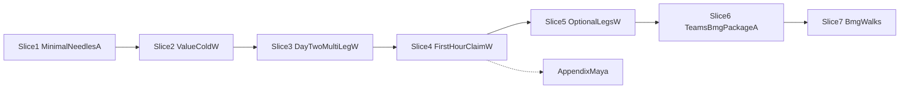

# Journey UX Test Expansion Plan

> **Status:** EXECUTED 2026-08-01. Plan gate: [handoff/JOURNEY-UX-TEST-EXPANSION-PASSED.md](handoff/JOURNEY-UX-TEST-EXPANSION-PASSED.md). Execute gate: [handoff/JOURNEY-UX-TEST-EXPANSION-EXECUTE-PASSED.md](handoff/JOURNEY-UX-TEST-EXPANSION-EXECUTE-PASSED.md) (slices 1–7 PASS; appendix Maya skipped).
>
> **Critique:** [poteto-agent](31eac55b-105f-4f8e-ab98-48d885a684e7) — accept with edits (Experience First + Prove It Works). Day-two multi-leg slice applied after human ask. Execute: [poteto-agent](28f53c55-5c4d-4ae3-801b-ddf87cd6470c).

**Goal:** Make vibecoder paths (guide-turn → sibling grill → bounce → claim) regressable across every sibling with a clear split: fast automated contracts vs honest persona walks.

**Architecture:** Keep pytest for package/DAG/script/smoke. Put coaching-voice proof in chat dogfood walks with decision-trail TSVs (Maya/Kai pattern). Never count compressed bulk-accept drivers as happy-path PASS. Encode that Maya rule as a structural lint, not prose alone.

**Default locked here:** Fold value-only cold-restart into Slice 2; keep [handoff/PRODUCT-SPINE-COLD-RESTART-OPEN.md](handoff/PRODUCT-SPINE-COLD-RESTART-OPEN.md) as that walk vehicle. Day-two multi-leg after the pack grew is Slice 3 (new; do not dilate the value-only OPEN gate).

---

## 0. Vibecoder first-hour + day-two checklist (sequencing authority)

Consumer delight beats test-inventory order. Every slice must leave these better guarded.

**Day one (first hour)**

1. **No-session** invoke only `/product-spine` → one clear This-turn slash (usually `/value`) without invented brand/teams/bmg legs.
2. Guide-turn has **Come-back-when** that names `/product-spine`.
3. Optional legs only on matching intent (or open incomplete session).
4. **Claim** loads notes from disk and lists `files-im-using` — no hunt/paste ask when files exist.
5. Wrong-slash / early-claim get coaching, not orphan silence.

**Day two / warm start (spine’s old shine — at risk after extra skills)**

6. **Cold re-entry (value-only):** new chat, existing notes, `/product-spine` → progress-so-far in you-are-here before any hunt ask ([PRODUCT-SPINE-COLD-RESTART-OPEN](handoff/PRODUCT-SPINE-COLD-RESTART-OPEN.md)).
7. **Cold re-entry (multi-leg):** same slug has clarity-ready value **and** an open incomplete brand or teams (or bmg) session → phase pulls to the open incomplete leg with progress-so-far from **that** skill’s sections; why-this-phase names open-session precedence; no skill menu dump; guided not queued (`.cursor/skills/product-spine/SKILL.md` `carry` + `open-*-not-ready`).
8. **Done-enough bounce cold:** brand-strategist / tam-planner / canvas-mapper already ready on disk → new chat `/product-spine` offers mvp or claim (or next real gap), **not** a re-open of the finished first gate.
9. **Warm start:** same chat mid-work, human asks where-am-I / invokes `/product-spine` → four-slot guide-turn with real progress-so-far; no fifth beat; no quote of status stdout.
10. Fail if the turn invents a second optional leg or asks the human to paste notes that already exist.

**Honest status before this plan’s Slice 3:** value-only cold is scheduled (Slice 2). Multi-leg day-two / warm after brand+teams+bmg joined is **not** proven by Slice 2 alone. That is the regression risk you are naming.

---

## 1. Coverage matrix (exists vs missing)

Legend: **A** = automated pytest; **W** = dogfood walk. `OK` / `partial` / **MISSING**.

| Sibling | Happy A | Happy W | Unhappy A | Unhappy W | Optional-leg / routing | Day-two / warm |
|---------|---------|---------|-----------|-----------|------------------------|----------------|
| product-spine | partial needles ([tests/test_product_spine_skill.py](tests/test_product_spine_skill.py)) | **partial** (UX mock used slug + gate bypasses — not honest first-hour) | partial (illegal-replies needles) | Kai **OK** (value+lean+claim) | brand/teams phase needles **partial**; dual-intent walk **MISSING** | value-only cold **OPEN**; multi-leg cold/warm **MISSING** |
| value | package/DAG/scripts/integrity **OK** | Maya **FAIL** (method); Kai partial | session integrity **OK** | Kai **OK** | n/a | via spine |
| bmg | ship digest + spine needles only | **MISSING** | **MISSING** | **MISSING** | business-intent walk **MISSING** | **MISSING** |
| teams | none (only named in spine tests) | **MISSING** | **MISSING** | **MISSING** | team-friction walk **MISSING** | **MISSING** |
| brand-identity | thermos runtime **partial** ([tests/test_brand_identity_thermos_fixes.py](tests/test_brand_identity_thermos_fixes.py)) | **MISSING** | thermos **partial** | **MISSING** | brand-intent walk **MISSING** | **MISSING** |
| lean-mvp | gate UX + coaching + package **OK** | Maya FAIL; Kai **OK** | gate bulk-accept tests **OK** | Kai **OK** | n/a | via spine |
| story-generation-prompt | package + S01–S08 **OK** | story suite **OK** | scenario suite **OK** | covered in suite | claim loads notes: spine needles **partial**; full claim walk only via Kai | n/a |

**Explicit MISSING (delight):** no-session first-hour walk; optional-leg path that reaches claim; brand/teams unhappy (wrong-slash / early-claim); **multi-leg day-two / warm re-entry** (open incomplete brand/teams/bmg; done-enough bounce cold; warm where-am-I).

**Already adjacent (not journey UX):** [tests/test_prompt_suite_compile*.py](tests/), scaffold tests, verify-value CLI recipes under [.cursor/skills/verify-value/](.cursor/skills/verify-value/).

---

## 2. Pass / fail rules (Maya FAIL + Kai PASS)

1. **Happy PASS** requires one-atom-per-turn chat dogfood (or pure automated needle/script proof). Compressed `drive_*_leg.py` bulk-accept is never a happy PASS ([handoff/PRODUCT-SPINE-MAYA-HAPPY-PATH-FAILED.md](handoff/PRODUCT-SPINE-MAYA-HAPPY-PATH-FAILED.md)).
2. **Structural encode (new):** add a pytest or trail lint that **fails** if a happy-PASS `WALK-EVIDENCE.md` cites `drive_*_leg.py` / bulk-accept as the proof vehicle. Prose rule points at that check.
3. **Unhappy PASS** may use express/skim/wrong-slash/early-claim as **logged stimuli**; must prove coaching voice + honest claim ceiling ([handoff/PRODUCT-SPINE-KAI-UNHAPPY-PATH-PASSED.md](handoff/PRODUCT-SPINE-KAI-UNHAPPY-PATH-PASSED.md)).
4. Walk gates need a decision-trail TSV under `handoff/decision-trails/` plus `WALK-EVIDENCE.md`. Pytest green is necessary, not sufficient.
5. Do not invent a spine `session.json`. Readiness comes from milestone files / `module_outcome`, not status brief alone.
6. Optional legs (teams, brand) must not be required before mvp/claim unless matching intent or open incomplete session.
7. Never revive Maya `PASSED`; honest one-atom core loop lives in the appendix gate only.
8. **Verify checklists forbid wipe** of `shiftswap` / `cashclaw` / `value-design` (not only a policy table).

### Per-walk done-criteria template (copy into each W slice)

- Trail TSV + WALK-EVIDENCE present
- Happy legs: one-atom pacing (or logged stimulus only on unhappy)
- Named catastrophic fails checked: invented second leg; missing bounce `/product-spine`; hunt-on-claim when files exist; bulk-accept cited as happy PASS; day-two menu dump / wrong-leg pull / re-open of done-enough first gate
- Pytest green necessary, not sufficient
- No mutation of historical slugs

---

## 3. Persona / slug policy

| Slug | Policy |
|------|--------|
| `shiftswap` | Historical Maya evidence only — do not wipe; do not redeclare PASSED |
| `cashclaw` | Historical Kai evidence only — do not wipe; do not re-run as new proof |
| `value-design` | Value-only cold-restart only — **do not wipe**; leave local dogfood alone otherwise |
| New walk slugs | Fresh names: `journey-day2`, `journey-first`, `journey-brand`, `journey-teams`, `journey-dual`, `journey-bmg` under matching `workproduct/<area>/`; wipe allowed only for those new slugs |
| Automated tests | Temp dirs / fixtures; no mutation of the three historical slugs |

---

## 4. Ordered build slices

### Slice 1 — Minimal spine routing needles

**Own:** Expand [tests/test_product_spine_skill.py](tests/test_product_spine_skill.py) **only for holes walks will hit**:

- Dual-intent precedence needles (claim > brand > team-friction > business)
- Open-session precedence needles (`open-brand-not-ready`, `open-teams-not-ready`, `open-bmg-not-ready`) if missing
- Optional-leg-not-required illegal-reply needles
- Claim `files-im-using` / no-hunt holes if still missing

Drop speculative `assertIn` expansion beyond that. Needle green is prose-drift proof, not journey proof.

**Also in this slice (or immediately after):** Maya encode lint (rule 2) so later W slices inherit the guard.

**Verify:** `python -m pytest tests/test_product_spine_skill.py -v` (+ new lint module if separate)

**Done when:** New assertions fail on a deliberately broken SKILL copy; green on live tree.

### Slice 2 — Value-only cold re-entry (fold existing OPEN gate)

**Own:** Execute [handoff/PRODUCT-SPINE-COLD-RESTART-OPEN.md](handoff/PRODUCT-SPINE-COLD-RESTART-OPEN.md) **verbatim**. This is the classic day-two shine on a **value** session only. Do not expand that gate into multi-leg.

- New chat, only `/product-spine`, slug `value-design`
- `you-are-here` names progress-so-far **before** any hunt/paste ask
- Four-slot guide-turn only; no fifth beat; no spine `session.json`
- Fail if ask-to-paste when profile/map/north-star files exist
- Do not wipe `value-design`

**Verify:** `python -m pytest tests/test_product_spine_skill.py -v`; trail `handoff/decision-trails/product-spine-cold-restart.tsv`; close cold-restart PASSED/FAILED.

### Slice 3 — Day-two / warm multi-leg re-entry (closes the pack-growth gap)

**Own:** Prove spine still guides after brand/teams/bmg joined. New slug `journey-day2` (wipe-ok). Seed workproduct fixtures; do not use `value-design`.

Walks (short; chat dogfood; per-walk template):

1. **Open incomplete brand cold:** clarity-ready value notes + open brand-identity session not brand-ready → `/product-spine` → brand phase, `/brand-identity`, progress-so-far from brand sections; why-this-phase cites open session; no teams invent; no menu of seven skills.
2. **Open incomplete teams cold:** same pattern for teams / tam-planner (or bmg / canvas-mapper if brand fixture is heavy — pick one of teams or bmg plus brand so two open-session pulls are covered).
3. **Done-enough bounce cold:** brand-strategist.md (or tam-planner.md) present as ready + clarity-ready → new chat `/product-spine` → mvp or claim (or real next gap), **not** re-entry into the finished first gate.
4. **Warm where-am-I:** same chat after a sibling turn, invoke `/product-spine` → four slots + progress-so-far; no status stdout dump.

Catastrophic fails: skill picker dump; inventing a second optional leg; hunt/paste when files exist; quoting `--brief` or strip symbols; treating status brief as readiness.

**Verify:** Trails `handoff/decision-trails/journey-day2*.tsv` + WALK-EVIDENCE under `tools/drafts/product-spine-journey-day2/`; pytest green; carry voice (guided, not queued).

### Slice 4 — First-hour no-session + short claim-exit

**Own:** New slug `journey-first` (wipe-ok).

1. Empty slate: only `/product-spine` → clarity → `/value` (no invented optional legs).
2. Short path to claim: enough clarity+mvp readiness (honest answers or documented minimal path) → claim loads notes + `files-im-using` — no hunt.

Not a full Maya one-atom marathon. Proves the first five minutes and the last door.

**Verify:** Per-walk template; pytest green; trails under `handoff/decision-trails/journey-first*.tsv`.

### Slice 5 — Optional-leg dogfood walks (brand + teams + dual-intent)

**Own:** Short chat walks. Slugs `journey-brand`, `journey-teams`, `journey-dual`. Fresh happy-path grilling (Slice 3 owns re-entry; this slice owns first-pass optional legs through claim).

1. Brand-intent → `/brand-identity` → brand-strategist done-enough → bounce `/product-spine` → **reach claim** (or mvp then claim) with loaded notes; no invented teams leg.
2. Team-friction → `/teams` → tam-planner done-enough → bounce → **reach claim** (or explicit dated claim-deferred follow-up if blocked); no invented brand leg.
3. Dual-intent (brand + team in one ask) → one destination per precedence; voice names what is skipped; do not invent the other leg.
4. **One unhappy stimulus each** for brand and teams (wrong-slash or early-claim) — Kai coverage does not transfer.

Evidence: `handoff/decision-trails/journey-*.tsv` + `tools/drafts/product-spine-journey-optional-legs/WALK-EVIDENCE.md` (no bulk-accept as PASS vehicle).

**Verify:** Per-walk template; pytest green; dual-intent row names winning intent + skipped leg.

### Slice 6 — Teams + BMG package parity (after walks)

**Own:** Add `tests/test_teams_skill_package.py` and `tests/test_bmg_skill_package.py`. File budget: ship digest + bounce `/product-spine` slash + workproduct root + done-enough milestone name (`tam-planner.md` / `canvas-mapper.md`). Thin — not full DAG suites. Not blocking on Slice 5 voice failures.

**Verify:** `python -m pytest tests/test_teams_skill_package.py tests/test_bmg_skill_package.py tests/test_product_spine_skill.py -v`

### Slice 7 — BMG happy + unhappy short walks

**Own:** New slug `journey-bmg`. Happy: business-intent → canvas-mapper with real answers → bounce. Unhappy: wrong-slash / early claim / express as stimulus → coaching stays on canvas path.

**Verify:** Per-walk template; two trails + WALK-EVIDENCE.

### Appendix — Optional Maya one-atom (not critical path)

**Own:** Only if human still wants honest value→lean→claim happy PASS after Slices 2–4. True one-atom-per-turn on a **new** slug (not `shiftswap`). Open as its own gate after first-hour, not after BMG completeness. Do not revive Maya PASSED.

**Verify:** Decision trail proves one atom per turn; Maya encode lint green; helper scripts stimulus-only for unhappy.

---

## 5. Out of scope

- Implementing the suite in the same chat that only accepted this plan (unless human explicitly says execute)
- Compiler / [scripted-skill-from-doc](.cursor/skills/scripted-skill-from-doc/) authoring tests
- Shared-runtime consolidation across paced skills
- Separate Brand Identity solo GitHub repo
- Wiping or re-litigating `shiftswap` / `cashclaw` / `value-design` dogfood
- Full DAG suites for teams/bmg matching value’s depth (Slice 6 stays thin package parity)
- Treating UX mock or needle-only green as honest first-hour / happy-core / day-two multi-leg proof
- Expanding PRODUCT-SPINE-COLD-RESTART-OPEN into multi-leg (Slice 3 owns that; keep value-only gate clean)

---

## 6. After plan acceptance

1. Human accepts or edits this plan.
2. Close journey gate: `handoff/JOURNEY-UX-TEST-EXPANSION-PASSED.md` with path to this plan; update [handoff/STATE.md](handoff/STATE.md) + [handoff/README.md](handoff/README.md).
3. Open an implementation gate (or execute slices in order) — **separate** from plan acceptance unless human says “execute now.”
4. Value-only cold-restart remains its own closable walk gate under Slice 2.
5. Day-two multi-leg evidence closes under Slice 3 (journey-day2 trails), not by dilating the value-design cold gate.
6. Appendix Maya is a separate gate if scheduled.

---

## Files most touched on execute

- [tests/test_product_spine_skill.py](tests/test_product_spine_skill.py) — Slice 1
- New: Maya encode lint (pytest or trail checker) — Slice 1
- New: `tests/test_teams_skill_package.py`, `tests/test_bmg_skill_package.py` — Slice 6
- [`.cursor/skills/product-spine/SKILL.md`](.cursor/skills/product-spine/SKILL.md) — only if Slice 1 finds real wiring holes
- `handoff/decision-trails/`, `tools/drafts/product-spine-journey-*` — W slices evidence (incl. `journey-day2`)
- Handoff close records per slice / cold-restart / appendix Maya
