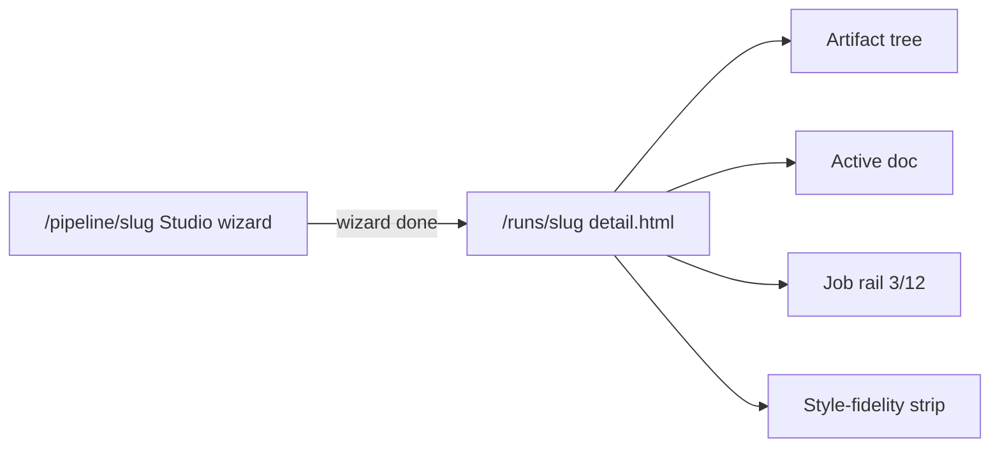
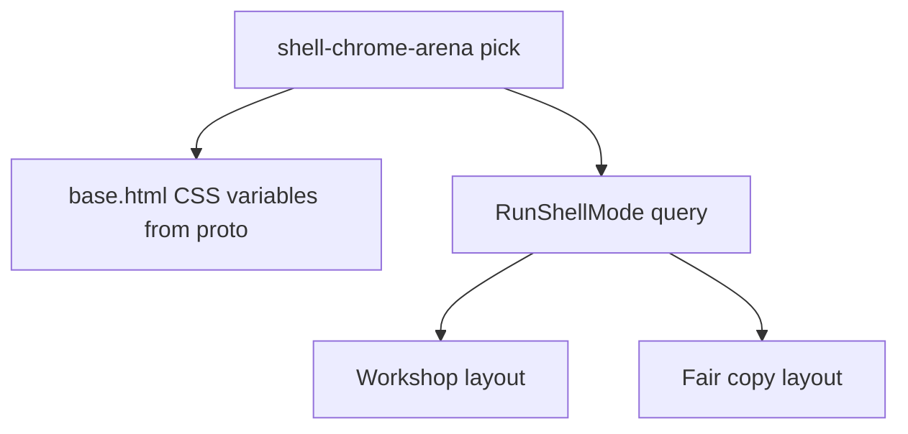

# Proto shell chrome (Workshop / Fair copy)

I'm using the **writing-plans** / poteto **Feature** path, with a **Prototype** shell arena as the architect step before production templates.

## Consumer impact

**Operator.** On a climbable run they switch **Workshop** vs **Fair copy** chrome on `/runs/{slug}`. Prose gets the wide center. The side panel is labeled **Perspective** and takes less width. Pipeline setup stays on `/pipeline/{slug}` (**Studio**). Placeholders (analyze wiring, invent seeds, thin attach) stay visibly unfinished; this wave does not fake them.

**Maintainer.** Mode is a small presentation enum parsed from the query string. Templates and CSS tokens move toward the proto look. Application climb/accept contracts and `scores.json` locks stay untouched.

## How (subsystem today)



- Live shell: [`eliotapp/presentation/templates/runs/detail.html`](eliotapp/presentation/templates/runs/detail.html) is a 3/6/3 grid (tree / doc / Job rail) plus optional strip. Pick-best lives in the tree column. Generic Tailwind in [`base.html`](eliotapp/presentation/templates/base.html).
- Proto north star: [`tools/drafts/webapp-ux-proto/index.html`](tools/drafts/webapp-ux-proto/index.html) (paper/ink/accent tokens, sticky switcher, canvas `200px | 1fr | 240px`). Names there (Cockpit / Canvas / Job rail) are legacy.
- Glossary already locked in [`CONTEXT.md`](CONTEXT.md): **Studio** / **Workshop** / **Fair copy** / **Perspective**. This chat briefly used Climb/Export as job paraphrases; chrome uses the CONTEXT words.
- Locks unchanged: HTTP never writes `scores.json`; style-fidelity trend ≠ AcceptDecision; [`tests/test_climb_accept_consumer_contracts.py`](tests/test_climb_accept_consumer_contracts.py) stays green.

## Locked design choices

| Choice | Decision | Principle |
|--------|----------|-----------|
| Studio | Stay on `/pipeline/{slug}` | Laziness / prior grill |
| Run modes | **Workshop** and **Fair copy** as separate chrome on `/runs/{slug}` | Experience First / CONTEXT.md |
| Mode transport | Query `?mode=workshop\|fair_copy` (default `workshop`; invalid → `workshop`) | Model the Domain / Laziness |
| Side panel | Rename **Job rail → Perspective**; shrink horizontal share | Subtract / CONTEXT.md |
| Doc pane | Widen relative to Perspective | Experience First |
| Visual depth | Closer proto match in one production pass after arena | Exhaust the Design Space |
| Placeholders | Do not wire analyze ↔ invent seeds or thicken attach | Laziness |
| Style-fidelity accuracy | Restyle strip chrome only; relative-movement indicator arena is a **follow-up** | Sequence verifiable units |
| Arena | 3 static mocks under `tools/drafts/shell-chrome-arena/` before production CSS | Prototype playbook |

### Data shape

```text
RunShellMode = workshop | fair_copy
# workshop: Improve / Pause / Resume / Step + Perspective story + style-fidelity strip + wide doc
# fair_copy: single pick-best in center + draft tree; Improve and strip climb buttons HIDDEN; Perspective summary-sized
```

Parse once in a tiny presentation helper; call from [`runs.py`](eliotapp/presentation/routes/runs.py) `_canvas_context`. Pass `shell_mode` into templates.

**Mode preservation (required).** Rail poll (`hx-get .../rail`), climb-strip swaps, and job POSTs that re-render rail must keep `mode` (append `?mode=` on GETs; `hx-vals` or hidden field on POSTs that redirect to detail). Without this, Fair copy flips back to Workshop on the first poll.

Operator chrome labels: **Workshop** / **Fair copy** / **Perspective** (not Climb, Export, Cockpit, Canvas, Job rail). Header may include a **Studio** (or Pipeline) link to `/pipeline/{slug}` when the wizard is still relevant; that is navigation, not a third run mode.

Secondary tabs already on the page (Scoreboard / Drafts / Pipeline) stay secondary. Workshop|Fair copy is the primary chrome switcher. Do not invent a third nav system.

**Fair copy scope (honest).** Live UI has pick-best (duplicated today in the tree column and in the rail) plus draft browsing. There is no side-by-side compare surface. This wave does **not** build a new compare UI. Fair copy mode means: one primary pick-best control in the center, draft tree for browsing, climb controls hidden.

## Shell arena (blocking = architect)

Throwaway only, same pattern as studio-chat arena. Path: `tools/drafts/shell-chrome-arena/`.

1. **Narrow Perspective** — proto tokens; tree ~180px, doc `1fr`, Perspective ~200px; Workshop|Fair copy switcher; strip under grid.
2. **Strip-integrated** — Pause/Resume/Step live in Perspective vertical stack; bottom strip is trend-only.
3. **Fair-copy-first** — pick-best sits in the center with draft list; Perspective collapses to short next-move copy; no climb buttons.

Serve statically. Dogfood in browser. Record pick in `handoff/decision-trails/shell-chrome.tsv`. **Default recommendation if dogfood is flat:** Narrow Perspective (matches wider prose + thinner rail). Production implements the recorded pick.

## Architecture (layers)

| Layer | Touch | Role |
|-------|-------|------|
| presentation | `base.html`, `runs/detail.html`, `_canvas_rail.html`, `_canvas_climb_strip.html`, `_canvas_doc.html`, `_canvas_tree.html`, `pipeline/wizard.html` lightly | Proto tokens, mode switcher, rename, proportions |
| presentation routes | `runs.py` | Parse `RunShellMode`; pass into context; preserve on redirects where cheap |
| application / core | none required | No climb-metric or accept changes |
| tests | `test_presentation_runs.py` (+ small mode parse cases) | Assert Perspective label; Workshop vs Fair copy chrome differences; scores.json unchanged |
| handoff | vision/catalog/contact-points + PASSED gate | Align names; mark shell chrome shipped |



## Throughput checkpoint

- **Blocking first steps.** Arena + trail pick; `RunShellMode` parse + presentation tests for mode and Perspective rename.
- **Independent workstreams.** n/a after blocking (tokens + templates share one shell; one owner).
- **Shared mutable state.** None new (query string only; no new run-dir files).
- **Smallest safe decomposition.** One feature owner; arena then TDD mode/rename then layout/CSS then gate.

## Implementation phases

### Phase 00 — Arena + trail

- Write three static HTML mocks; open in browser; record pick in `handoff/decision-trails/shell-chrome.tsv`.
- Update [`handoff/UI-CONTACT-POINTS.md`](handoff/UI-CONTACT-POINTS.md) planned mode query (still GAP until shipped).

### Phase 01 — Mode + rename (TDD)

- Helper: parse `mode` → `workshop` | `fair_copy`.
- Templates: header switcher Workshop | Fair copy; `Job rail` → `Perspective` (heading + `aria-label`; rename `id="canvas-job-rail"` only if tests/HTMX targets update in the same change).
- Workshop mode: Improve / Pause / Resume / Step + strip + Perspective story. Keep analyze / invent-seeds buttons as existing placeholders (do not wire them).
- Fair copy mode: **hide** Improve and strip climb buttons; **one** pick-best control in the center column; remove the duplicate pick-best from tree and rail. Do not delete pick-best / climb routes.
- Thread `shell_mode` through rail/strip HTMX as above.
- Tests: assert "Perspective"; assert Workshop shows Improve and Fair copy does not; assert single pick-best in Fair copy; update "Job rail" assertions in [`tests/test_presentation_runs.py`](tests/test_presentation_runs.py).

### Phase 02 — Proto tokens + proportions

- No presentation static CSS pipeline today (CDN Tailwind only). Lift proto `:root` tokens into [`base.html`](eliotapp/presentation/templates/base.html) `<style>`.
- Keep or formalize the detail-page full-bleed breakout already in `detail.html` (parent `<main>` is `max-w-5xl`; canvas must keep escaping it or add a `` so proto proportions are not clipped).
- Regrid `detail.html` to arena-picked proportions (wider doc, narrower Perspective).
- Restyle climb strip to proto-like bar (gradient/spark presentation only). **Do not** change how polyline points are computed.
- Soften pipeline wizard chrome enough to share tokens (no invent/analyze wiring). Prefer labeling the wizard surface **Studio** where an operator-facing title exists.

### Phase 03 — Catalog + gate

- Refresh [`handoff/PIPELINE-UI-CATALOG.md`](handoff/PIPELINE-UI-CATALOG.md) / [`handoff/UI-UX-WAVE-VISION.md`](handoff/UI-UX-WAVE-VISION.md) next-step lines (chrome matches CONTEXT; no Climb/Export synonym needed).
- `handoff/SHELL-CHROME-PASSED.md` when pytest green + control-ui smoke on Workshop and Fair copy.
- Note follow-ups: style-fidelity relative-movement arena; attach polish; analyze/invent wiring; real draft-compare UI if wanted later.

## Verification

```powershell
$env:PYTHONPATH="."; python -m pytest tests/test_presentation_runs.py tests/test_climb_accept_consumer_contracts.py -q
```

control-ui: open a scored run — Workshop mode (wide doc, Perspective, strip); switch Fair copy — pick-best primary; confirm no `scores.json` write from HTTP paths already locked.

## Out of scope

- Analyze ↔ invent seeds wiring (buttons may remain as placeholders)
- New side-by-side draft compare UI
- Attach / local-file-ref UX thickening
- Style-fidelity “relative movement” accuracy redesign (separate arena later)
- Catalog admin page
- Any `scores.json` write from HTTP
- Renaming URL paths (`/runs`, `/pipeline`)

## Feature playbook notes (execution)

- **how:** done above (canvas + pipeline + proto).
- **architect:** satisfied by Phase 00 arena (`architect skipped as separate skill: arena is the design exploration`).
- **interrogate:** only if arena pick or mode chrome is contested after dogfood.
- Implement via poteto-agent with this data shape; verify on localhost; open PR.

## Principles → choices (this plan)

| Principle | Choice it drove |
|-----------|-----------------|
| Experience First | Workshop/Fair copy split; wider prose; proto-closer look |
| Exhaust the Design Space | 3-mock shell arena before production CSS |
| Laziness Protocol | Query mode, not new routes; no analyze/invent wiring |
| Model the Domain | `RunShellMode = workshop \| fair_copy` (CONTEXT names) |
| Subtract Before You Add | Job rail → Perspective; drop Cockpit/Canvas/Climb/Export chrome labels |
| Boundary Discipline | Presentation/templates only; consumer contracts untouched |
| Sequence verifiable units | Arena → mode/rename → tokens → gate; fidelity metric later |
