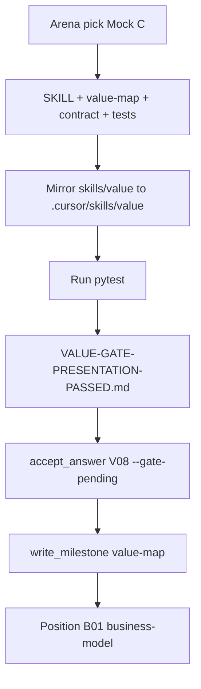

# Ship value-map gate presentation + pass V08

## Goal

You approved the map content. This plan does two things:

1. **Skill ship** — encode Mock C ([`mock-c-dogfood.md`](tools/drafts/value-gate-arena/mock-c-dogfood.md)) as the V08 gate presentation contract so Cursor chat stays scannable (no Mermaid, no tables, no text walls).
2. **Session lock** — run scripts to pass V08 on [`workproduct/value-proposition/value-design/session.json`](workproduct/value-proposition/value-design/session.json) and advance to business-model.

**Out of scope (deferred):** `Gate_Review_Lens` artifact in [`export-lenses.md`](.cursor/skills/value/references/export-lenses.md) — only promote if C still feels dense in practice ([arena pick](handoff/decision-trails/value-gate-presentation.tsv)).

---

## Presentation contract (what we ship)

Turn 1 at value-map gate (V08 only):

```
progress-strip  →  Who sticky  →  Box sticky  →  Honest read  →  pass/reopen question
```

- **Who** — segment + freeze in short peer sentences (borrow A's who+freeze rhythm from prose judge).
- **Box** — four offering parts as a plain dash list (max ~10 words per line per `cognitive_murder`).
- **Honest read** — thin gain links, hypothesis labels, no orphans, one-line differentiation.
- **Drill on ask** — `links` or `diff` expands turn 2; never dump fit matrix in turn 1.
- **Forbidden at gate** — Mermaid, tables, full canvas, monolithic ad-lib paragraph, three Blank ad-libs in the opening beat (keep ad-libs on-ask only per arena rejection of Mock B).

Reference mock: [`tools/drafts/value-gate-arena/mock-c-dogfood.md`](tools/drafts/value-gate-arena/mock-c-dogfood.md)

---

## Files to change

### 1. Skill orchestration — [`skills/value/SKILL.md`](skills/value/SKILL.md) (mirror to [`.cursor/skills/value/SKILL.md`](.cursor/skills/value/SKILL.md))

Add a `value-map-gate-review` block under `protocol-3` (gate trigger only, not every turn):

- Trigger: `position.atom_id` is V08 or value-map gate review after reopen.
- Flow: run `status.py --sections`, render three stickies + honest read + one pass/reopen question.
- Drill: on `links` / `diff`, emit dash-list fit strengths (`indirect` / `conditional` / `weak` only — never fake direct).
- Forbid: Mermaid, tables, full-canvas matrix, ad-lib wall at gate open.
- Extend existing `(gate-review ...)` or `(forbidden 'emit-full-canvas-matrix-or-scorecard-before-required-answers)` to name these explicitly.

### 2. Atom reference — [`skills/value/references/value-map.md`](skills/value/references/value-map.md)

At V08 atom, add presentation rules:

- Gate opens with split stickies, not diagram or ad-lib dump.
- KB `ad-lib-pitch` moves to **on-ask** (`ad-lib`, `pitch`, `blank formula`) — not the gate opening beat.
- Fit strength labels must stay honest (session V05 inference already accepted indirect/conditional chains).

### 3. Session contract — [`skills/value/references/session-contract.md`](skills/value/references/session-contract.md)

One line under status/gate section: value-map gate review uses inline stickies + drill-on-ask; links to SKILL `value-map-gate-review`.

### 4. Tests — [`tests/test_value_skill_package.py`](tests/test_value_skill_package.py)

Add `test_value_map_gate_presentation_contract` asserting needles:

- `value-map-gate-review` (or equivalent block name)
- `links` / `diff` drill-on-ask
- forbid Mermaid/tables at gate
- ad-lib on-ask not gate-open
- mirror trees still match (`test_canonical_and_cursor_trees_match`)

### 5. Mirror ship tree

Edit canonical under `skills/value/`, then byte-identical copy to `.cursor/skills/value/` (test enforces digest match).

### 6. Close handoff

Create [`handoff/VALUE-GATE-PRESENTATION-PASSED.md`](handoff/VALUE-GATE-PRESENTATION-PASSED.md) per handoff-authoring:

- Outcome: PASS
- Evidence: arena pick C-dogfood + pytest command output
- Pick: Mock C inline; D+A fallback documented, not shipped
- Update [`handoff/STATE.md`](handoff/STATE.md) — move gate from Open to Shipped

---

## Pass V08 on value-design (session scripts)

After skill diff is in place:

```powershell
cd c:\Projects\value
$env:PYTHONPATH = 'src'
python .cursor/skills/value/scripts/accept_answer.py `
  workproduct/value-proposition/value-design/session.json `
  V08 `
  "Pass — value map is a coherent hypothesis; gate presentation fix shipped (Mock C inline stickies)." `
  decision `
  --gate-pending

python .cursor/skills/value/scripts/write_milestone.py `
  --module value-map `
  workproduct/value-proposition/value-design/session.json
```

Verify:

- `position.module` → `business-model`, `position.atom_id` → `B01`
- `artifacts` includes `value-map.md` with `status: final`
- Blocking unknown on presentation format resolved or superseded

---

## Verification

```powershell
python -m pytest tests/test_value_skill_package.py -v -k "gate_presentation or mirror"
python -m unittest discover -s tests -v
```

Confirm `value-map.md` written under `workproduct/value-proposition/value-design/` from accepted V01–V07 state.

---

## Flow


