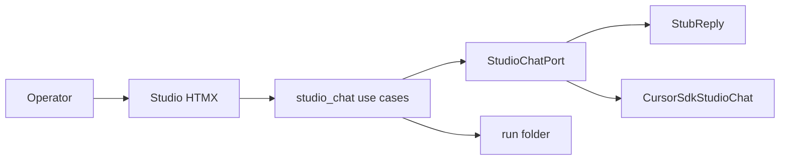

# Studio chat + file inputs

I'm using the **writing-plans** / poteto **Feature** path: named data shape first, short mockup arena, then verifiable units on the existing wizard.

## Consumer impact

**Operator.** In Studio (`/pipeline/{slug}` step 1) they brainstorm in a slim chat, attach files prepared outside the session, then hit **Ready to distill**. They no longer depend on Cursor IDE chat alone for rough input.

**Maintainer.** Chat is an application use case behind a port. Presentation stays HTMX. Live model calls stay in infrastructure (same `CURSOR_API_KEY` + `tools/sdk_bridge.py` pattern as climb). HTTP still never writes `scores.json`.

## Locked design choices

| Choice | Decision | Principle |
|--------|----------|-----------|
| Surfaces | Studio only this slice | Laziness / Experience First |
| Chat transport | Sync POST + HTMX fragment swap (no SSE v1) | Laziness |
| Model | `StudioChatPort` — stub default in tests; Cursor local SDK when key present | Boundary Discipline |
| Transcript | `brainstorm-chat.jsonl` in the run folder | Model the Domain |
| Distill gate | Explicit **Ready to distill** writes/updates `rough-input.md` from transcript (+ keeps paste path) | Foundational Thinking |
| File kinds | `rough-input.md`, `discovery.json`, `source-excerpt.md`, `style-block.md` | Match catalog |
| Chrome | Stay on current wizard templates; no proto shell promotion | Laziness |
| Arena | 2–3 static HTMX mockups under `tools/drafts/studio-chat-arena/` before production templates | Exhaust the Design Space |



## Data shape

```text
StudioChatTurn = { role: user|assistant|system, text: str, at: iso8601 }
StudioChatLog = ordered turns in brainstorm-chat.jsonl (one JSON object per line)
AttachKind = rough_input | discovery | excerpt | style_block
```

- Append-only JSONL for chat (idempotent enough for retries: client may resubmit; server assigns turn ids).
- **Ready to distill** concatenates user (+ optional assistant) turns into `rough-input.md` and advances wizard step (same as today’s `stage_brainstorm` advance to discovery).
- Attaches write through existing `run_store` helpers (`write_rough_input`, `write_discovery`, excerpt/style-block writers). Reuse validation from [pipeline_wizard.py](eliotapp/application/pipeline_wizard.py) where uploads already exist for discovery.

## Architecture (layers)

| Layer | New / touch | Role |
|-------|-------------|------|
| `eliotapp/core/` | small `shapes/studio_chat.py` | `StudioChatTurn` parse/serialize only |
| `eliotapp/application/` | `studio_chat.py` | append turn, list turns, ready_to_distill, attach_file |
| `eliotapp/application/` | Protocol `StudioChatPort` | `reply(turns, user_text) -> str` |
| `eliotapp/infrastructure/` | `studio_chat_stub.py`, `studio_chat_cursor.py` | stub + Cursor SDK adapter using `sdk_bridge.patch_windows_bridge_discovery` |
| `eliotapp/presentation/routes/pipeline.py` | new routes | chat POST, attach POST, ready-to-distill POST |
| templates | `_brainstorm_step.html` + partials | chat thread, compose box, attach panel |
| tests | `test_studio_chat.py`, extend `test_presentation_pipeline.py` | no live SDK in CI |

Wire the port at app startup in [app.py](eliotapp/presentation/app.py): stub unless `CURSOR_API_KEY` and optional `ELIOTWF_STUDIO_CHAT=sdk`.

## Mockup arena (blocking, before production UI)

Under `tools/drafts/studio-chat-arena/`:

1. **Chat-dominant** — thread + compose; attach as secondary collapse  
2. **Split** — chat left, attach list right  
3. **Attach-first** — file drop zone primary; chat below  

Serve statically (same pattern as ux-proto). Pick **Chat-dominant** as production default unless dogfood clearly prefers split (document pick in decision trail).

## Throughput checkpoint

- **Blocking first steps.** Arena pick; core turn shape + JSONL store tests; attach use cases with validation.  
- **Independent workstreams.** (n/a after blocking: presentation + Cursor adapter share run-dir contract; serialize after store is green.)  
- **Shared mutable state.** One writer path for `brainstorm-chat.jsonl` and attach files in application layer; no parallel HTTP writers inventing formats.  
- **Smallest safe decomposition.** One feature owner; arena then TDD units then HTMX then SDK adapter.

## Implementation phases

### Phase 00 — Arena + trail

- Write three static HTML mocks; open in browser; record pick in `handoff/decision-trails/studio-chat.tsv`.  
- Update [UI-CONTACT-POINTS.md](handoff/UI-CONTACT-POINTS.md) with planned routes (still GAP until shipped).

### Phase 01 — Core + application store (TDD)

- `StudioChatTurn` + append/list on `brainstorm-chat.jsonl`.  
- `ready_to_distill(slug)` → write `rough-input.md`, advance wizard step.  
- `attach_prepared(slug, kind, bytes)` for the four kinds; discovery still JSON-validated.  
- Tests: temp run dirs only. No Starlette yet.

### Phase 02 — HTMX Studio UI (stub port)

- Replace paste-only brainstorm step with arena-chosen layout.  
- Routes: `POST .../chat`, `POST .../attach`, `POST .../ready-to-distill`; keep existing paste path as fallback textarea if useful.  
- Stub replies with a fixed helpful brainstorming line so UI works without a key.  
- Tests in `test_presentation_pipeline.py`: message appears; attach writes file; ready advances; **assert scores.json absent/unchanged**.

### Phase 03 — Cursor SDK adapter

- `CursorStudioChat` using local agent + project settings (same spike pattern as [sdk-climb-spike.py](tools/drafts/sdk-climb-spike.py) / [sdk_bridge.py](tools/sdk_bridge.py)).  
- Prompt: brainstorm-only; instruct model not to write run files (HTTP/application owns disk).  
- Gate live dogfood behind env; unit-test adapter with mocked agent if feasible, else mark live as manual smoke in handoff.  
- Timeout/error → HTMX error fragment; do not corrupt JSONL.

### Phase 04 — Catalog + gate record

- Refresh [PIPELINE-UI-CATALOG.md](handoff/PIPELINE-UI-CATALOG.md) Studio section from “planned” to “shipped”.  
- `handoff/STUDIO-CHAT-PASSED.md` when pytest green + one live smoke (if key) or stub-only PASS with live deferred note.  
- Leave Workshop/Fair copy / proto shell out of scope.

## Verification

```powershell
$env:PYTHONPATH="."; python -m pytest tests/test_studio_chat.py tests/test_presentation_pipeline.py tests/test_climb_accept_consumer_contracts.py -q
```

control-ui: Studio step 1 chat + attach + Ready to distill on a fresh slug (stub). Optional live: set key + `ELIOTWF_STUDIO_CHAT=sdk`.

## Out of scope

- Proto shell / Studio–Workshop–Fair copy header modes  
- Distiller auto-run (gate only; Distiller skill/SDK job later)  
- Style-block library browser (attach existing file is enough)  
- Streaming SSE  
- Workshop graph animation  
- Any `scores.json` write from HTTP

## Execution note (poteto Feature)

On implement: run **how** on pipeline wizard + driver_jobs ownership; **architect**/arena already covered by Phase 00 mocks (skip full architect skill if arena pick is recorded); delegate code via poteto-agent with this data shape; verify on localhost; open PR.