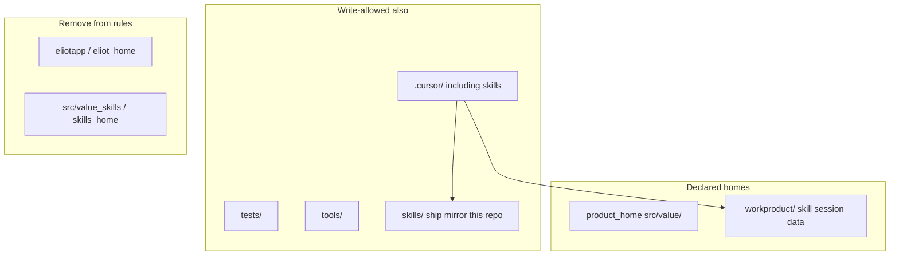

# Value-shape rules rewrite (post-purge deferred pass)

## Clarification (what the last edit was / was not)

The surgical write-gate fix only made `src/value/` a first-class `product_home`. That is **not** the ship-tree exception. Per your answers:

- Root [`skills/`](skills/) stays **informal / repo-specific** — not a declared write-home in rules.
- Skill session/progress already lives under [`workproduct/`](workproduct/) (`value-proposition/`, `lean-mvp/`, etc.). That is the friction path to protect.
- `eliotapp/` / `eliot_home` was the previous app that poisoned the rules — remove it.
- Interpreting “SRC/VALUES can be deleted” as **`src/value_skills/`** (legacy `skills_home`). That tree is already absent on disk; only rule references remain. **`src/value/` stays** as the four-layer spoke.

## Self-check findings (pre-execution)

Verified against disk before build:

- `src/value_skills/` — absent; only rule refs remain (safe to scrub).
- Skill session roots — confirmed under `workproduct/value-proposition/` and `workproduct/lean-mvp/` via skill `_session/catalog.py`.
- **Gap fixed in this plan:** root [`skills/`](skills/) holds many `.py` files (ship mirror of `.cursor/skills/`). “Informal” must mean **not a declared product_home protocol**, not “omit from the write allow-list.” After dropping `eliot_home` / evacuate escapes, blocking `skills/**/*.py` would add friction the user explicitly rejected.
- Plan file currently lives under the Cursor plans cache (`value-shape_rules_rewrite_c138c6e2`); on execute, also copy/index it into [`.cursor/plans/`](.cursor/plans/README.md) so the workspace index lists it.
- Still assumed (not re-confirmed): “SRC/VALUES” meant `src/value_skills/`, not `src/value/`.

## Target shape

## In scope (paired rule rewrite)

### 1. [`repo-layout.mdc`](.cursor/rules/repo-layout.mdc)

Rewrite always-applied layout to Value shape:

- **Frontmatter / invariant / optimization**: drop Eliot/`eliotapp`; state product home + skills + `workproduct/` session data + supporting trees.
- **Delete** `protocol-1b-skills-modules-home` and `protocol-1c-eliot-home` as Eliot homes.
- **Add** a small `workproduct` protocol (or fold into protocol-3): `workproduct/` is skill/session state; **no Python** under it; agents may create `workproduct/<skill-area>/<slug>/` without asking.
- **protocol-0 write gate**: resolve only `product_home`; allow writes under `product_home`, `tests/`, `tools/`, `.cursor/` (includes `.cursor/skills/`), `workproduct/` (non-Python), and — **this repo only, informal** — root `skills/` so ship-mirror Python/prose stays editable. Drop `eliot_home`, drop evacuate-only/`skills_home` branches. Drop “parallel package tree … without skills_home or eliot_home” / eliotapp exception wording.
- Keep `forbidden-root-level-dirs` (bare `core`/`application`/…/`value` at root) so DDD layers stay under `src/<slug>/`. Do **not** forbid root `skills/`.
- Soften **protocol-2 / protocol-4** so skill session trees under `workproduct/` are not “junk” and do not require a root ship-output permission gate; ship-mirror edits under `skills/` likewise are not “generated junk.”
- Keep **protocol-1 product-home** (four layers) as already corrected.
- protocol-3 roles: remove `eliotapp/`; describe `workproduct/` as skill session data; note root `skills/` as informal ship mirror (write-allowed here, not a portable product_home declaration).

### 2. [`thermonuclear.mdc`](.cursor/rules/thermonuclear.mdc)

- Globs → `tests/**,tools/**/*.py` only (drop `eliotapp/**`, `src/value/**`, `src/value_skills/**`).
- `apply-body-when`: drop `eliot_home`, `product-home`, `skills_home`; keep tests + tools paths.
- Rewrite notes: no Eliot/evacuation language; placement follows `repo-layout` product home + tools.

### 3. [`skills-repo.mdc`](.cursor/rules/skills-repo.mdc)

Retarget to how skills actually work today (package-local `scripts/_session/`, not an engine package):

- Globs → `.cursor/skills/**,tools/drafts/skills/**` (drop `src/eliotwf_skills/**`).
- Homes: skill-home `.cursor/skills/<name>/`; session-data `workproduct/`; note informal ship mirror `skills/` (repo-specific).
- Remove `modules-home eliotapp/`, `protocol-2-modules-in-eliotapp`, and import-from-eliotapp requirements.
- Scripts stay thin/stdlib; domain helpers live under the skill’s own `scripts/` (as value/lean-mvp already do).

### 4. [`skill-authoring.mdc`](.cursor/rules/skill-authoring.mdc)

- Drop `modules-home "eliotapp/"` and `src/eliotwf_skills` note.
- Point at package-local `scripts/` + `skills-repo.mdc` (no separate engine home).

### 5. Tiny skill-prose sync (two lines)

[`/.cursor/skills/value/SKILL.md`](.cursor/skills/value/SKILL.md) and [`skills/value/SKILL.md`](skills/value/SKILL.md) line ~241 still say “exception to skills-repo eliotapp import rule”. Retarget that `scripts-exception` note to the new stdlib/`_session` rule so ship/dev trees stay digest-aligned.

## Explicitly out of scope

- **Tests** — leave alone (your #7).
- **`pstack-models.mdc` `hillclimb:`** — leave (may be plugin role).
- **Declaring root `skills/` as portable `product_home`** — still informal / this-repo-only (but write-allowed — see self-check).
- **Deleting `src/value/`** — keep the spoke.
- **Rebuilding `tests/fixtures/retarget_mini`** — leave for later.
- **Broader skill content / AGENTS.md** — AGENTS already Value-shaped; no change required unless a leftover surfaces during the grep pass.
- **Committing** — only if you ask.

## Verification

1. Grep `.cursor/rules/` for `eliotapp`, `eliot_home`, `eliotwf_skills`, `value_skills`, `skills_home` — expect zero (except historical plan prose if any).
2. Confirm `workproduct/` still described as allowed skill session root; Python under it still forbidden.
3. `python -m pytest tests/ -q` — expect same green baseline (rules-only change; no test edits).
4. Manual read of the four rewritten rules as a fresh agent would: Value product home + skills + workproduct, no missing `eliotapp/`.
