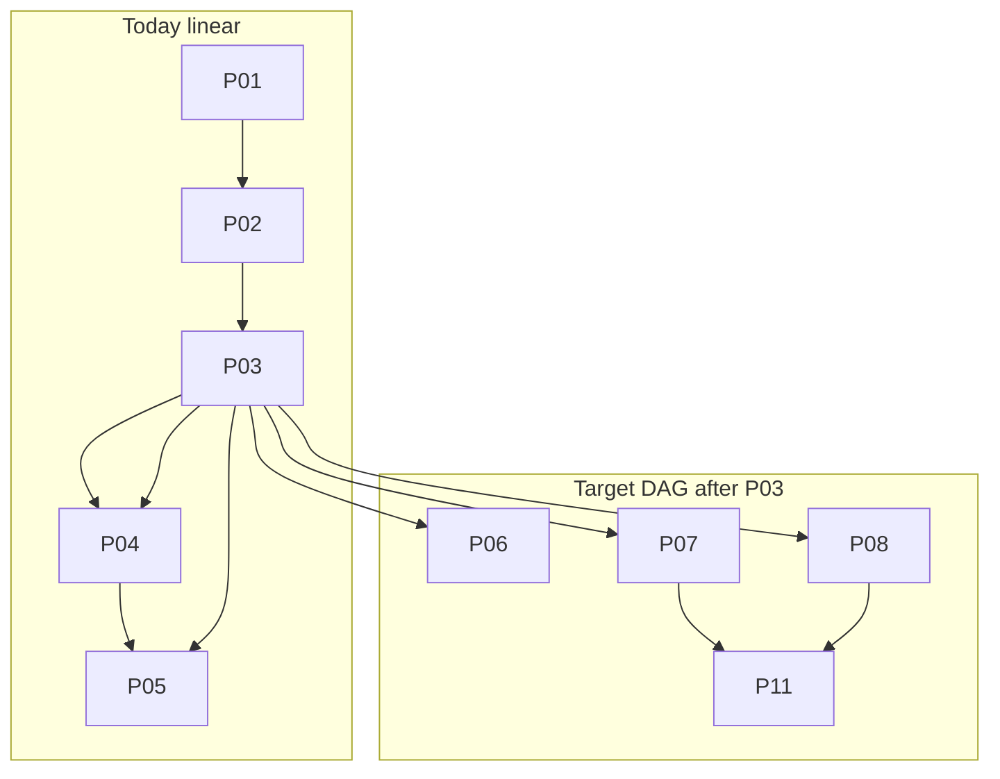

# Value skill: DAG pacing + section gap-fill

## Context

The skill works (pressure tests pass) but **linear one-atom-per-turn** pacing breaks the vibe for your Discord cohort: builders drop in mid-repo, answer in paragraphs, and stall on teaching nuance (gain taxonomy, severity labels) that belongs in reference material—not as hard gates.

**Root cause:** [`atoms.json`](c:\Projects\value\.cursor\skills\value\assets\atoms.json) is a single chain (`unlocks`), and [`next_unsatisfied_atom`](c:\Projects\value\.cursor\skills\value\scripts\_session.py) scans file order. [`section-map.json`](c:\Projects\value\.cursor\skills\value\assets\section-map.json) already groups atoms into canvas headings but is **artifact-only**, not interview UX.

**Architectural tension to fix:** `position` (write path) and `next_question.py` (read path) can disagree today. One scheduler must own both.



## Design principles (poteto)

| Principle | Choice |
|-----------|--------|
| **Experience first** | UX unit = **section** (Jobs, Pains, Gains), not atom ID. Resume shows section status, not "P08". |
| **Model the domain** | Scheduler = ready-set over a DAG; `position` = preferred focus atom among ready set, not chain head. |
| **Build the lever** | Scripts own gap detection and bulk accept; agent maps prose → atoms, scripts validate writes. |
| **Encode lessons in structure** | **Soft atoms** (taxonomy labels) accept `unknown`; teach scales only on request or at gate review. |
| **Sequence verifiable units** | Ship scheduler first, then gap-fill, then orchestrator UX—each phase has tests. |

## Named data shape

**Atom metadata** (extend [`atoms.json`](c:\Projects\value\.cursor\skills\value\assets\atoms.json), bump `schema_version` to `1.1` in session):

```json
{
  "id": "P08",
  "module": "profile",
  "section": "Gains",
  "requires": ["P03"],
  "soft": true,
  "asks": "...",
  "accepts_summary": "..."
}
```

- `requires`: prerequisite atom IDs (replaces sole reliance on `unlocks`; keep `unlocks` temporarily for gate bridges only, then derive or delete in phase 3).
- `section`: key into [`section-map.json`](c:\Projects\value\.cursor\skills\value\assets\section-map.json) milestones.
- `soft`: classification nuance optional at accept time; `unknown` on labels is valid advance.

**Scheduler output** (`ready_atoms`, `focus_atom`, `section_status`):

- `ready_atoms`: all atoms whose `requires` ⊆ answered and module not bypassed.
- `focus_atom`: tie-break among ready (see policy below).
- `section_status`: per section, `empty | partial | satisfied | unknown_ok`.

**Draft map** (agent-produced JSON, script-validated):

```json
{
  "source": "user_brain_dump",
  "mappings": [
    {"atom_id": "P07", "answer": "...", "kind": "inference", "satisfied": true},
    {"atom_id": "P08", "answer": "...", "kind": "unknown", "satisfied": true, "gaps": ["gain relevance labels"]}
  ]
}
```

## Scheduler policy

1. **Module gates unchanged:** profile → value-map → business-model → experiments; bypass/pass decisions stay as today.
2. **Intra-module:** return atoms in `ready_atoms` using tie-break:
   - `gate_pending` milestone action first (fix known bug: gate answered before `write_milestone.py`).
   - Else **incomplete section** from `section-map` with fewest satisfied atoms (section-first UX).
   - Else lowest atom ID within that section (stable ordering).
3. **Off-position accept:** allow accept on any **ready** atom (not only `position.atom_id`) when `--records` or normal accept; recompute `position` to new focus after accept.
4. **Soft accept rule:** for `soft: true`, missing taxonomy → accept with `kind: unknown` + optional `unknowns[]` entry; do not follow-up loop on nuance unless user asks to teach.

### Profile DAG (first tranche)

| Atom | requires | section | soft |
|------|----------|---------|------|
| P01 | [] | Segment | hard |
| P02 | [P01] | Situation | hard |
| P03 | [P02] | Jobs | hard |
| P04,P05,P06 | [P03] | Jobs | soft |
| P07 | [P03] | Pains | soft |
| P08 | [P03] | Gains | **soft** |
| P09 | [P01] | Alternatives | soft |
| P10 | [P03,P09] | Evidence | soft |
| P11 | [P03,P07] | Jobs | hard |
| P12 | [P11] | gate | hard (gate **pass** still checks profile completeness at decision time; soft atoms may be unknown) |

Value-map / BM / experiments: add `requires` in a follow-on pass within phase 1 (cross-module edges like `V03` → `P07` are the important ones).

## UX modes (orchestrator)

Update [`SKILL.md`](c:\Projects\value\.cursor\skills\value\SKILL.md) protocol-3 turn recipe:

### Default: section-aware single question

1. Ledger + **section strip** (e.g. `Profile: Segment✓ Situation✓ Jobs◐ Pains◐ Gains· Alternatives·`).
2. **One-line orientation** tied to section, not atom pedagogy.
3. **Micro-lesson only if** user says "teach me" / first visit to section / gate review—not every turn.
4. One primary question from `next_question.py` (returns `focus_atom` + `section` + optional `sibling_ready` hint).
5. Contextual nudge toward next **decision**, not next atom.

### Draft-map-gap-fill (opt-in or after P01)

Trigger phrases: "here's what I know", "brain dump", "map what I said", explicit batching request.

1. Agent asks for **one paragraph** covering current section (or whole profile if user prefers).
2. Agent emits draft-map JSON; runs new `map_gaps.py` (validate only) then `accept_bulk.py`.
3. `gaps.py` (or `next_question --gaps`) returns **only blocking hard gaps**; soft gaps listed as "refine later".
4. Resume normal section flow.

### Drop-in decision mode (new protocol)

When user invokes `/value` with a **decision** ("should I add X?", "who is this for?") mid-repo:

1. `status.py --sections` + read session.
2. Identify **minimum section** needed to answer (don't restart at P01 if segment satisfied).
3. Ask **one decision-framed question** or offer draft-map for that section.
4. Never emit full canvas; never invent missing profile state.

This matches your "drop in and out while building" goal without abandoning teaching—the reference files still hold nuance; live turns stay coarse.

## Scripts (stdlib-only, under [`.cursor/skills/value/scripts/`](c:\Projects\value\.cursor\skills\value\scripts))

| Script | Role |
|--------|------|
| `_session.py` | Add `build_dag()`, `ready_atoms()`, `section_status()`, `pick_focus_atom()`; replace `next_unsatisfied_atom`; fix gate_pending vs next_question |
| `next_question.py` | Emit focus atom + section + ready count + gate_due |
| `status.py` | Add `--sections` one-line section strip |
| `accept_answer.py` | Allow ready off-position; after accept, call scheduler not `unlocks` |
| `gaps.py` | List hard gaps by section from session + DAG |
| `accept_bulk.py` | Validate draft-map JSON; append answers; recompute position |
| `map_gaps.py` | Dry-run draft-map (no write); report satisfied/unsatisfied per atom |

No NLP in scripts—the agent maps; scripts enforce invariants (poteto **boundary discipline**).

## Reference + contract updates

- [`references/session-contract.md`](c:\Projects\value\.cursor\skills\value\references\session-contract.md): scheduler fields, soft accept, bulk accept, drop-in mode, section resume wording.
- [`references/profile.md`](c:\Projects\value\.cursor\skills\value\references\profile.md) (and siblings): move taxonomy tables to `(kb ...)` blocks; mark P08/P07 accepts as soft in prose; keep teaches for on-demand load.
- [`assets/session.schema.json`](c:\Projects\value\.cursor\skills\value\assets\session.schema.json): `schema_version` `1.0 | 1.1`; optional top-level `pacing_mode` enum `standard | express` (express = gate atoms + priority job + top assumption only—defer to phase 3 if scope tight).
- **Ship mirror:** sync changes to [`skills/value/`](c:\Projects\value\skills\value) alongside [`.cursor/skills/value/`](c:\Projects\value\.cursor\skills\value).

## Verification

Extend [`tests/test_value_skill_package.py`](c:\Projects\value\tests\test_value_skill_package.py) and [`tests/test_value_session_integrity.py`](c:\Projects\value\tests\test_value_session_integrity.py):

- DAG cycle detection on `requires`.
- After P03 accepted, ready set includes P04–P08 (parallel).
- P08 accepts with `unknown` relevance labels on soft atom.
- `gate_pending` blocks skip to next module until milestone write.
- `accept_bulk` from fixture draft-map advances session correctly.
- `gaps.py` returns no hard gaps when only soft labels missing.
- Resume: `status --sections` reflects partial Jobs without repeating P01.

Re-run pressure scenarios in [`docs/value-skill-pressure-tests.md`](c:\Projects\value\docs\value-skill-pressure-tests.md): add **Scenario D** — brain dump after P01 fills Jobs+Pains, asks only Gains gap.

## Phases

### Phase 1 — DAG scheduler (foundation)

- Add `requires`, `section`, `soft` to all atoms (profile module first; complete other modules before merge).
- Implement scheduler in `_session.py`; unify `advance_position_after_accept` + `next_question.py`.
- Fix gate_pending / next_question race.
- Tests for ready-set and soft P08 accept.
- **Done when:** existing smoke tests pass + new DAG tests green.

### Phase 2 — Section UX + gap-fill lever

- `status --sections`, `gaps.py`, `accept_bulk.py`, `map_gaps.py`.
- Wire `section-map.json` into scheduler tie-break.
- Update SKILL.md turn recipe (section strip, teach-on-tap, draft-map flow).
- **Done when:** fixture brain-dump reduces profile to ≤3 follow-up turns.

### Phase 3 — Drop-in decision mode + polish

- SKILL protocol for decision-triggered entry; resume copy uses sections not atom IDs.
- Optional `express` pacing_mode (gate-only path)—only if phase 1–2 still feel slow in live trial on `value-design` session.
- Update pressure-test doc; migrate `value-design` session schema 1.0→1.1 in place (script or lazy upgrade on read).

## Explicitly out of scope (v1)

- UI / canvas app.
- LLM inside Python scripts.
- Removing teaching content from references (only change **when** it surfaces).
- Eliotapp engine move (stay stdlib scripts per skill package exception).

## Open decision (default if unchanged)

**Default turn after phase 2:** section-aware **one question**, with draft-map offered after segment lock (P01) or on user request—not draft-first by default. Draft-first is easy to add later via `pacing_mode`.

## Resume note

Your live session [`workproduct/value-proposition/value-design/session.json`](c:\Projects\value\workproduct\value-proposition\value-design\session.json) stops at P08 (gains). Phase 1 soft-P08 rule would have let that turn advance with `unknown` labels—a direct fix for the stall you hit.

---

## Self-review (checked against repo)

### Verified correct

- **Linear chain is the bottleneck:** [`next_unsatisfied_atom`](c:\Projects\value\.cursor\skills\value\scripts\_session.py) walks `atoms.json` file order; `unlocks` is a single successor per atom.
- **Section-map exists but is artifact-only:** [`section-map.json`](c:\Projects\value\.cursor\skills\value\assets\section-map.json) drives `fill_milestone_template` / briefs, not interview order.
- **Position vs next_question divergence is real and tested:** [`test_next_question_prefers_curriculum_gap_over_position`](c:\Projects\value\tests\test_value_session_integrity.py) expects P02 when position is stale at V01. DAG scheduler must **preserve gap-first behavior** (unmet requires in earlier modules before next module).
- **gate_pending skip bug is real:** when all profile atoms are answered and P12 is accepted with `gate_pending`, linear scan skips answered atoms and can return **V01 before** `write_milestone.py`. Phase 1 must return a **milestone sentinel** (or hold focus on gate atom) until artifact is `final`.
- **value-design session** is at P08 with P01–P07 accepted; soft-P08 directly addresses the stall you hit.

### Gaps fixed in this revision

| Issue | Correction |
|-------|------------|
| **Dual ship trees** | Every asset/script change must land in **both** [`.cursor/skills/value/`](c:\Projects\value\.cursor\skills\value) and [`skills/value/`](c:\Projects\value\skills\value) (npx ship surface). Add a phase-1 checklist item or test that hashes key files match. |
| **P12 requires too narrow** | P12 gate **accepts** need segment, priority job, pains, gains, alternatives, evidence—not just P11. Use `requires: [P11]` to reach the gate atom; **gate pass** remains a decision validated at accept time (orchestrator), not a longer requires list. Do not block P12 on P08 taxonomy when P08 is soft. |
| **Cross-module entry** | V01 must require **`module_outcome(profile) in {completed, bypassed}`**, not merely “P12 answered.” Add `requires_module: profile` (or scheduler check) on first atom of each module. |
| **Conditional atoms (P01, B06, E08)** | `--stay` and conditional writes in references stay; DAG adds edges but does not remove blocking-unknown behavior. Document in phase 1: `requires` + `stay` are orthogonal. |
| **Off-position accept tests** | [`test_off_position_accept_refused_without_ceremony`](c:\Projects\value\tests\test_value_session_integrity.py) refuses V05 at init (not ready). New rule: refuse if atom **not in ready_atoms**, not if `atom_id != position.atom_id`. Add test: accept P07 while focus is P08 when both ready after P03. |
| **Reference `writes` clauses** | Module refs still describe linear `position.atom_id P0N+1`. Phase 2: update `(writes ...)` to say “scheduler sets position to next focus atom” or leave as semantic side-effect docs—do not hand-maintain successor IDs in two places once `requires` is canonical. |
| **V07 missing from milestone map** | V07 is in design briefs but **not** in `milestones.value-map`. Phase 2: add a `Differentiation` (or similar) heading for V07 so section UX and gap-fill cover it. |
| **Schema typo** | `pacing_mode` is a **top-level session field**, not under `project`. |
| **Migration path** | Phase 1: if `requires` absent on an atom, **derive** from legacy `unlocks` reverse chain so partial rollout does not break value-map/BM/experiments until their requires are authored. |
| **Soft accept ownership** | Scripts do not enforce `accepts` prose today; soft behavior lives in **`accepts_summary` + SKILL.md + orchestrator**. Update atoms.json summaries and profile ref `(accepts ...)` for P07/P08, not only a Python flag. |

### Test impact (explicit)

- **Keep:** gate_pending accept test, write_milestone gate requirement, curriculum-gap-over-position (semantics preserved via requires).
- **Change:** off-position refuse test → not-ready refuse; add ready off-position accept test.
- **Add:** all-profile-answered + P12 gate_pending → next_question must **not** return V01 until milestone written.
- **Extend:** [`ATOM_FIELDS`](c:\Projects\value\tests\test_value_skill_package.py) validation for `requires`, `section`, `soft` on atoms.json; validate `requires` DAG acyclic and references resolvable.

### Risk not in original plan

- **Parallel ready set may feel like batching** if orchestrator lists siblings (“you could also answer pains or gains”). Default: mention **section** only, not sibling atom IDs, unless user asked to batch.
- **Express pacing_mode** is underspecified; keep phase 3 optional until live trial on value-design—do not block phases 1–2.
