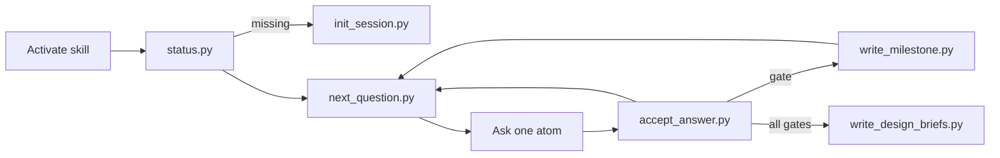

# Value skill recovery (intent + thin scripts)

## Audit (checked)

Corrections applied after review:

- Atom range was wrong (`P01–E10`); real ids are **P01–P12, V01–V08, B01–B08, E01–E10**.
- KB belongs in **`assets/knowledge-base.json`**, not `references/` (refs stay `def-ref`; JSON is an asset).
- Scripts must not regex-parse Lisp-ish module markdown — add **`assets/atoms.json`** as the machine index (kept in sync with module refs).
- `write_design_briefs` always writes **three** briefs (product, UX, app) — no soft optional.
- Dual trees: **edit `skills/value/`, then sync to `.cursor/skills/value/`**; tests assert both trees match (or run against both). Today tests only read `.cursor`.
- Package-local `_session.py` is an explicit **exception** to skills-repo’s “import eliotapp” rule: this skill is the ship surface, not an Eliot engine feature.
- Suite phase order (Canvas → Design → Test → Evolve) stays **mapped** onto current modules (profile → value-map → business-model → experiments); BM remains before experiments. Ledger `phase` labels map: Canvas=profile, Design=value-map, Evolve=business-model, Test=experiments — document that mapping; do not reorder modules in this pass.
- Each agent turn must **surface a one-line ledger** from `status.py` (suite’s visible progress intent), not only bury it in JSON.
- Define **`completion_pct`**: `(count of atoms with a current accepted answer) / (total atoms in atoms.json)` × 100, integer; bypassed modules count as complete for remaining atoms in that module.
- Add **test-card** and **learning-card** templates under assets; experiments atoms reference them.
- Orchestrator philosophy from suite §2 (no spreadsheet mirage, no cognitive murder / sticky-note pacing, end with one next-step nudge) goes into `SKILL.md` protocols, not only module refs.

## Intent lock

- **Scope:** [skills/value/](skills/value/) canonical; sync mirror to [.cursor/skills/value/](.cursor/skills/value/). Values ship repo later.
- **Pacing:** Keep atoms P01–P12, V01–V08, B01–B08, E01–E10.
- **Cargo:** Port what is not reliable model knowledge from [docs/value-proposition-prompt-suite (1).md](docs/value-proposition-prompt-suite%20(1).md).
- **No superpowers:** No SDD/worktrees; do not expand [docs/superpowers/](docs/superpowers/).

## What goes into the skill (the delta)

Add [skills/value/assets/knowledge-base.json](skills/value/assets/knowledge-base.json) from suite §1 almost verbatim:

- visual analogies → forced actions
- supporting-job trigger banks
- job/pain/gain scales
- high-value job rubric
- value-map fit rules
- Osterwalder 7 BM questions (0–10 anchors)
- experiment library (name / reliability / cost / metric / cta)

Add [skills/value/assets/atoms.json](skills/value/assets/atoms.json): ordered list of `{id, module, asks, accepts_summary, unlocks, gate?}`. Module markdown remains the teaching source; scripts read only `atoms.json` + `session.json` + KB.

Enrich module refs (still `def-ref` + atoms) so each atom **points at** the bank it must apply:

- **profile.md** — sticky-note discipline, scales, supporting-job categories + triggers, high-value gate (≥2 of 4), early-adopter action ladder
- **value-map.md** — product categories, checkmark/orphan matrix, Blank ad-lib ×3 at gate
- **business-model.md** — front/back stage, 7 questions with score-or-unknown, MedTech/Hilti as text compare prompts (no book-image claims)
- **experiments.md** — lit-fuse ranking, test/learning card templates, 5 data traps + defenses, validation funnel (no WTP before interest)

Update [session-contract.md](skills/value/references/session-contract.md) + [session.schema.json](skills/value/assets/session.schema.json):

- `ledger.phase` / `ledger.active_module` / `ledger.completion_pct` / `ledger.validation_milestone` / `ledger.unvalidated_bombs`
- `answers[]` append-only; current answer for an atom = latest record for that `atom_id`
- reopen only via `--reopen` / user “reopen X” → superseding answer + conflict note
- agent still asks consent before `init_session.py` (script does not invent consent)

## Thin scripts (stdlib only, inside the skill)

Under `skills/value/scripts/` (synced to `.cursor/skills/value/scripts/`):

| Script | Job |
|--------|-----|
| `init_session.py` | Create `workproduct/value-proposition/<slug>/session.json` from schema defaults |
| `status.py` | Print one-line ledger + position, completion %, answered ids, next atom, bombs |
| `next_question.py` | Emit next unsatisfied atom id + ask text; report gate/milestone due; skip answered atoms unless reopen |
| `accept_answer.py` | Append answer, advance via `atoms.json` unlocks, refresh ledger; refuse duplicate without `--reopen` |
| `write_milestone.py` | Fill module template from accepted answers → milestone markdown + artifact status |
| `write_design_briefs.py` | Always write product-design-brief.md, ux-brief.md, and app-design-brief.md |

Shared helper: `scripts/_session.py` (load/validate/save session, read atoms.json + KB, ledger recompute, template fill). CLIs stay thin wrappers.

Agent contract in [SKILL.md](skills/value/SKILL.md):

1. On activation: `status.py` (or consent → `init_session.py`).
2. Open turn with one-line ledger from status.
3. Ask only what `next_question.py` returns.
4. On accept: `accept_answer.py`.
5. At module gate: `write_milestone.py`.
6. After all gates or bypasses: `write_design_briefs.py`.
7. Load `assets/knowledge-base.json` when applying scales, scores, experiment choice, or traps.

## Useful outputs for UX / UI / app design

- Enrich [ux-brief.template.md](skills/value/assets/ux-brief.template.md): segment, trigger, jobs (F/S/E/supporting), scaled pains/gains, alternatives, evidence strength, journey from channels/relationships, empty/loading/success/error/recovery, trust/info needs, experiment hooks.
- Enrich [product-design-brief.template.md](skills/value/assets/product-design-brief.template.md): problem, priority job, fit links, orphans/parking lot, BM constraints, moat/unknown scores, excluded scope.
- Add [app-design-brief.template.md](skills/value/assets/app-design-brief.template.md): capabilities from value map, primary flows from jobs+channels, entities/data from offering, non-goals from orphans/bypasses, open assumptions from bombs.
- Add `test-card.template.md` and `learning-card.template.md` for experiment atoms.

Writers map session fields into sections; gaps stay `unknown` — never invent.

## Tests and docs

- Sync rule: change `skills/value/` then copy tree to `.cursor/skills/value/`; test asserts file digests match for SKILL, references, assets, scripts.
- Extend [tests/test_value_skill_package.py](tests/test_value_skill_package.py): KB keys; atoms.json covers every module atom id; schema ledger; script smoke on temp dir (init → accept → next skips → milestone → three briefs).
- Update [docs/value-skill-pressure-tests.md](docs/value-skill-pressure-tests.md) with script-backed progress cases.
- Do not rewrite superpowers plans/specs.

## Explicit non-goals

- No Values GitHub sync in this pass.
- No nested `references/*/atoms/` folders.
- No book figure reproduction.
- No module reorder to suite’s Test-before-Evolve sequencing.
- No SDD / superpowers process.
- No new `eliotapp/` Value engine.
