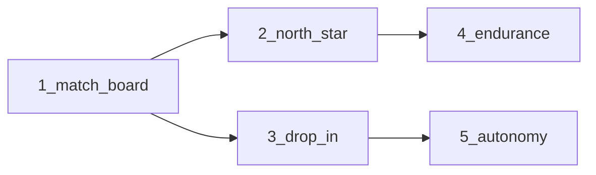

# Values skill: five upgrades from Value Design

## Why

Live Value Design session showed: V04 fails without a parts×gains pairing; users need a paste-ready outward pitch; mid-session should decide against the locked segment; memory files only feel valuable when endurance is named; autonomy belongs in the profile, not the offering map.

## Audit vs our own guidelines (checked before build)

Checked against [`knowledge-base.json`](.cursor/skills/value/assets/knowledge-base.json) (`fit_check_rules`, `cognitive_murder`, `spreadsheet_mirage`, `pregnant_man_trap`), [`value-map.md`](.cursor/skills/value/references/value-map.md) (ad-lib, orphans, V05 fit), protocol-0/3/5, Discord intro, and the Value Design session.

| # | Valid? | Valuable? | Guideline check |
|---|--------|-----------|-----------------|
| 1 Match board | Yes | Highest | Implements `pain_relievers_must` / `gain_creators_must` and feeds later V05 fit. Risk: `cognitive_murder` if we dump full P07/P08 essays — mitigate with short sticky labels + one question. Not a spreadsheet matrix. |
| 2 North-star blurb | Yes | High | Serves extreme pain (cannot articulate outward value) and Discord gains (reactions/recognition). Reuses ad-lib ingredients early; do **not** duplicate V08 three Blank variations. Label as draft from accepted answers (`pregnant_man_trap`: speech ≠ validated demand). |
| 3 Drop-in decide | Yes | High | Matches “decision tool not planner” (V02). Use **session** P09 alternatives, never hardcode Value Design’s “model-chase / UI theater” as universal. One question, not a three-choice quiz. |
| 4 Endurance | Yes | Medium-high | Matches V03 hypothesis (memory = work not wasted). One spoken sentence on pause — listing every file path is cognitive murder. Sparse early build-pack sections are fine; do not claim validation. |
| 5 Autonomy park | Yes, if precise | High | Profile may rank autonomy as a **job/need**; offering map must stay outward. Guardrail is “don’t productize autonomy as the offering,” not “never discuss autonomy in the grill.” Aligns with Discord north star and orphan parking. |

**Verdict:** all five stay. Corrections below are baked into the build steps.

Dual-tree rule: edit [`.cursor/skills/value/`](.cursor/skills/value/) then mirror to [`skills/value/`](skills/value/). No Spec Kit.

---

## 1 — Fit matching for V03 / V04

**Problem:** Orchestrator only gets `asks` text; user cannot match offering parts to pains/gains.

**Change:** When focus is V03 or V04, `next_question.py` JSON adds agent-internal fields (never quoted as raw JSON to the user):

- `match_board.parts` — from current V02 answer (split on numbered/bulleted items when possible; else one part block)
- `match_board.targets` — P07 for V03, P08 for V04
- `match_board.part_labels` / `target_labels` — short sticky summaries (aim ≤10 words each per profile pacing discipline) for voice rendering
- `match_prompt` — present two plain lists (dashes/newlines, **no tables**), then **one** link question

Helper in [`_session.py`](.cursor/skills/value/scripts/_session.py): `match_board_for_atom(session, atom_id) -> dict`.

SKILL protocol-3: on V03/V04, voice-recipe renders sticky lists then one question. Update [`value-map.md`](.cursor/skills/value/references/value-map.md) `asks` / `teaches` to require the match board. Prefer linking to **extreme** pains when severity is labeled in P07 (`fit_check_rules.pain_relievers_must`).

**Test:** session with V02+P07+P08 answered → `next_question` at V03 includes `match_board` with both sides and short labels.

---

## 2 — Discord north-star blurb

**Change:** Fold into existing [`write_build_pack.py`](.cursor/skills/value/scripts/write_build_pack.py) — add `north-star-blurb.md` via `assets/north-star-blurb.template.md` (no second CLI).

Content rules:

- One short paragraph: who (P01), progress/job (P03/P11), why it matters to someone else (pain/gain as available)
- Second line: install CTA for human paste only
- Plain Discord text; mark as draft from accepted session state
- Distinct from V08 gate: V08 still generates three Blank ad-lib variations; this file is the **one** early paste-ready north star

Wire: every build-pack run (including `--force` on pause); also after profile milestone so users get a blurb before value-map completes. Add to [`export-lenses.md`](.cursor/skills/value/references/export-lenses.md) and session-contract artifacts.

**Test:** smoke that `north-star-blurb.md` contains segment language without `P01` / `Ledger:`.

---

## 3 — Mid-session decision mode

Tighten [`SKILL.md`](.cursor/skills/value/SKILL.md) `drop-in-decision-mode`:

1. Load session; if segment satisfied, **do not** restart at P01.
2. One decision-framed question against locked segment + priority job + **accepted P09 alternatives when present** (generic wording — not hardcoded Value Design examples).
3. Dispositions inside that one turn: serves outward value / park as orphan / record unknown — user picks in their answer, not a multi-prompt menu.
4. Forbidden: full canvas, inventing profile, treating Values as an autonomy/creativity coach for the *product*.

Prose contract only for v1 (no new script).

**Test:** contract string assertions for the new drop-in bullets (including “accepted alternatives” not fixed alternative names).

---

## 4 — Endurance made obvious

- After [`write_milestone.py`](.cursor/skills/value/scripts/write_milestone.py) succeeds: call the same build-pack fill helper so gate exit refreshes IDE files (including north-star blurb).
- SKILL protocol-6: on break/pause/close, run `write_build_pack.py --force` and speak **exactly one** human sentence naming what endured and where we left off (section name, not atom IDs). Do not list every output path.

**Test:** smoke that milestone path refreshes at least one build-pack artifact (e.g. `CONTEXT.product.md` or `north-star-blurb.md`).

---

## 5 — Autonomy guardrail (precise)

In SKILL protocol-5 parking + V01 `teaches`:

- **Allow** autonomy in profile (jobs, gains, priority sequence) — Value Design proved it belongs there.
- **Park** when the user proposes autonomy/creativity/liberty as the **offering** or expands V01 into an autonomy product; steer back to outward value for someone else.
- Forbidden: silent expansion of offering boundary into autonomy coaching without reopen of V01.
- One-line V01 bridge: profile needs ≠ offering; the map is the thing in the box aimed outward.

Mirror one forbidden line in session-contract / export-lenses.

**Test:** SKILL contains both “profile may hold autonomy” and “park autonomy-as-offering.”

---

## Implementation order



Do 1 → 2 → 4 → 3 → 5, then tests + mirror.

## Verification

```powershell
cd c:\Projects\value
python -m unittest discover -s tests -p "test_value*.py" -v
```

Manual: resume `value-design` at V04 — sticky parts list + gains list, then one link question.

Ship: commit + push Value and Values when you ask.

---

## Discord blurb (post after ship — plain text, no tables)

Rewritten to lead with **their** gains (outward north star), not a feature laundry list; honest that this came from grilling ourselves, not a field test (`pregnant_man_trap`).

Copy-paste:

We ran Values on Values. The grill locked who it’s for and what hurts — Cursor friends who can build but struggle to aim at someone else’s value — then it suggested upgrades so the skill would actually serve that north star, not get cleverer for us. Now the value-map asks show you what’s in the box beside real pains and gains so you can link them; you get a short north-star blurb you can paste when you’re trying to say the outward value out loud; mid-session /value decides against your locked customer instead of restarting the profile; pausing saves the memory files so the work feels like it endured; and the skill parks “make me an autonomy coach” so it stays pointed at what others value. Same idea as before: try it on the project you have open, then base the next decision on that customer.

`npx skills add rphoward/Values`
https://github.com/rphoward/Values
